# DIY 前置课：《前端工程化-宏观篇》学习札记

---


> [!tip]
>
> **引子**
>
> 前端项目，从最初的 `HTML` 静态页：
>
> 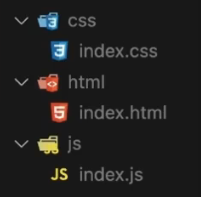
>
> 演变成现在的前端工程：
>
> 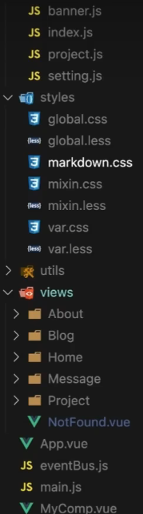
>
> 究竟经历了什么？

如果在第一次接触 `Vue` 或 `React` 这些前端框架前存在这样的疑问，大概率是自己的知识结构少了一块重要组成部分——前端工程化的相关知识。


## 1 前端必备的知识结构

- 语言
- 工程化（往往跳过）
- 框架
- 服务端

工程化的知识点的密集程度甚至超过了前端语言和主流框架，一旦缺失，自然无法深入理解前端。

最直观的感受，就是与高薪无缘：自学时缺失工程化的相关训练，导致知识体系不完整，无法透彻理解前端框架，更无从解决实际问题——

- `Vue` 中绑定的相对路径无法渲染出图片，除非在模板内写死；

- 实际项目启动缓慢

- 打包体积亟待优化：打包体积超 `10Mb+`

- 脚手架的深度定制

工程化的实质：只聚焦一个 **核心问题**——解决前端项目在到达一定规模后出现的各式各样的问题。工程化就是解决这些问题的 **一系列技术的合集**。

举例：村里修路 vs 建造港珠澳大桥


## 2 模块化

项目到达一定规模才会出现的问题主要有两大类：

- 全局变量污染（`IIFE` 的局限性：没有共享数据的渠道）

- 依赖混乱问题


解决方案：模块化。

- 官方标准：**ES Module**
- 社区标准：**CommonJS**（AMD、CMD、UMD 次之）

每个 `JS` 文件均视为一个模块，每个模块既可以有自己的内部实现，又可以导出某些功能供外部使用：

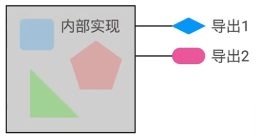

例如：

```html
<!-- 普通脚本引入：存在污染 -->
<script src="sum.js"></script>
<!-- 按模块引入：没有污染 -->
<script src="sum.js" type="module"></script>
```

再如：

```js
// sum.js
function sum(a, b) {
    return a + b;
}
export default sum;

// main.js
import sum from './sum.js';
console.log(sum);
```

控制台结果：

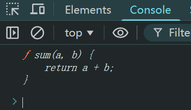

总之，模块化让多个模块间的导入和导出变得井井有条：

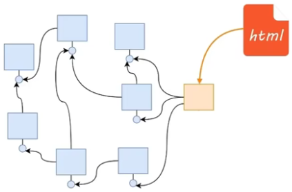


> [!tip]
>
> **模块化的地位**
>
> 模块化的出现，可以说是 **吹响了前端崛起的号角**，各种第三方 `JS` 工具库如雨后春笋般层出不穷，各自解决前端某个领域的问题。
>
> P.S.：截至 2026 年 2 月 1 日整理笔记时，`npm` 官方公布的 `package` 包的总数为：。


## 3 包管理


大量 `package` 包的爆发式增长最终促成了 `npm` 包管理器的诞生。

**包（package）** 是模块的集合，用于解决某一方面的特定问题。

一个第三方库可以看做是一个包（`package`）。

每个包里面包含一个或多个模块（`modules`），如 `Axios`、`jQuery`、`Moment.js` 等。

每个包也可以有自己的：

- `GitHub` 仓库

- 官网

- 版本

- 依赖（如 `jQueryUI` 依赖 `jQuery`）

  ……

于是产生了新的问题：

- 如何快速下载并安装一个包？
- 如何快速卸载一个包？
- 如何优雅地升级一个包？
- 如何避免版本冲突？

答案是 **包管理器（package manager）**：

- 官方版：`npm`
- 社区版：`yarn`、`pnpm`、`cnpm`

例如：

```bash
# 安装 jQuery 包
> npm i jquery
# 安装指定版本的 jQuery 包
> npm i jquery@1
# 快速卸载 jQuery 包
> npm uninstall jquery # 或 npm un jquery

```


前端的模块化和包管理虽然不能解决前端的所有问题，但它们是前端工程化的起点，其管理模式和设计理念将深刻地影响前端的发展（案例：莱特兄弟发明飞机）。


## 4 ESLint

略懂前端的开发者搭建出的项目一定包含 `ESLint`（[https://eslint.org/](https://eslint.org/)）。

> [!tip]
>
> **DIY：关于 ESLint 的名称**
>
> `ESLint` 全称是 **EcmaScript Lint**，它是 **专为检查和规范 “ES”（EcmaScript，即 JavaScript 语言标准）代码而生的 Lint 工具**；
>
> 而 `Lint` 工具则是一个在编程领域有着几十年历史的专用术语，**原指从羊毛制品中摘除的线头和瑕疵（Lint）**，在编程语境下引申为 **“静态代码分析工具”**，用于检查源代码中潜在的错误、不规范的写法、风格问题或可疑的代码结构，就像为代码“摘除瑕疵”。


### ESLint 示例

1. `no-unused-vars` 规则：`'isPrime' is defined but never used. eslint(no-unused-vars)`（详见：[https://eslint.org/docs/latest/rules/no-unused-vars](https://eslint.org/docs/latest/rules/no-unused-vars)）；
2. `no-bitwise` 规则：`Unexpected use of '~'. eslint(no-bitwise)`（详见：[https://eslint.org/docs/latest/rules/no-bitwise](https://eslint.org/docs/latest/rules/no-bitwise)）；
3. `no-plusplus` 规则：`Unary operator '++' used. eslint(no-plusplus)`（详见：[https://eslint.org/docs/latest/rules/no-plusplus](https://eslint.org/docs/latest/rules/no-plusplus)）；
4. `semi` 规则：`Missing semicolon. eslint(semi)`（详见：[https://eslint.org/docs/latest/rules/semi](https://eslint.org/docs/latest/rules/semi)）；
5. `eol-last` 规则：`Newline required at end of file but not found. eslint(eol-last)`（详见：[https://eslint.org/docs/latest/rules/eol-last](https://eslint.org/docs/latest/rules/eol-last)）。


`ESLint` 通过配置文件 `.eslintrc` 控制检测行为。


## 5 Babel

`Babel` 是一个将下一代 `JS` 代码转换为当前和旧版本浏览器或环境都能兼容运行的`JavaScript` 编译器。

> [!tip]
>
> **关于 Babel 的名称**
>
> `Babel` 的名称灵感直接来源于《圣经》中巴别塔（**Tower of Babel**）的故事。在《圣经·创世记》中，人类要联合起来建造一座可以通往天堂的高塔（巴别塔）。为了阻止这个计划，上帝让人类开始说不同的语言，导致人们无法沟通，最终塔楼停工，人类也分散到世界各地。
>
> `Babel` 的创始人 **Sebastian McKenzie** 借用这个典故为其工具命名，巧妙地传达了 `Babel` 的核心理念：致力于解决 **因“语言”不通（新语法与旧环境）而导致的“工程巴别塔”难题**。

配置文件：`babel.config.js`

`Babel` 不仅是一个解决语言兼容性问题的专用工具，学习时也可以利用它来观察编译后的结果，从而学习某些语法、API 实现思路。

> [!tip]
>
> **面试题**
>
> 如何把 `ES6` 的 `class` 转换成 `ES5` 的语法？
>
> `Babel` 的转换结果就是绝佳的参考之一。

其他场景：

- `React` 中 `JSX` 的转换思路

- `async / await` 的实现原理

  ……


## 6 CSS 预编译器

常见的有三类（`CSS` 预编译器“三剑客”）

- `Sass`：[https://sass-lang.com/](https://sass-lang.com/)
- `Less`：[http://lesscss.org/](http://lesscss.org/)
- `Stylus`：https://stylus-lang.com/

一旦学会一个，另两个自然触类旁通。

以 `Sass` 为例：

```scss
/* 变量 */
$baseColor: #f40
$borderColor: rgba($baseColor, .88)

.item
  color: $baseColor
  border: 1px solid $borderColor

/* 嵌套 */
.container
  display: flex
  .item
    margin: 0 10px
    &:hover
      font-weight: bold

/* 循环 */
$bcolor: #036
@for $i from 1 through 10
  li:nth-child(#{$i})
    background: lighten
    ($bcolor, $i * 5%)
    
/* mixin 混合 */
@mixin abs-center
  position: absolute
  left: 50%
  top: 50%
  transform: translate(-50%, -50%)

.s1
  @include abs-center
```

CSS 预编译器的主要作用：提升开发效率和质量。


## 7 PostCSS：CSS 的终极方案

官网：[https://tailwindcss.com/](https://tailwindcss.com/)。

**David Clerk** 博文地址：《[人人都该懂点 `PostCSS`](https://davidtheclark.com/its-time-for-everyone-to-learn-about-postcss/)》。

核心原理：

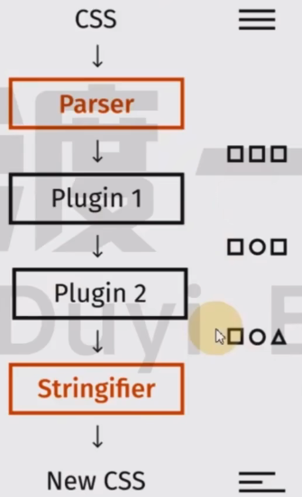

核心流程：`PostCSS` 将 `CSS` 代码解析为 `AST` 抽象语法树，然后交给它的一系列插件作进一步处理，最后由 `PostCSS` 将其重新文本化，变成最终的 `CSS` 样式代码。

示例配置：

```js
// postcss.config.js
module.exports = {
  map: false,
  plugins: {
    tailwindcss: {},
    'postcss-preset-env': {}, // 前沿 CSS 优雅降级
    'postcss-modules': {}, // 解决类名冲突
  },
};
```

几乎所有的 `CSS` 转换工具都加入了 `PostCSS` 大家族，包括大名鼎鼎的 `Tailwind CSS`：

```css
@tailwind base;
@tailwind components;
@tailwind utilities;
```

（现场演示环节可参考 `Tailwind CSS` 官网首页示例效果）


## 8 构建工具

这是前端工程化中 **最重要** 的知识板块。

构建工具同时也是前端工程化中 **学习时间最长**、**内容最多**、**体系最庞大**、**覆盖知识点最广** 的核心领域，是所有前端框架诞生的摇篮。

构建工具是结束前端语言学习后，通往框架学习的最后一座桥梁。


为什么需要构建工具？

答：因为开发者和浏览器眼中最理想的代码特征和组织形态是 **完全不同的**：

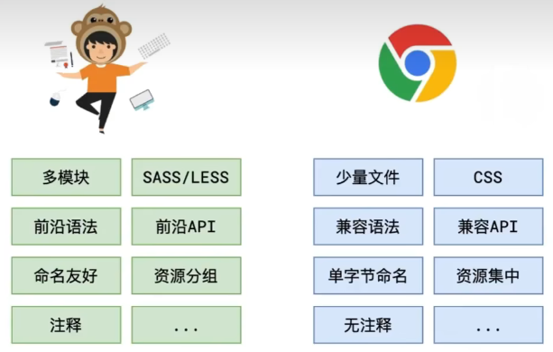


常见的构建工具：

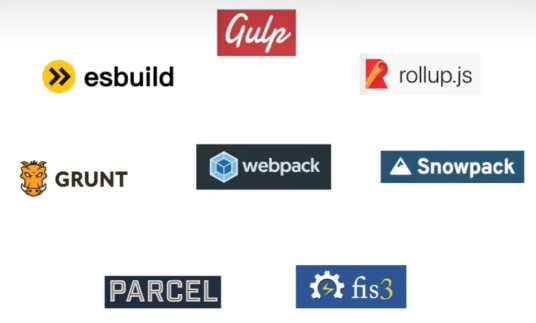

众多构建工具中，核心是 `Webpack`。`ESBuild` 和 `Snowpack` 虽然强悍但尚不足以取代 `Webpack`。

> [!tip]
>
> **主流构建工具的更迭**
>
> `DeepSeek`：上述观点在 2022 年底是准确的，但近两三年形势已变。如今：
>
> 1. **Webpack 地位稳固但非唯一**：它深厚的生态和灵活性保证了其在大型、复杂项目中的“压舱石”地位，短期内不会被完全取代。
> 2. **新一代工具已成主流**：以 `Vite` 为代表的新一代工具，因其卓越的开发体验和够用的生态，**已成为现代新项目的首选**，改变了行业标准。
> 3. **趋势是“融合”而非“替代”**：未来，高性能的 `Rust/Go` 工具链与成熟的 `JavaScript` 生态会进一步融合。对于个人或团队而言，根据项目复杂度、技术栈和团队熟悉度做技术选型变得更加重要。

（现场演示 `Webpack` 的基本工作流程）


`Webpack` 核心原理图（所有资源都可视为模块）：

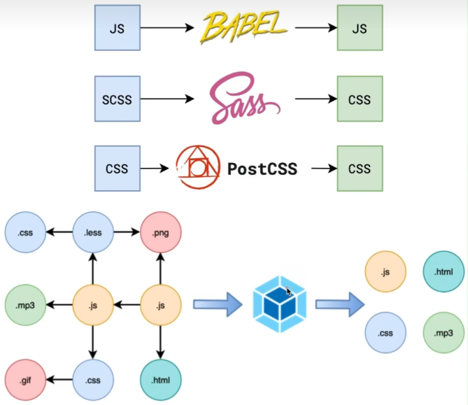


## 9 Webpack 的核心能力

### 9.1 打包压缩

打包命令：`npm run build`

注意：构建工具可以和前端框架没有任何关联，构建工具利用原生 `JS` 也可以实现不输前端框架的页面效果。


### 9.2 文件指纹

例如：`js/app-9ea93.js`，其中的 `9ea93` 成为 `hash`（哈希值的前几位），它会随着模块内容的变化而变化。

> [!important]
>
> **重要特征**
>
> 源码内容不变，`hash` 值不变；源码内容变化，`hash` 变化。

有了文件指纹，既可以享受浏览器提供的缓存机制，又能在内容更新时主动请求最新的网站数据：

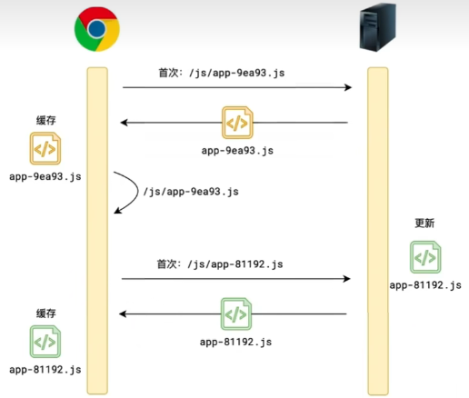


### 9.3 开发服务器

用于在开发阶段，将 `Webpack` 的打包结果放到内存中，以便在请求服务器时直接得到服务器从内存读取的响应内容。

同时，一旦源码发生变动，监听 `src` 目录的 `Webpack` 会自动重新打包，并刷新页面加载最新的打包结果。

启动命令举例（默认监听 `8080` 端口）：

```js
// package.json
{
  "scripts": {
    "serve": "webpack serve"
  }
}
```


工作原理图：

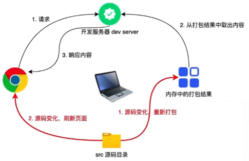


## 10 前端工程化学习路线

1. 模块化
   1. `CommonJS`（:star: 重点）
   2. `ES Module`（:star: 重点）
   3. `AMD`
   4. `CMD`
   5. `UMD`
2. 包管理器
   1. `npm`（:star: 重点）
   2. `cnpm`
   3. `pnpm`
   4. `yarn`
   5. `bower`
3. 构建工具
   1. `Webpack`（:star: 重点）
      1. 概念：`chunk`、`bundle`、`hash`、`contenthash`、`loader`、`plugin` ...
      2. 原理
      3. 配置
      4. 扩展：`Babel`、`CSS` 预编译器、`PostCSS`、`ESLint` ...
      5. 优化：减少模块解析、`loader` 优化、热替换、自动分包、手动分包、代码压缩、`Tree Shaking`、懒加载、`ESLint`、`bundle` 分析工具、`gzip`
   2. `Rollup`（触类旁通）
   3. `Grunt`
   4. `ESBuild`
   5. `Gulp`
   6. `Parcel`
   7. `Fis3`
   8. `Snowpack`
4. 脚手架
   1. `Vite`（`ESBuild + Rollup`）
   2. `vue-cli`（`Webpack`）
   3. `umijs`（`Webpack`）
   4. `create-react-app`（`Webpack`）

作为前端开发者，工程化的知识是 **一定绕不过去的**。一个显而易见的事实：工程化是高薪就业的敲门砖。

光有工程化也是不够的。工程化基础打牢后，语言特性、前端框架、服务端 `NodeJS` 也得达到相应的深度，不能头重脚轻。

