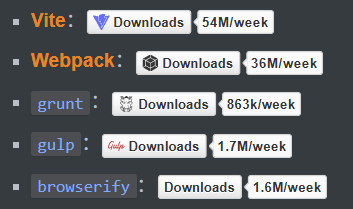

# L01：如何在浏览器端实现模块化

---

## 1 课程简介

本门课需要的前置知识：`ES6`、模块化、包管理器、`Git`

本门课的讲解特点：

1. 合适的深度：`Webpack` 使用层面很简单，但原理层面非常复杂
2. 合适的广度：`Webpack` 生态圈极其繁荣，有海量的第三方库可以融入到 `Webpack`

## 2 浏览器端的模块化

问题：

- 效率问题：精细的模块划分带来了更多的 `JS` 文件，更多的 `JS` 文件带来了更多的请求，降低了页面访问效率
- 兼容性问题：浏览器目前（2020 年 1 月）仅支持 `ES6` 的模块化标准，并且还存在兼容性问题
- 工具问题：浏览器不支持 `npm` 下载的第三方包

这些仅仅是前端工程化的一个缩影。

当开发一个具有规模的程序，你将遇到非常多的 **非业务问题**，这些问题包括：

- 执行效率

- 兼容性

- 代码可维护性

- 代码可扩展性

- 团队协作

- 测试

  ……

我们将这些问题统称为 **工程问题**。工程问题与业务无关，但它深刻地影响着开发进度。

如果没有一个好的工具解决这些问题，将使得开发进度变得 **极其缓慢**，同时也让开发者陷入技术的泥潭。

## 3 根本原因

> [!tip]
>
> **思考**
>
> 上面提到的问题，为什么在 `node` 端没有那么明显，反而到了浏览器端变得如此严重呢？

因为在 `node` 端 JS 文件是在本地运行的，可以很自然地读取本地文件，且效率比浏览器远程传输 `JS` 文件高得多。

出现工程化问题的 **根本原因** 在于——

在浏览器端，**开发时态**（`devtime`）和 **运行时态**（`runtime`）的侧重点 **截然不同**。

**开发时态，devtime：**

1. 模块划分越细越好
2. 支持多种模块化标准
3. 支持 `npm` 或其他包管理器下载的模块
4. 能够解决其他工程化的问题

**运行时态，runtime：**

1. 文件越少越好
2. 文件体积越小越好
3. 代码内容越乱越好（安全考虑）
4. 所有浏览器都要兼容
5. 能够解决其他运行时的问题，主要是执行效率问题

这种差异在小项目中表现得并不明显，可是一旦项目形成规模，就越来越明显。如果不解决这些问题，前端项目形成规模只能是一纸空谈。

## 4 解决办法

既然开发时态和运行时态面临的局面有巨大的差异，因此，我们需要有一个工具，这个工具能够让开发者专心地在开发时态写代码，然后利用这个工具将开发时态编写的代码转换为运行时态需要的东西。

这类工具就是 **构建工具（build tools）**：

这样一来，开发者就可以专注于开发时态的代码结构，而不用担心运行时态遇到的问题了。

## 5 常见的构建工具

（数据为 `NPM` 官方发布的实时周下载量）

- （**Vite**)

- （**Webpack**)

- （`Grunt`)

- （`Gulp`)

- （`Browserify`)

- 其他

更新笔记时的统计数据截图（`2026-01-26` 至 `2026-02-01`）：

