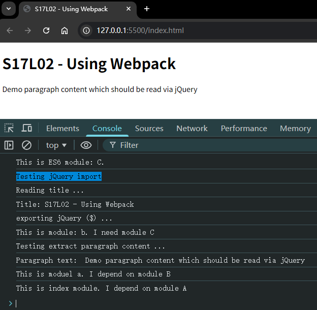

# L02：Webpack 的安装和使用

---


> [!tip]
>
> `Webpack` 官网：[https://webpack.js.org/](https://webpack.js.org/)
>
> 中文版：[https://www.webpackjs.com/](https://www.webpackjs.com/)
>
> 目前的最新版本：`Webpack 5`
>
> 注意：要逐步学会自行阅读文档。


## 1 Webpack 简介

`Webpack` 是基于模块化的打包（构建）工具，它把一切视为 **模块**。

它通过一个开发时态的入口模块为起点，分析出所有的依赖关系，然后经过一系列的过程（压缩、合并），最终生成运行时态的文件。

`Webpack` 的特点：

- **为前端工程化而生**：`Webpack` 出现于 2012 年 3 月 [^2]，致力于解决前端工程化，特别是浏览器端工程化中遇到的问题，让开发者集中注意力编写业务代码，而把工程化过程中的问题全部交给 `Webpack` 来处理；
- **简单易用**：支持零配置，可以不用写任何一行额外的代码就使用 `Webpack`；
- **强大的生态**：`Webpack` 是非常灵活、可以扩展的。`Webpack` 本身的功能并不多，但它提供了一些可以扩展其功能的机制，使得一些第三方库可以融入到 `Webpack` 中；
- **基于 Node.js**（:star:）：由于 `Webpack` 在构建的过程中需要读取文件，因此它是运行在 `node` 环境中的；
- **基于模块化**：`Webpack` 在构建过程中要分析依赖关系，具体通过分析模块化导入语句（`imort`、`require` 等）实现；它支持各种模块化标准，包括但不限于 `CommonJS`、`ES6 Module`。


## 2 Webpack 的安装

`Webpack` 通过 `npm` 安装，它提供了两个包 [^1]：

- `webpack`：核心包，包含了 `Webpack` 构建过程中要用到的所有 `API`
- `webpack-cli`：提供一个简单的 `CLI` 命令，它调用了 `Webpack` 核心包的 `API`，来完成构建过程。

安装方式：

- 全局安装：可以全局使用 `Webpack` 命令，但是无法为不同项目对应不同的 `Webpack` 版本（`npx` 出现前的无奈之举）
- **本地安装**：推荐，每个项目都使用自己的 `Webpack` 版本进行构建

安装命令（`-D` 表示仅限开发环境下使用）：

```bash
npm i -D webpack webpack-cli
```

原视频中的工具版本：

- `Webpack`：`webpack@4.41.5`
- `Webpack CLI`：`webpack-cli@3.3.10`

因此跟随视频进度的安装命令为：

```bash
npm i -D webpack@4.41.5 webpack-cli@3.3.10
```


## 3 使用

```shell
webpack
```

默认情况下，`Webpack` 会以 `./src/index.js` 作为入口文件分析依赖关系，打包到 `./dist/main.js` 文件中。

通过 `--mode` 选项可以控制 `Webpack` 打包结果的运行环境（值为 `'development'` 或 `'production'`）


## 4 实测

`npm` 安装命令：

```bash
npm i -S jquery@3 -D webpack@4.41.5 webpack-cli@3.3.10
```

编辑 `index.html` 内容，然后从命令行执行：

```bash
# （目根目录运行）
# 打包
rm -Recurse -Force dist
npx webpack --mode="development"
```

从浏览器运行打包后的 `JS`：

1. 临时新建 `index.html` 文件（不在 `dist` 内新建，以免误删）；
2. 用 `script` 引入打包结果（`src="dist/main.js"`）；
3. 启动 `VSCode Live Server`，打开控制台查看输出结果。

实测效果：




---

[^1]: 根据 `DeepSeek` 提供的数据，`webpack-cli` 的第一个独立版本发布于 **2017 年 8 月 21 日**（`v1.0.0`），从 `Webpack 4` 开始正式分离。
[^2]: 根据 `SurviveJS` 线上演示文稿提供的数据，详见：https://presentations.survivejs.com/re-imagining-webpack/#/1


