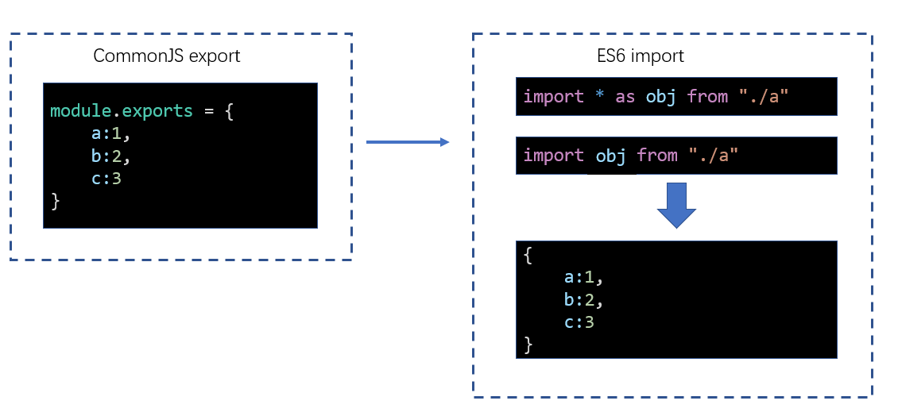

# L03：模块化的兼容性

---


由于 `Webpack` 同时支持 `CommonJS` 和 `ES6 Module` 模块化标准，当导入和导出两边的 `JS` 使用不同的模块化标准时，`Webpack` 的打包结果略有区别。本节针对这类情况进行了专门说明。


## 1 同一标准下

如果导出和导入使用的是同一种模块化标准，打包后的效果 **和之前学习的模块化没有任何差异**：


## 2 不同模块化标准

不同的模块化标准，`Webpack` 按照如下的方式处理：

:one: `ESM` 导出 + `CommonJS` 导入：


:two: `CommonJS` 导出 + `ESM` 导入（:star: 最常见）：



易错情况：

```js
// ESM 默认导出
export default {foo, bar, baz}
// CommonJS 导入
const obj = require('./someModule.js');
console.log(obj); // {default: {foo, bar, baz}}
```


## 3 最佳实践

代码编写最忌讳的是精神分裂，选择一个合适的模块化标准，然后 **贯彻整个开发阶段**。

