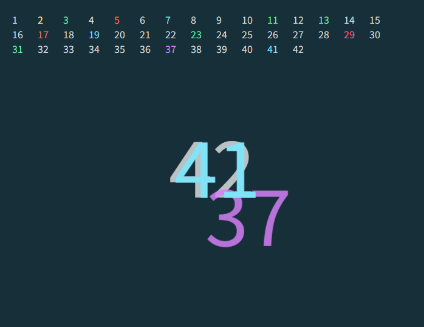
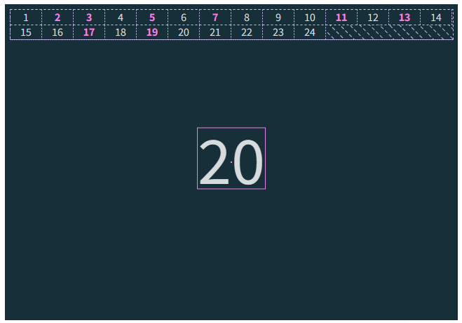
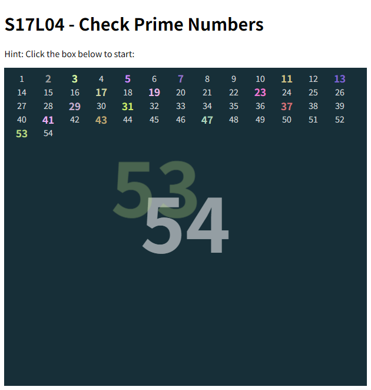

# L04：【练习】酷炫的数字查找特效

---

本节通过一个实际案例，让大家切身感受一下利用 `Webpack` 实现的模块化开发范式为前端带来的颠覆式创新。


## 1 需求描述

实现一个交互式的查找质数的趣味页面：点击页面任意位置开始排查：页面正中从 1 开始逐个检查当前自然数 `n` 是否为质数——

- 若为质数：将 `n` 的字体颜色改为随机色，并带 `CSS3` 渐出特效，同时罗列区也要带上相同的字体颜色； 
- 若为合数：仅按默认样式放到罗列区域，正中位置不带特效；

屏幕点击效果：单击页面任意位置暂停排查；再次点击恢复；再次点击继续排查，如此往复循环。

最终效果如图所示（排查中）：




## 2 实测备忘

:one: 关于数字的垂直居中（精确居中）问题：由于字体的特殊性，中央数字的绝对居中只能通过 **纯手动调节** 实现。

**调试要领**：外层容器提供正中心位置，内部元素调整垂直方向的偏移量——



对应的 `CSS` 样式：

```css
.box {
  position: relative;
  & > .current {
    position: absolute;
    top: 50%;
    left: 50%;
    transform: translate(-50%, -50%); /* 大致居中 */
    border: 1px solid violet;
    & > .n {
      position: absolute;
      font-size: 6rem;
      line-height: 6rem;
      transform: translate(-50%, -56%); /* 精确居中 */
      border: 1px solid violet;
    }
  }
}
```

但是设为 **绝对定位** 有个缺陷：出现滚动条后会跟着移动。因此最终改为 **固定定位**，居中通过手动调整到容器中间即可。


:two: 在 JS 中实现 `CSS` 动画需要借助 `transition` 属性：

```css
&.prime {
  opacity: 1;
  transform: translate(-50%, -50%);

  /* 设置过渡属性 */
  transition: 
    transform 500ms linear 500ms,
    opacity 0.7s ease-out 0.3s;

  &.animate { /* 静态调试用 */
    transform: translate(200px, 200px); /* 实际改为随机偏移量 */
    opacity: 0;
  }
}
```

配合 `JS`：

```js
// src/pages/printNumber.js: function drawPrime()
DOM.current.appendChild(span);

span.clientHeight;  // force render

const rx = randIndex(150, -350), ry = randIndex(150, -350);
span.style.transform = `translate(${rx}px, ${ry}px)`;
span.style.opacity = '0';
```

这里必须让浏览器强制刷新才能看到动画特效。


:three: 在 `src/util/` 文件夹下新建 `index.js` 将所有子模块汇总：

```js
export { default as isPrime } from './isPrime.js';
export * from './randColor.js';
export { default as NumberChecker } from './number-checker.js';
```


:four: 设计静态页面早期利用 `JS` 脚本快速生成模拟数据：

```js
// src/util/mockdata.js
const pool = document.querySelector(".pool");
const frag = Array.from({ length: 600 }, (_, i) => i + 1)
  .map((n) => {
    const div = document.createElement("div");
    if (Math.random() > 0.7) {
      div.classList.add("prime");
    }
    div.innerHTML = n;
    return div;
  })
  .reduce(
    (tank, e) => (tank.appendChild(e), tank),
    document.createDocumentFragment(),
  );

pool.innerHTML = "";
pool.appendChild(frag);

document.querySelector('.n').innerHTML="20";

// 用法（src/index.js）
import './util/mockdata.js';
```


:five: 代码优化：动画结束后删除该元素（注册 `transitionend` 事件）：

```js
// src/pages/printNumber.js: drawPrime():
// 淡出后删除元素
span.ontransitionend = ev => ev.target.remove();
```


:six: 用 `JS` 切换 `CSS` 样式时，优先考虑使用 `dom.classList.toggle()` 方法切换样式类：

```js
DOM.center.classList.toggle('hidden', checker(n));
div.classList.toggle('prime', checker(n));
```


:seven: 改进：利用 `toString()` 的进制参数实现纯随机颜色的生成，无需提前定义颜色值：

```js
// src/util/randColor.js
export const randIndex = (end, start = 0) => 
  Math.floor(Math.random() * (end - start) + start); 

export const randColor = () => Array.from({length: 3}, (_, i) => i)
  .map(_ => randIndex(255, 100).toString(16).padStart(2, '0'))
  .reduce((prefix, hex) => prefix + hex, '#')
  .toUpperCase();
```


:eight: 巧用 `class` 类封装 `timer` 状态：

```js
export default class NumberChecker {
  constructor(interval = 500, counter = 1) {
    this.interval = interval;
    this.timer = null;
    this.counter = counter;
  }

  start() {
    if(this.timer) {
      return;
    }
    this.timer = setInterval(() => {
      this.performTask(this.counter++);
    }, this.interval);
  }

  stop() {
    clearInterval(this.timer);
    this.timer = null;
  }

}
```


DIY 版最终效果：




## 3 小结

通过 `Webpack` 引入打包功能后，之前复杂的单个 `JS` 脚本开发可以通过 **模块化** 不断拆分功能点，并且完全消除了全局变量污染和依赖混乱的痛点，极大地提升了开发效率。

实战案例的具体细节不是本节重点，重点在体会 **模块化的开发范式** 给前端带来的全新开发体验。
