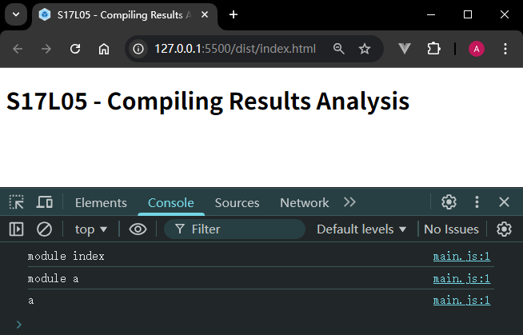
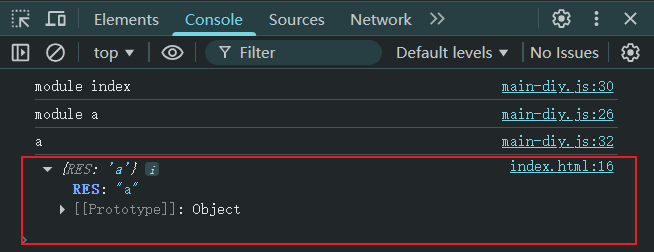
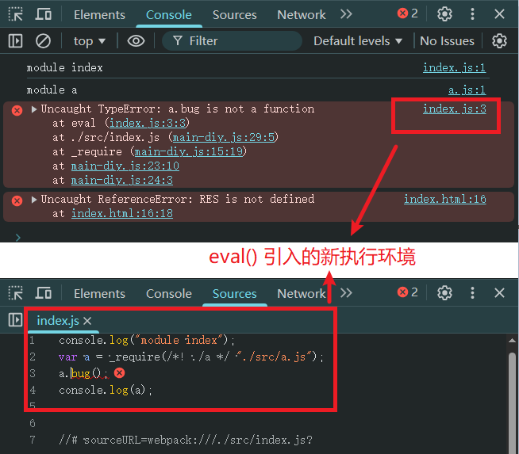
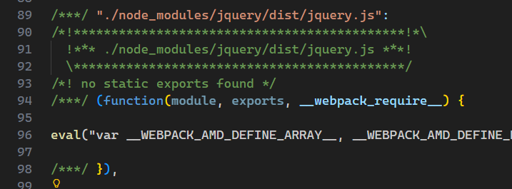
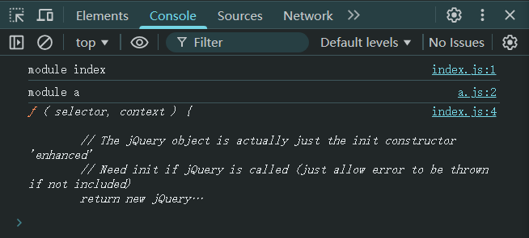
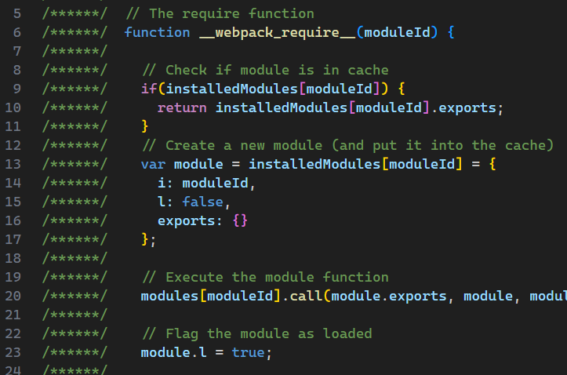
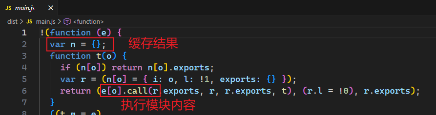

# L05：Webpack 编译结果分析

---


> [!tip]
>
> **本节概要**
>
> 本节通过一个简单的 `CommonJS` 模块引用示例，从手动实现打包过程切入，进而深入分析了 `Webpack` 在开发及生产环境下的打包结果的基本结构，为后续理解 `Webpack` 的其它核心概念奠定坚实的基础。


## 1 尝试手动编译

基本案例的项目结构（忽略 `node_modules` 文件夹）：

```bash
PROJECT_ROOT
|   package-lock.json
|   package.json
|
+---dist
|       favicon.ico
|       index.html
|       main-diy.js
|       main.js
|
\---src
        a.js
        index.js
```

其中 `src/` 目录有两个基于 `CommonJS` 书写的 `JS` 模块：

```js
// index.js
console.log("module index");
var a = require("./a");
console.log(a);

// a.js
console.log("module a");
module.exports = "a";
```

用 `npm run build` 正常打包后的执行结果：



在 `dist` 目录创建 `main-diy.js` 并引入 `index.html` 页面，手动尝试整合这两个模块：

```js
const RES = (function(modules){
  const module = {
    exports: {}
  };
  
  // key = moduleId, value = moduleExports
  const _moduleCache = {};

  function _require(moduleId) {
    if(moduleId in _moduleCache) {
      return _moduleCache[moduleId];
    }

    const moduleHandler = modules[moduleId];
    moduleHandler.call(module.exports, module, module.exports, _require);
    const result = module.exports;

    _moduleCache[moduleId] = result;

    return result;
  }

  return _require('./src/index.js');
})({
  './src/a.js'(_module, exports, _require) {
    console.log("module a");
    _module.exports = "a";
  },
  './src/index.js'(_module, exports, _require) {
    console.log("module index");
    var a = _require("./src/a.js");
    console.log(a);
  }
});
```

> [!important]
>
> **注意**
>
> 实测时忘了修改 `index.js` 模块中的相对路径（`./a`），导致 `JS` 中断执行（**务必统一为唯一的 `moduleId` 格式**）。
>
> 另外，原模块凡是用到了 `module.exports` 句式的，为避免 `IDE` 区别对待 `CommonJS` 中的写法而无法正常高亮函数参数，因此统一改为 `_module` 和 `_module.exports`。

实测代码在视频基础上略微改进，新增了 `IIFE` 结构的返回值，相当于定义了一个 **命名空间**。于是可以在 `index.html` 中验证：

```html
<script src="main-diy.js"></script>
<script>
  console.log({RES});
</script>
```

最终结果：



可以看到，`index.js` 模块的返回结果，就是内部 `module.exports` 的结果，暴露到全局的命名空间为 `RES`。


## 2 使用 eval 的目的

核心目的：`eval` 会在 `JS` 虚拟机中重开一个执行环境，这样就不会暴露打包文件的具体细节，方便调试。

具体做法：将模块内容全部放入 `eval()` 函数，末尾再手动拼接一个自定义的关联地址（格式为：`webpack:///${moduleId}`，其中的 `webpack:///` 前缀是 `Webpack` 自动添加的，并非强制要求）：

```js
(function(){})({
  './src/a.js'(_module, exports, _require) {
    eval("console.log(\"module a\");\n_module.exports = \"a\";\n\n\n//# sourceURL=webpack:///./src/a.js?");
  },
  './src/index.js'(module, exports, _require) {
    eval("console.log(\"module index\");\nvar a = _require(/*! ./a */ \"./src/a.js\");\nconsole.log(a);\n\n\n//# sourceURL=webpack:///./src/index.js?");
  }
});
```

该关联地址在模块报错时很实用：

人为引入一个 `Bug`（`L3`）：

```js
// src/index.js:
console.log("module index");
var a = require("./a");
a.bug();
console.log(a);

// dist/main-diy.js:
eval("console.log(\"module index\");\nvar a = _require(/*! ./a */ \"./src/a.js\");\na.bug();\nconsole.log(a);\n\n\n//# sourceURL=webpack:///./src/index.js?");
```

报错时，浏览器会在一个虚拟的执行环境展示错误信息：




## 3 引入 jQuery 的编译结果

 和引入 `a.js` 模块没有本质区别，只是放入 `eval` 中的内容是 `jQuery` 库罢了：



改造 `src/a.js` 模块：

```js
// ./src/a.js:
const $ = require('jquery');
console.log("module a");
module.exports = $;
```

使用 `npm run dev` 命令打包，最终控制台看到的结果如下：




## 4 对比 Webpack 的打包结果

`Webpack` 在打包过程中比手动实现多考虑了几步：

- 缓存内容考虑的是否加载结束；
- 缓存的记录是一个对象，模块实际导出的内容是该对象的一个属性（即 `exports` 属性）；
- 考虑了其他模块化标准的处理，不仅仅是 `CommonJS` 模块化标准；
- 内部 `_require` 函数重命名为 `__webpack_require__`；

截图如下（`require` 函数的重命名、`cache` 缓存的内容不同、考虑模块的加载状态）：




## 5 生产环境下的打包结果

在开发环境（`--mode=development`）相对没有本质区别，只是对打包结果做了压缩和简化：




## 6 小结

理解了手动实现的细节，就理解了 `Webpack` 的编译打包结果；

理解了 `Webpack` 的打包结果，才有可能理解之后的编译过程；

理解了编译过程，才能理解后续介绍的 `Webpack` 核心概念（加载器 `loader`、插件 `plugin` 等）的原理；

