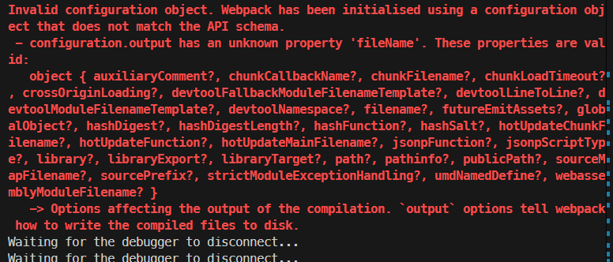

# L06：Webpack 配置文件简介


## 1 配置文件

`Webpack` 提供的 `CLI` 命令行工具支持的参数很多，例如 `--mode`，但更多的时候，我们会使用更加灵活的配置文件来控制 `Webpack` 的行为。

默认情况下，`Webpack` 会读取位于项目根目录下的 `webpack.config.js` 文件作为其 **配置文件**；若要变更默认设置，可以通过 `CLI` 命令行参数 `--config` 手动指定配置文件。例如配置文件在 `src` 目录下：

```bash
npx webpack --config ./src/diy.config.js
```


## 2 配置文件使用的模块化规范

`Webpack` 的配置文件必须通过 `CommonJS` 模块导出一个对象，对象中的各种属性对应不同的 `Webpack` 配置。

> [!important]
>
> **注意**
>
> **配置文件中的代码，【必须是】有效的 node 代码**

当命令行参数与配置文件中的配置出现冲突时，**以命令行参数为准**。

因此 `package.json` 的脚本可以用 `--mode` 覆盖 `webpack.config.js` 的默认配置：

```js
// package.json:
{
    "scripts": {
        "dev": "webpack",
        "build": "webpack --mode=production"
    }
}
// webpack.config.js:
module.exports = {
    mode: "development"
}
```


## 3 基础配置简介

1. `mode`：编译模式，值类型为字符串，取值为 `"development"` 或 `"production"` 或 `"none"`，用于设定编译结果代码所在的运行环境，会影响 `Webpack` 对编译结果代码格式的处理；
2. `entry`：入口，字符串（后续会详细讲解），指定入口文件；
3. `output`：出口，对象（后续会详细讲解），指定编译结果文件。

示例：

```js
module.exports = {
    entry: "./src/main.js",
    output: {
        filename: "bundle.js"
    }
}
```


## 4 实测备忘

:one: 通过 `--config` 参数变更配置文件既可以用 `=` 又可以用空格隔开文件全路径：

```bash
# any of the following is fine
npx webpack --config=./diy.config.js
npx webpack --config="./diy.config.js"
npx webpack --config ./diy.config.js
npx webpack --config "./diy.config.js"
npx webpack --config diy.config.js
npx webpack --config "diy.config.js"
```

:two: 经实测，`--mode` 值为 `"none"` 时和 `"development"` 等效。此外 `--mode` 也可以不用等号：

```bash
npx webpack --mode none
npx webpack --mode "none"
```

:three: 实测发现 `Webpack` 自定义输出文件名时，`filename` 不能写成 `fileName`，否则报错：



