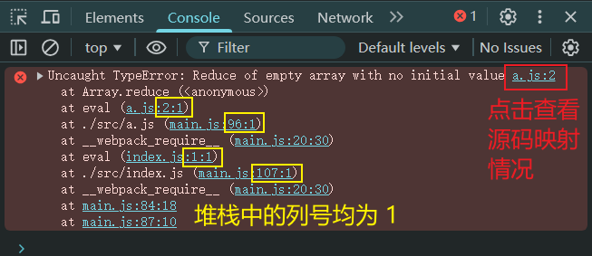
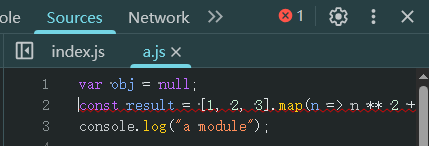
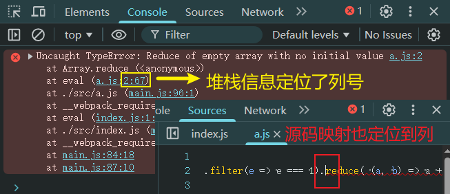

# L07：Webpack 中的 devtool 配置项与源码映射

---

> [!tip]
>
> **题外话**
>
> 学习 `Webpack` 要有 **大局观**，知晓它的边界。


## 1 Source Map 源码映射

> [!note]
>
> 本小节的知识与 `Webpack` 无关。

前端发展到现阶段，很多时候都不会直接运行源代码，可能需要对源代码进行 **合并**、**压缩**、**转换（TypeScript）** 等操作，真正运行的是转换后的代码。


这就给调试带来了困难，因为当运行发生错误的时候，我们更加希望能看到源代码中的错误，而不是转换后代码的错误。

> [!tip]
>
> `jQuery` 压缩后的代码：https://code.jquery.com/jquery-3.4.1.min.js

为了解决这一问题，`Chrome` 浏览器率先支持了 `source map`，其他浏览器纷纷效仿，目前，几乎所有新版浏览器都支持了 `source map`。

`source map` 实际上是一项配置，配置中不仅记录了所有源码内容，还记录了和转换后的代码的 **对应关系**。

下面是浏览器处理 `source map` 的原理：


**最佳实践**：

1. `source map` 应在 **开发环境** 中使用，作为一种 **调试手段**；
2. `source map` 不应该在生产环境中使用：`source map` 的文件一般较大，不仅会导致额外的网络传输，还容易暴露原始代码；即便要在生产环境中使用 `source map`，用于调试真实代码的运行问题，也要做一些处理来规避网络传输和代码暴露方面的问题。


## 2 Webpack 中的 Source Map

使用 `Webpack` 编译后的代码难以调试，可以通过 `devtool` 配置来 **优化调试体验**。

详细配置参考官方文档：

- 英文版：https://webpack.js.org/configuration/devtool/
- 中文版：https://www.webpackjs.com/configuration/devtool/

一般只关注开发阶段和生产阶段的最佳实践。

### 【开发阶段】最佳实践摘录

以下选项非常适合 **开发环境**：

- `eval` - Each module is executed with `eval()` and `//# sourceURL`. This is pretty fast. The main disadvantage is that it doesn't display line numbers correctly since it gets mapped to transpiled code instead of the original code (No Source Maps from Loaders).
  `eval`：每个模块都使用 `eval()` 执行，并且都有 `//# sourceURL`。此选项会非常快地构建。主要缺点是，由于会映射到转换后的代码，而不是映射到原始代码（没有从 `loader` 中获取 `source map`），所以不能正确的显示行数。
- `eval-source-map` - Each module is executed with `eval()` and a SourceMap is added as a DataUrl to the `eval()`. Initially it is slow, but it provides fast rebuild speed and yields real files. Line numbers are correctly mapped since it gets mapped to the original code. It yields the best quality SourceMaps for development.
  `eval-source-map`：（:star: 推荐）每个模块使用 `eval()` 执行，并且 `source map` 转换为 `DataUrl` 后添加到 `eval()` 中。初始化 `source map` 时比较慢，但是会在重新构建时提供比较快的速度，并且生成实际的文件。行数能够正确映射，因为会映射到原始代码中。它会生成用于开发环境的 **最佳品质** 的 `source map`。
- `eval-cheap-source-map` - Similar to `eval-source-map`, each module is executed with `eval()`. It is "cheap" because it doesn't have column mappings, it only maps line numbers. It ignores SourceMaps from Loaders and only display transpiled code similar to the `eval` devtool.
  `eval-cheap-source-map`：类似 `eval-source-map`，每个模块使用 `eval()` 执行。这样的 `source map` 之所以 `cheap`（低开销），是因为它 **没有生成列映射**（`column mapping`），只是映射行数。它会忽略源自 `loader` 的 `source map`，并且仅显示转译后的代码，就像配置为 `eval` 那样。
- `eval-cheap-module-source-map` - Similar to `eval-cheap-source-map`, however, in this case Source Maps from Loaders are processed for better results. However Loader Source Maps are simplified to a single mapping per line.
  `eval-cheap-module-source-map`：类似 `eval-cheap-source-map`，并且，在这种情况下，源自 `loader` 的 `source map` 会得到更好的处理结果；但是 `loader` 提供的 `source map` 会被简化为每行一个映射（`mapping`）。


### 【生产阶段】最佳实践摘录

- `none`：生产环境下的 **默认值**。构建最快、开销最小，效果最差。
- `source-map`：构建最慢、效果最好、开销最大（应提供额外的访问限制，防止源码暴露）。

其余详见文档。


## 3 实测备忘

:one: 实测发现，`source map` 文件在最新版浏览器的 `Network` 标签中 **依旧不可见**。

:two: 改进视频中的演示案例：

视频中的代码并没有对 `cheap-eval-source-map` 配置项进行专门的设计，因此演示效果未能突出 **仅映射到行号** 的特点。

实测时对 `src/a.js` 模块改造如下（在 `reduce()` 位置报错）：

```js
// src/a.js:
var obj = null;
const result = [1, 2, 3].map(n => n ** 2 + 1).filter(e => e === 1).reduce((a, b) => a + b);
console.log("a module");

// webpack.config.js:
module.exports = {
  mode: "development",
  devtool: "cheap-eval-source-map",
  watch: true,
};
```

此时的控制台报错情况（注意冒号后的列数）：



实测源码映射结果（**仅定位到第 2 行**）：




:three: 若 `devtool` 的值改为 `eval-source-map`，尽管源码映射看不到打包的痕迹，但实测效果和 :two: 一样，**仍然只能提示到某一行**。

:four: 但如果 `devtool` 的值设为 `eval`，虽然源码映射有 `Webpack` 的打包痕迹，但是能精确定位到出错的位置：

```js
// webpack.config.js:
module.exports = {
  mode: "development",
  devtool: "eval",
  watch: true,
};
```



由此可见：如果在很长的一段代码调试中，既想定位到可能报错的列、同时又不想看到任何打包痕迹，**至少文档提供的这四个选项是无法满足的**。