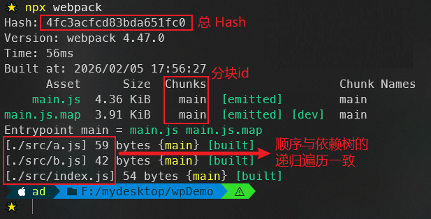
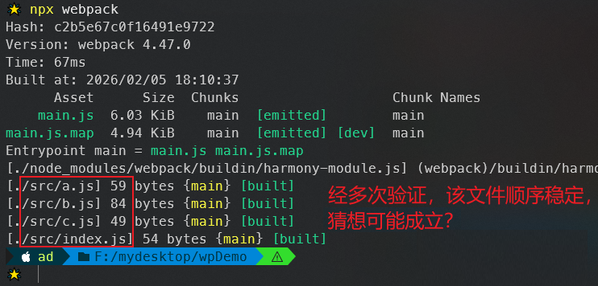

# L08：Webpack 的编译过程

---

[toc]


> [!tip]
>
> 想讲好一堂课，除了技术过硬外，其他方面（例如课程内容的编排组织上）也同样要下工夫。


`Webpack` 的作用是将源代码编译（构建、打包）成最终代码：


整个过程大致分为三个步骤——

1. 初始化
2. 编译
3. 输出


## 1 初始化

此阶段，`Webpack` 会将 **CLI参数**、**配置文件**、**默认配置** 进行融合，形成一个最终的配置对象。

对配置的处理过程是依托一个 `NPM` 第三方库 `yargs`（[](https://www.npmjs.com/package/yargs)）完成的。

此阶段相对比较简单，主要是为接下来的编译阶段做必要的准备。

目前，可以简单的理解为，初始化阶段主要用于产生一个最终的配置。


## 2 编译

### 2.1 创建 chunk

`chunk` 是 `Webpack` 在内部构建过程中的一个概念，译为 `块`，它表示 **通过某个入口找到的所有依赖的统称**（不太准确）。

> [!tip]
>
> `DeepSeek`：
>
> **Chunk 是模块的集合**，这些模块一起被加载和执行。`Webpack` 根据以下因素决定如何生成 `chunk`：
>
> 1. **入口点配置**
> 2. **代码分割策略**（动态导入）
> 3. **优化配置**（`SplitChunksPlugin`）
> 4. **模块间的依赖关系**

根据入口模块（默认为 `./src/index.js`）创建一个 `chunk`：


每个 `chunk` 都有至少两个属性（每个 `chunk` 都有名字）：

- `name`：默认为 `main`
- `id`：唯一编号，开发环境和 `name` 相同；生产环境是一个 **数字**，从 `0` 开始。


### 2.2 构建所有依赖模块


> 抽象语法树 `AST` 在线测试工具：https://astexplorer.net/

简图：


### 2.3 产生 chunk assets

在第二步完成后，`chunk` 分块中会产生一个模块列表，列表中包含了 **模块id** 和 **模块转换后的代码**。

接下来，`Webpack` 会根据配置为 `chunk` 生成一个 **资源列表**，即 `chunk assets`；资源列表可以理解为 **生成到最终文件的文件名和文件内容**。


> [!note]
>
> **关于 chunk hash**
>
> `chunk hash` 是根据所有 `chunk assets` 的内容生成的一个 `hash` 字符串
> `hash`：一种算法，具体有很多分类；其特点是将一个任意长度的字符串转换为一个固定长度的字符串，而且可以保证：只要原始内容不变，产生的 `hash` 字符串就不变。

简图（每个 `chunk asset` 也叫 `bundle`）：


### 2.4 合并 chunk assets

这一步将多个 `chunk` 的 `assets` 合并到一起，产生一个总的 `hash`：


## 3 输出

此步骤非常简单，`Webpack` 将利用 `node` 中的 `fs` 模块（文件处理模块），根据编译产生的总的 `assets`，生成相应的文件：


## 4 总过程

补充 watch 的切入点（编译）


### 涉及术语

1. `module`：模块，分割的代码单元，`Webpack` 中的模块可以是任何内容的文件，不仅限于 `JS`；
2. `chunk`：`Webpack` 内部构建模块的块，一个 `chunk` 中包含多个模块，这些模块是从入口模块通过依赖分析得来的；
3. `bundle`：`chunk` 构建好模块后会生成 `chunk` 的资源清单，清单中的每一项就是一个 `bundle`，可以认为 `bundle` 就是最终生成的文件；
4. `hash`：最终的资源清单所有内容联合生成的 `hash` 值；
5. `chunkhash`：`chunk` 生成的资源清单内容联合生成的 `hash` 值；
6. `chunkname`：`chunk` 的名称，如果没有配置则使用 `main`；
7. `id`：通常指 `chunk` 的唯一编号，如果在开发环境下构建，和 `chunkname` 相同；如果是生产环境下构建，则使用一个从 `0` 开始的数字进行编号。


## 5 实测备忘

DIY 猜想：末尾的文件打印顺序，是否与 `Webpack` 的依赖树遍历顺序一致？



验证：让 `src/b.js` 模块依赖新增的 `src/c.js` 模块，重新比较输出结果（对单入口场景可能成立）：



> [!tip]
>
> `DeepSeek`：
>
> **您的观察很敏锐，但这个猜想不完全成立！** 让我详细解释：
>
> 控制台输出顺序 ≠ 依赖树遍历顺序
>
> `Webpack` 控制台输出的文件列表顺序 **通常不是** 依赖树的递归遍历顺序。
>
> ```js
> // webpack.config.js
> module.exports = {
>   mode: 'development',
>   entry: {
>     // 有多个入口时，输出顺序明显不是树遍历顺序
>     page1: './src/page1.js',
>     page2: './src/page2.js',
>     page3: './src/page3.js'
>   }
> };
> ```
>
> 打包输出可能是这样的：
>
> ```markdown
> asset page3.js    1.23 KiB
> asset page1.js    1.45 KiB  
> asset page2.js    1.67 KiB
> asset vendors.js  10.2 KiB
> ```
>
> 你看到 **page3 先输出，但这不是因为它在依赖树中先被遍历**。
>
> 输出顺序由多个因素决定：
>
> 1. `Webpack` 内部处理流程
> 2. 优化插件的影响
> 3. 最终输出阶段的排序策略
> 4. `Chunk ID` 的分配算法
>
> 如果你需要依赖树的实际遍历顺序，建议：
>
> 1. 使用 `--stats verbose` 查看详细构建信息
> 2. 编写插件捕获 `compilation.hooks` 的各种事件
> 3. 不要依赖控制台输出的文件列表顺序来判断构建过程
