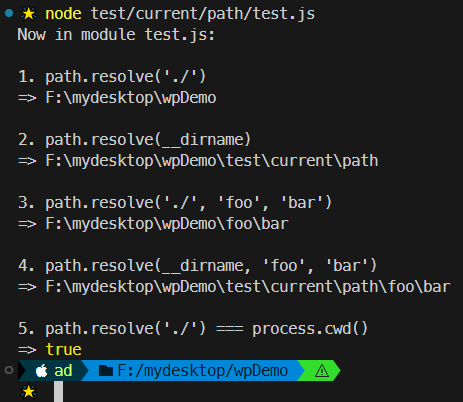
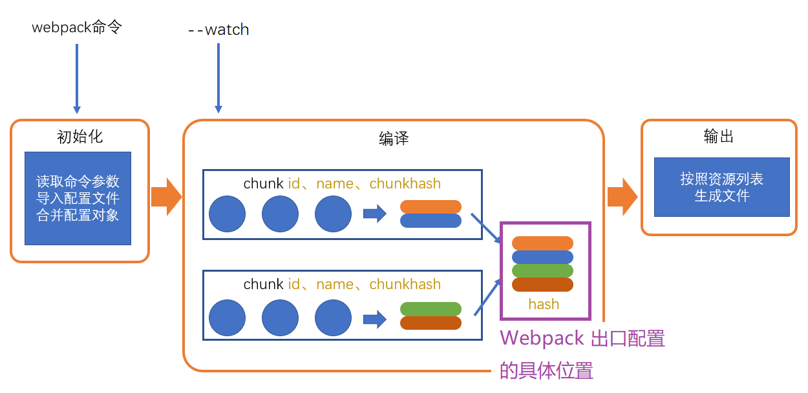
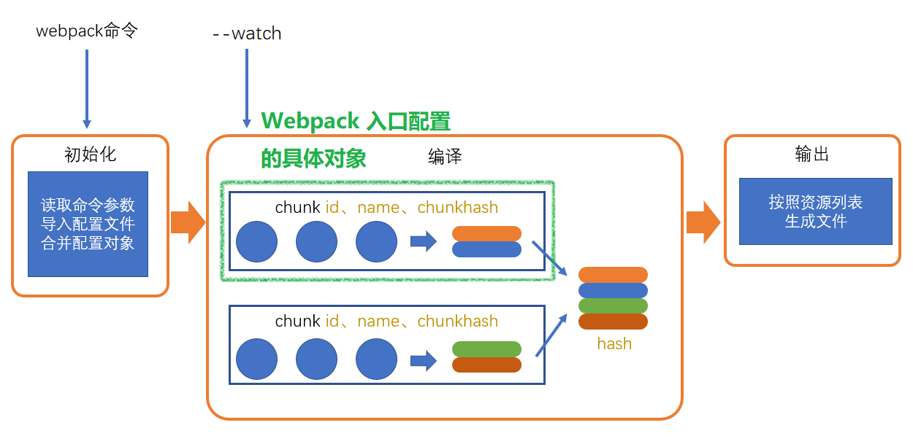
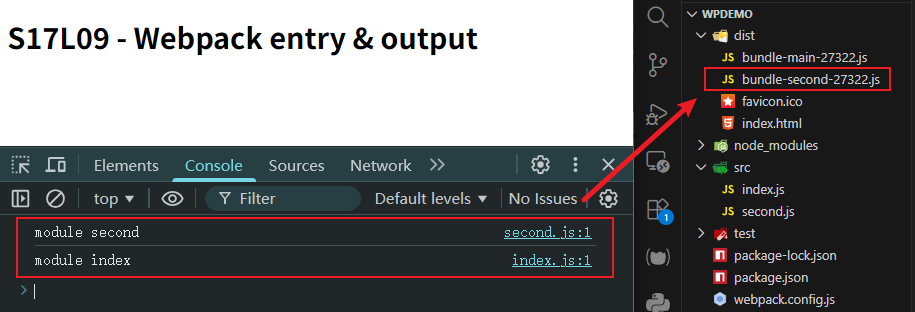
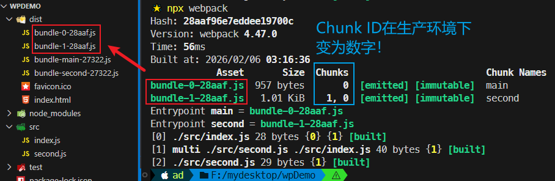

# L09：Webpack 的入口与出口配置

---


## 1 关于当前路径的两种写法

在 `node` 环境中，当前路径有两种写法：`./` 和 `__dirname`。

`__dirname` 是 `Node.js` 中的特殊变量，它在 **任何情况下** 都表示 **当前运行的 JavaScript 文件所在的目录**，并且是 **绝对路径**。

而 `./` 的具体含义，又分两种情况——

1. 在模块化代码中：如 `require("./")`，表示当前 `JavaScript` 文件所在的目录（同 `__dirname`）；
2. 在路径处理中：`./` 表示 `node` 的运行目录。


### DIY：验证 ./ 的第二种情况

`./` 的第一种情况就是平时一直在用的概念，不必验证。

对于第二种情况，原视频说【没法测试】，仅口头描述了 `./` 的具体含义；实测时为了验证第二种情况，借助 `Node.js` 的内置模块 `path` 提供的路径解析接口 `path.resolve()`，自行设计了如下案例脚本：

```js
// test/current/path/test.js:
const path = require('node:path');

const getExpression = fn => fn.toString().replace('() => ', '');

const cases = [
  () => path.resolve('./'),
  () => path.resolve(__dirname),
  () => path.resolve('./', 'foo', 'bar'),
  () => path.resolve(__dirname, 'foo', 'bar'),
  () => path.resolve('./') === process.cwd(),
];

console.log('Now in module test.js:');
cases.forEach((fn, i) => console.log(`
${(i + 1)}. ${getExpression(fn)} 
=>`, fn()));
```

导航到项目根目录，执行如下命令：

```powershell
# 输出当前路径
> (pwd).Path
F:\mydesktop\wpDemo
# 执行测试脚本
> node test/current/path/test.js
```

实测截图：



结论：

- 尽管 `./` 写在了最里层文件中，最终的路径解析结果都是 `node` 命令所在的路径；且该路径与 `node` 下的 `process.cwd()` 等效；
- `__dirname` 始终返回的是被执行的脚本所在的绝对路径。


## 2 关于 path.resolve 的正确用法

根据官方文档，`path.resolve()` 方法可以将一组路径序列（或路径片段）解析为 **绝对路径**，方向为 **从右向左**，**直到拼装出第一个绝对路径**。

原版文档摘录如下（`path` 文档详见：[https://nodejs.org/docs/latest/api/path.html](https://nodejs.org/docs/latest/api/path.html)）：

> [!tip]
>
> **`path.resolve([...paths])` [#](https://nodejs.org/docs/latest/api/path.html#pathresolvepaths)**
>
> Added in: v0.3.4
>
> - `...paths` [&lt;string>](https://developer.mozilla.org/en-US/docs/Web/JavaScript/Data_structures#string_type) A sequence of paths or path segments
> - Returns: [&lt;string>](https://developer.mozilla.org/en-US/docs/Web/JavaScript/Data_structures#string_type)
>
> The `path.resolve()` method resolves a sequence of paths or path segments into an absolute path.
>
> The given sequence of paths is processed from right to left, with each subsequent `path` prepended until an absolute path is constructed. For instance, given the sequence of path segments: `/foo`, `/bar`, `baz`, calling `path.resolve('/foo', '/bar', 'baz')` would return `/bar/baz` because `'baz'` is not an absolute path but `'/bar' + '/' + 'baz'` is.
>
> If, after processing all given `path` segments, an absolute path has not yet been generated, the current working directory is used.
>
> The resulting path is normalized and trailing slashes are removed unless the path is resolved to the root directory.
>
> Zero-length `path` segments are ignored.
>
> If no `path` segments are passed, `path.resolve()` will return the absolute path of the current working directory.
>
> ```js
> path.resolve('/foo/bar', './baz');
> // Returns: '/foo/bar/baz'
> 
> path.resolve('/foo/bar', '/tmp/file/');
> // Returns: '/tmp/file'
> 
> path.resolve('wwwroot', 'static_files/png/', '../gif/image.gif');
> // If the current working directory is /home/myself/node,
> // this returns '/home/myself/node/wwwroot/static_files/gif/image.gif'
> ```


## 3 Webpack 出口的配置

这里的 **出口（Output）** 是针对 `assets` 资源列表中的 **文件名或路径** 的配置：



出口通过 `Webpack` 的 `output` 选项进行配置。

`output` 的值是一个 `JS` 对象，里面包含（视频讲到的）：

- `path`：表示资源放置的文件夹，默认是 `dist` 目录，必须是 **绝对路径**（通常借助 `path` 模块拼接实现）；
- `filename`：表示打包合并后的 `JS` 文件所遵循的规则——
  - 静态规则：`"bundle.js"`、`"seg1/seg2/bundle.js"` 等；
  - 动态规则：主要用于存在多个入口模块的情况，文件名中可以包含多个占位符，写作 `[placeholder]-foo.[placeholder].bar.js`。

可用的占位符包括：

- `[name]`：即 `chunkname`；
- `[hash]`：总的资源 `Hash`，通常用于解决浏览器缓存带来的更能滞后的问题；
  - `[hash:5]`：只截取前 5 位 `hash` 值。
- `[chunkhash]`: 使用 `chunkhash` 值，可对文件变更实施更精准的控制（其他文件若未改动，则无需重新请求 `JS` 文件）
- `[id]`: 即使用 `chunkid`，不推荐（因为生产环境为变为数字编号）


## 4 Webpack 入口的配置

:star: :star: :star: 重点：入口配置针对的对象是 `chunk`：



入口通过 `Webpack` 的 `entry` 选项进行配置。

`entry` 的值同样是一个 `JS` 对象，之前介绍的 `entry: './src/index.js'` 是缩写形式，完整写法为：

```js
module.exports = {
    entry: {
        main: './src/index.js'
    }
}
```

其中，`main` 表示 `Chunk` 的名称，`'./src/index.js'` 表示入口模块（也叫启动模块）的 `moduleId`。


## 5 实测备忘

:one: 配置 `entry` 入口时，如果属性值为一个 `moduleId` 数组，则打包后的 `JS` 文件会同时运行这两个 `moduleId` 对应的模块：



此时对应的入口配置为：

```js
const path = require('node:path');

module.exports = {
  mode: "development",
  entry: {
    main: './src/index.js',
    second: ['./src/second.js', './src/index.js']
  },
  output: {
    path: path.resolve(__dirname, 'dist'),
    filename: 'bundle-[name]-[hash:5].js'
  }
};
```


:two: 关于出口文件名为何不推荐使用 `chunkid` 的验证：切到生产环境后，打包文件的 `chunkID` 从文字变为了数字，可读性极差——

修改 `Webpack` 配置文件，切换到生产模式，同时出口文件名引入 `chunkid`：

```js
const path = require('node:path');

module.exports = {
  mode: "production",
  entry: {
    main: './src/index.js',
    second: ['./src/second.js', './src/index.js']
  },
  output: {
    path: path.resolve(__dirname, 'dist'),
    // filename: 'bundle-[name]-[hash:5].js'
    filename: 'bundle-[id]-[hash:5].js'
  }
};
```

最终结果如下（可读性极差）：



另外注意到：即便项目的文件内容完全不变，生成的两次打包结果对应的总 `Hash` 值也不一样（`28aaf` v.s. `27322`），这从侧面也说明 `Hash` 值在计算时除了考虑文件内容是否变动，还有其他因素影响最终结果（具体未展开讨论）。

> [!tip]
>
> 为此 `DeepSeek` 给出的回复是：
>
> 这种情况说明 `Webpack` 的 `Hash` 计算并不**仅**依赖于文件内容。实际上，Hash 值的变化可能由以下多种因素导致：
>
> **主要影响因素**
>
> 1. 构建时间戳（`Build Timestamps`）：即使文件内容相同，`Webpack` 可能会在生成的文件中包含构建时间戳，这会影响最终 `Hash`。
> 2. 构建 `ID`（`Build ID`）：`Webpack` 会为每次构建生成唯一的构建 `ID`，通常是一个递增的数字或随机值。
> 3. 模块 `ID`（`Module IDs`）：
>    1. 默认情况：`Webpack` 给每个模块分配数字 `ID`（0, 1, 2...）
>    2. 模块顺序变化：即使内容相同，如果模块加载顺序改变，`ID` 分配也会变化
>    3. 使用 `HashedModuleIdsPlugin` 可以解决此问题，使用基于文件路径的 `Hash` 作为模块 `ID`
> 
> 4. `Chunk ID` 和 顺序：`Chunk` 的生成顺序和 `ID` 分配会影响最终的 `Hash` 值。
>
> 5. `Webpack` 运行时（`Runtime`）代码：每次构建时，`Webpack` 会生成一段运行时代码；
>
> 6. `Chunk` 的包含内容标识：`Chunk` 的 `Hash` 计算会考虑该 `Chunk` 包含的所有模块 `ID`，而不仅仅是内容。
>
> 
>**关键结论**：`Webpack` 的 `Hash` 值设计上就不是纯粹的内容 `Hash`，它反映了 **整个构建过程的状态**。要获得完全相同的 `Hash`，需要确保整个构建环境、配置、依赖和顺序完全一致。对于生产部署，建议使用 `contenthash` 结合确定性构建配置。
