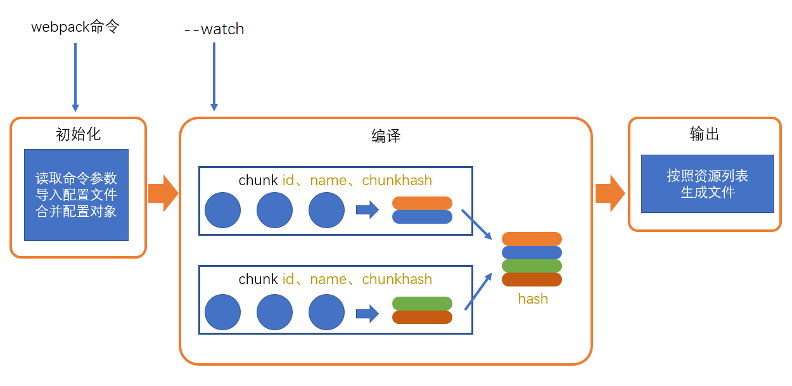
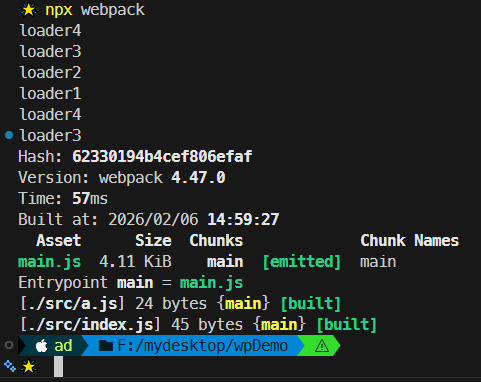
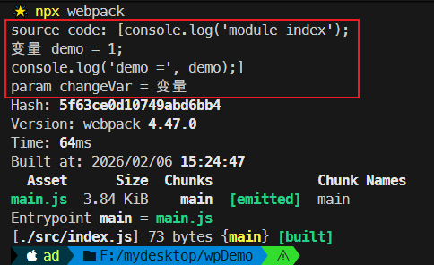
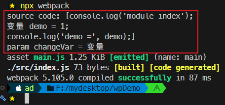
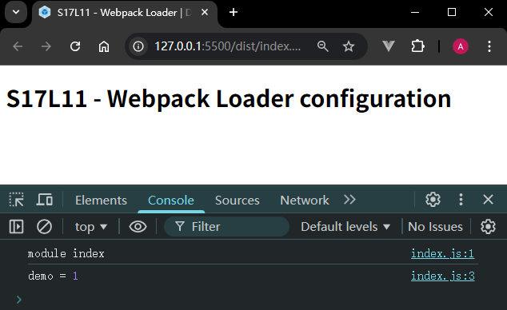

# L11：Webpack 中的 loader 加载器

---


## 1 概述

`Webpack` 的核心功能，在于 **分析** 出各种模块的依赖关系，然后形成 **资源列表**，最终 **打包** 生成到指定的文件中。

更多的其他功能需要借助 `webpack loaders` 和 `webpack plugins` 完成（预留了两套扩展接口）。

`webpack loader`： `loader` 本质上是一个 **函数**，其作用是将某个源码字符串转换成另一个源码字符串返回。


## 2 loader 的解析流程

核心要点：`loader` 函数将在 **模块解析的过程中** 被调用，最终返回处理后的源代码。

复习：`Webpack` 的编译全流程（宏观）：



复习：未引入 `loader` 时，`Webpack` 在 `Chunk` 中解析模块的流程：


新增：引入 `loader` 后，`Webpack` 在 `Chunk` 中解析模块的 **更细致流程**：


新增：`loader` 的处理流程（注意 `loader` 部分的箭头，旨在强调其 **逆向** 执行机制）：


### 示例一：解析 【变量 a = 1;】

本节通过自定义的 `loader` 处理 `JS` 模块中的特殊写法：`变量 a = 1;`。

最终配置：

```js
// 先安装一个开发依赖
// > npm i -D loader-utils

// loaders/test-loader.js:
var loaderUtils = require("loader-utils");
module.exports = function(sourceCode){
    //sourceCode : 变量 a = 1;
    console.log("test-loader1 运行了")
    var options = loaderUtils.getOptions(this)
    console.log(options);  // {chageVar: '变量'}
    var reg = new RegExp(options.changeVar, "g");
    return sourceCode.replace(reg, "var");
};

// webpack.config.js:
module.exports = {
    module: {
        rules: [
            {
                test: /index\.js$/, 
                use: [
                    {
                        loader: './loaders/test-loader.js', 
                        options: {changeVar: '变量'}
                    },
                    // 或者将上述对象直接写成 moduleId + 查询参数的形式：
                    './loaders/test-loader.js?changeVar=变量',
                ]}
        ]
    }
};
```


## 3 loader 的具体配置

完整配置：

```js
module.exports = {
    module: { // 针对模块的配置，目前版本只有两个配置，rules、noParse（未展开）
        rules: [ // 模块匹配规则，可以存在多个规则
            { // 每个规则是一个对象
                test: /\.js$/, // 匹配的模块正则
                use: [ // 匹配到后应用的规则模块
                    {  // 其中一个规则
                        loader: "模块路径", // loader 模块的路径（模块 ID），该字符串会被放置到 require 中
                        options: { //向对应 loader 传递的额外参数
                            anyKey: anyValue
                        },
                    },
                    // 上述 loader 对象也可以简写为【模块ID + 查询参数】的形式：
                    "模块路径?anyKey=anyValue",
                ],
            },
        ],
    },
};
```

简化配置：

```js
module.exports = {
    module: {
        rules: [ // 模块匹配规则，可以存在多个规则
            { // 每个规则是一个对象
                test: /\.js$/, // 匹配的模块正则
                use: ["模块路径1", "模块路径2"] // loader 模块的路径（模块 ID），该字符串会被放置到 require 中
            }
        ]
    }
}
```


## 4 执行多个 loader 的先后顺序

匹配 `loader` 规则时按 **正向** 匹配，执行 `loader` 处理逻辑时按 **逆向** 组合：

DIY：`loader` 的收集过程类似一个 **入栈** 的操作：

```js
rules = [loader1, loader2, loader3, loader4];
loader = compose(loader1, loader2, loader3, loader4)
newSrcCode = loader(oldSrcCode);
```


### 示例二：若存在 require 导入

假设 `index.js` 通过 `require()` 函数导入了模块 `a`：

```js
// webpack.config.js:
module.exports = {
  mode: "development",
  module: {
    rules: [
      {test: /index\.js$/, use: ['./loaders/loader1.js', './loaders/loader2.js']},
      {test: /\.js$/, use: ['./loaders/loader3.js', './loaders/loader4.js']},
    ]
  }
}
// ./src/index.js:
require('./a.js');
console.log('module index')
```

按照 `Webpack` 的编译流程、并结合 `loader` 的处理流程，最终打包时 `loader` 的执行顺序是：

```markdown
loader4
loader3
loader2
loader1
loader4
loader3
```

实测结果：




> [!tip]
>
> **思考**
>
> `loader` 中可否按 `ES6` 的模块化标准书写处理逻辑？
>
> （不可以，因为 `loader` 是在 `Webpack` 打包过程中运行的，此时处于 `node` 环境中，而 `Webpack` 并没有考虑这种情况，因此只能采用 `CommonJS` 规范）


## 5 实测备忘

:one: 关于 `loader-utils` 接口已作废的问题。

实测时发现新版 `loader-utils` 工具库已经废弃 `loaderUtils.getOptions(this);` 的写法了，只有安装视频中指定的版本（`v1.2.3`）才行：

```bash
> npm i -D loader-utils@1.2.3
```

获取 `options` 参数的最新方案是升级到 `Webpack 5`（无需安装开发依赖包 `loader-utils`），直接使用 `Webpack` 内置的 `this.getOptions()` 来获取自定义参数：

```js
// Webpack 5
module.exports = function (srcCode) {
  console.log('source code:', `[${srcCode}]`);
  const { changeVar } = this.getOptions();
  console.log('param changeVar =', changeVar);
  const regexp = new RegExp(changeVar, 'g');
  // Do convertion
  return regexp.test(srcCode) ? srcCode.replace(regexp, 'var') : srcCode;
};
```

旧版打包结果：



新版打包结果（命令行更简洁）：



将打包后的 `JS` 文件引入 `index.html`：


