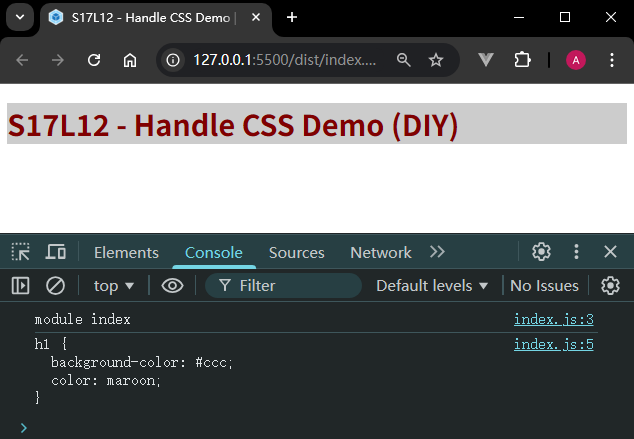

# L12：Webpack 实战：用自定义 loader 处理 CSS 样式

---

本节利用 L11 介绍的 `loader` 的知识，将源代码中的 `CSS` 文件通过自定义 `loader` 的形式打包到最终结果并呈现对应的样式。

实测效果图：




## 实战备忘

:one: 核心逻辑：匹配到 `CSS` 文件后，在 `loader` 函数中手动创建 `style` 元素并插入样式内容，最后将所有 `JS` 代码用模板字符串返回即可。

```js
// loaders/style-loader.js
module.exports = function(srcCode) {
  return `const style = document.createElement('style');
style.innerHTML = \`${srcCode}\`;
document.querySelector('head').appendChild(style);
module.exports = \`${srcCode}\`;`
}
```


:two: 要得到 `require('path/to/css/file.css')` 的返回结果，本质就是将源代码通过 `module.exports` 再次导出。


:three: 注意模板字符串内部的反引号的转义。