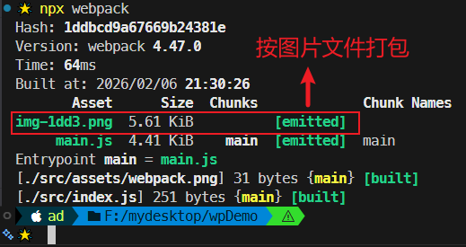
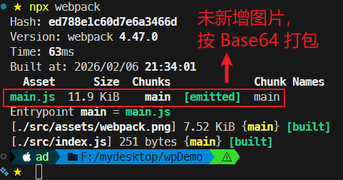
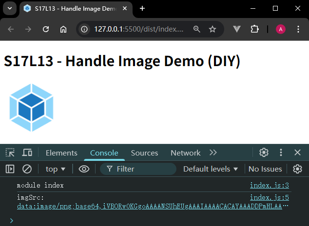

# L13：Webpack 实战：用自定义 loader 处理图片

---


## 1 概述

本节利用 `L11` 介绍的知识，通过自定义 `loader` 函数，并根据图片文件的字节大小，动态决定最终的打包结果（图片文件或 `Base64` 编码）。


## 2 实测备忘

:one: 二进制文件内容应该按 `buffer` 缓冲区读取，而非字符串：

```js
const imgLoader = function(buffer) {
    // ...
}
imgLoader.raw = true;
module.exports = imgLoader;
```


:two: 将 `buffer` 内容转 `Base64` 编码：

```js
const getBase64 = buffer => `data:image/png;base64,${buffer.toString('base64')}`;
```


:three: 利用 `loader-utils` 动态生成打包文件的文件名（嵌入占位符）：

```js
function getFilename(buffer, filename) {
  const imgName = loaderUtils.interpolateName(this, filename, {
    content: buffer
  });
  this.emitFile(imgName, buffer);
  return imgName;
}
```

更多用法，详见官方文档：https://www.npmjs.com/package/loader-utils。


实测效果：

按图片打包（图片大小超过自定义阈值）：



按 `Base64` 编码后的图片字符串打包（图片大小未超过自定义阈值）：



最终效果：

