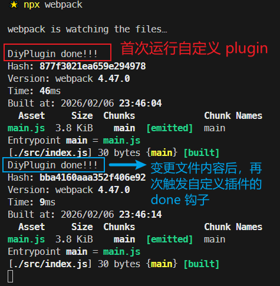

# L14：Webpack plugin 的配置方法

---


> [!important]
>
> 学习本节前再次重申：明确 `Webpack` 中的 `plugin` 插件的技术边界，学会抓大放小即可。
>
> 试图在本节中完全掌握 `plugin` 的各种配置是不切实际的，也大可不必。


## 1 plugin 的由来

`loader` 的功能定位是 **转换代码**，而对于 `Webpack` 中的某些操作难以通过 `loader` 完成，例如：

- 当 `Webpack` 生成文件时，顺便多生成一个说明描述文件；
- 当 `Webpack` 编译启动时，控制台输出一句话，表示 `Webpack` 启动了；
- 当 …… 时，实现 ……

这类操作需要把功能点嵌入到 `Webpack` 的编译流程中。`Webpack` 通过 `plugin` 插件机制来实现这类操作需求：


## 2 plugin 的创建与注册

`plugin` 的 **本质** 是一个 **带有 apply 方法的对象**（类似 `Java` 的函数式接口 `Function`）：

```js
var plugin = {
    apply: function(compiler){
        
    }
}
```

通常，习惯上，我们会将该对象写成构造函数的模式：

```js
class MyPlugin{
    apply(compiler){

    }
}

var plugin = new MyPlugin();
```

要将插件应用到 `Webpack`，需要把插件对象配置到 `Webpack` 的 `plugins` 数组中：

```js
module.exports = {
    plugins:[
        new MyPlugin()
    ]
}
```


## 3 compiler 对象与 compilation 对象

`apply` 函数的运行时机：在 `Webpack` 初始化阶段创建好 `Compiler` 对象后运行。

`compiler` 对象是在初始化阶段构建的，整个 `Webpack` 打包期间只有一个 `compiler` 对象；后续完成打包工作的是 `compilation` 对象，它是在 `compiler` 对象内部创建的另一个对象。

启用 `watch` 监听模式后，每次更新源代码内容都会生成一个新的 `compilation` 对象，但 `compiler` 全程仅有一个实例。

`apply` 方法会在 **创建好 compiler 对象后被调用**，并向方法传入一个 `compiler` 对象：


## 4 钩子函数的注册

`compiler` 对象提供了大量的钩子函数（`hooks`，可以理解为事件），`plugin` 的开发者可以注册这些钩子函数，参与 `Webpack` 编译和生成。

你可以在 `apply` 方法中使用下面的代码注册钩子函数：

```js
class MyPlugin{
    apply(compiler){
        compiler.hooks.事件名称.事件类型(name, function(compilation){
            // 事件处理函数
        })
    }
}
```

**事件名称**

即要监听的事件名，即钩子名，所有的钩子：

- `Webpack 4` 中文版：https://www.webpackjs.com/api/compiler-hooks
- `Webpack 5` 英文本（:star: 推荐）：https://webpack.js.org/api/compiler-hooks/


**事件类型**

这一部分使用的是 [Tapable API](https://github.com/webpack/tapable)，这个小型的库是一个专门用于钩子函数监听的库。

它提供了一些事件类型：

- `tap`：注册一个同步的（`synchronous`）钩子函数，函数运行完毕则表示事件处理结束；
- `tapAsync`：注册一个基于回调（`callback-based`）的异步的钩子函数，函数通过调用一个回调表示事件处理结束；
- `tapPromise`：注册一个基于 `Promise` 的（`promise-based`）异步的钩子函数，函数通过返回的 `Promise` 进入 **已决状态** 表示事件处理结束。


**处理函数**

处理函数有一个事件参数 `compilation`。


## 5 实测备忘

实测 `compiler` 钩子 `done` 的注册：



在开启监听模式后，随意修改 `./src/index.js` 模块内容，`done` 钩子多次触发。