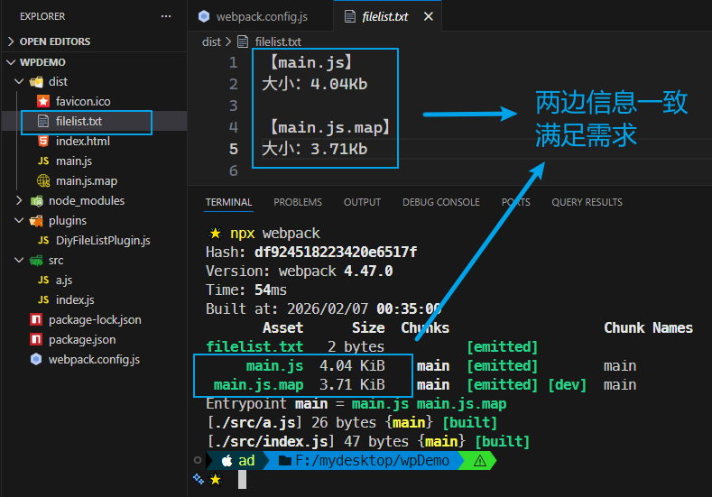

# L15：Webpack 实战：用自定义 plugin 添加文件列表

---


## 1 概述

需求描述：创建一个 `Webpack` 插件，实现在最终的打包结果中新增一个文本文件，其中包含本次打包过程中生成的文件相关信息，具体格式如下：

```markdown
【文件名1】
大小：{xxx}Kb

【文件名2】
大小：{xxx}Kb

……
```


核心逻辑：

```js
// plugins/DiyFileListPlugin.js:
module.exports = class DiyFileListPlugin {

  constructor(filename) {
    this.filename = filename;
  }

  apply(compiler) {
    const filename = this.filename;
    compiler.hooks.emit.tap('DiyFileListPlugin-emit', function(compilation) {
      const { assets } = compilation;
      const contents = [];
      for (const iFilename in assets) {
        const content = assets[iFilename];
        const size = Math.round(100 * content.size() / 1024) / 100;
        contents.push(`【${iFilename}】\n大小：${size}Kb\n`);
      }

      compilation.assets[filename] = {
        source(){
          return contents.join('\n');
        },
        size() {
          return contents.length;
        }
      };
    });
  }
}


// webpack.config.js
const DiyFileListPlugin = require('./plugins/DiyFileListPlugin');
module.exports = {
  mode: "development",
  devtool: 'source-map',
  plugins: [
    new DiyFileListPlugin('filelist.txt'),
  ]
};
```


> [!tip]
>
> `loader` vs `plugin`
>
> 通过演示案例可知，`plugin` 比 `loader` 能实现更多功能；`loader` 能实现的功能 `plugin` 勉强也能实现，只是侧重点不一样，不如 `loader` 直接。


## 2 实测备忘录

:one: 根据 `assets` 获取文件尺寸信息，错写成 `content.length`，其实应该直接调用 `content.size()` 方法。

:two: 最终的结果应该除以 `1024` 而非视频中的 `1000`；且最后的浮点值应该保留两位小数。

:three: 利用 `ES6` 的 `class` 语法糖还可以给自定义插件设计更多配置参数，在 `node` 环境下可随意发挥。

:four: 模拟 `assets` 对象结构新增文件时，回调没有用箭头函数，导致 `this` 的含义改变，无法正确获取配置的文件名：

```js
apply(compiler) {
    const filename = this.filename;
    compiler.hooks.emit.tap('DiyFileListPlugin-emit', function(compilation) {
        compilation.assets[filename] = {
            ...
        }
    });
}
```


实测截图：

