# L17：Webpack 其他细节配置

---

> [!tip]
>
> 实测内容括号中使用的 `Hash` 值为 `Git` 专属分支 `L17_details` 中的 `commit` 版本 `ID`（即 `SHA-ID`）。用于后续基于该 `ID` 进行拓展练习。


## 1 概述

本节内容属于典型的【细枝末节】，学习要求：

- 务必知道它能干什么；
- 至于它是怎么实现的，忘了就忘了。

将来遇到相关问题再来探明细节即可。

举例：驳斥【学了那么多技术、看了那么多书又有什么用？】论调：十年前吃过的饭是白吃的吗？

为了实现第一个目标，第一遍需要 **认真学、仔细练**，建立知识体系。

虽然还是会忘，但学过和没学过，完全是两回事。


## 2 context

用法：

```js
const path = require('node:path');
module.exports = {
    context: path.resolve(__dirname, "app")
}
```

该配置会影响 `entry` 和 `loader` 中的默认解析路径（即 `process.cwd()` [^1]），配置后均以 `context` 设置的绝对路径为基准。这样，`Webpack` 的配置就独立于`CWD`（`Current Working Directory`，即当前执行路径）。

实测（`a7886f3`）：

```js
// webpack.config.js:
const path = require('node:path');

module.exports = {
  mode: "development",
  context: path.resolve(__dirname, 'src'),
  entry: "./index.js", // i.e. ./src/index.js
  module: {
    rules: [{
      test: /index\.js$/,
      use: [{
        loader: '../loaders/loader1.js'  // i.e. ./loaders/loader1.js
      }]
    }]
  },
};
```

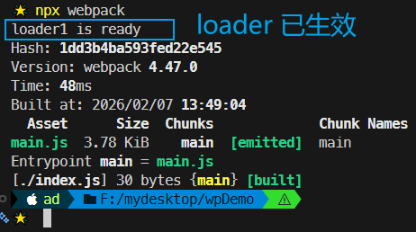


## 3 output

### :one: library

示例用法：

```js
module.exports = {
    library: "abc",
}
```

作用：打包结束后，会将生成的 `JS` 文件中的 `IIFE` 执行结果（返回值）暴露给全局变量 `abc`（以配合某些插件的使用）。

应用场景：类比 `jQuery` 库的引入。

实测（`87c52aa`）：

修改 `index.js` 模块：

```js
console.log("module index");
module.exports = {
  library: 'DIY: output.library option in actoin'
}
```

实测打包效果：

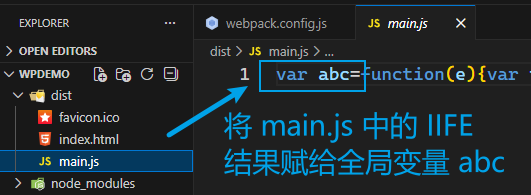

页面验证全局变量 `abc`：

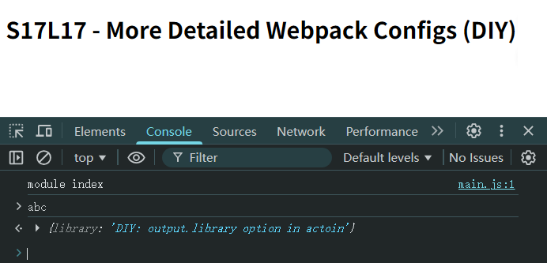


### :two: libraryTarget

```js
libraryTarget: "var"
```

该配置可以更加精细地控制如何暴露 `entry` 的导出结果，默认使用 `"var"`，可选用的值包括：

- `var`：默认值，暴露给一个普通变量：`var abc = _entry_return_`（已实测）；
- `window`：暴露给 `window` 对象的一个属性：`window["abc"] = _entry_return_`（已实测）；
- `this`：暴露给 `this` 的一个属性：`this["abc"] = _entry_return_`（已实测）；
- `global`：暴露给 `global` 的一个属性：文档提示为 `global['MyLibrary'] = _entry_return_`，实测为 `window["abc"] = _entry_return_`；
- `commonjs`：暴露给 `exports` 的一个属性：`exports["abc"] = _entry_return_`（已实测）；
- 其他：https://v4.webpack.js.org/configuration/output/#outputlibrarytarget

实测值为 `window` 时（`5158528`）：

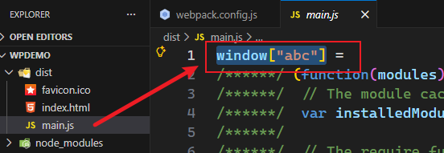


## 4 target

示例配置：

```js
module.exports = {
    target: "web" // 默认值
}
```

设置打包结果最终要运行的环境，常用值有：

- `web`：打包后的代码运行在 `Web` 环境中（即浏览器环境）
- `node`：打包后的代码运行在 `node` 环境中（可直接用 `node` 命令执行）
- 其他：https://v4.webpack.js.org/configuration/target/（已更新）

实测（`ff112ff`）：

将 `target` 设为浏览器环境，然后强制打印 `node` 内置模块 `fs`：

```js
// src/index.js:
const fs = require('node:fs');
console.log("module index");
console.log(fs);
```

页面和打包过程均报错：

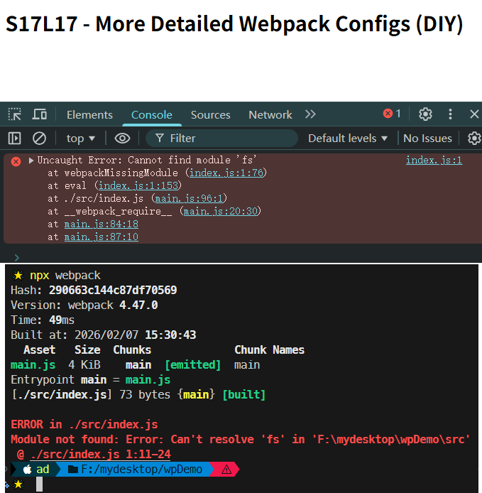

如果改为 `target: "node"`，打包和 `node` 执行均正常：

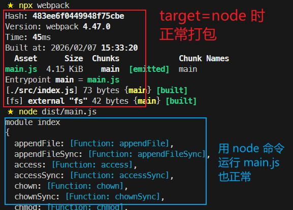


## 5 module.noParse

示例配置：

```js
module.exports = {
    module: {
        noParse: /jquery/
    }
}
```

不解析正则表达式匹配的模块，通常用它来忽略那些大型的单模块库（`jQuery.js`、`D3.js` 等），以提高 **构建性能**。

> [!note]
>
> **注意**：该配置多用于避免对一些成熟的第三方库重复打包，仅提高打包时的性能，对打包结果的运行性能没有影响。

实测（`3129204`）：

```js
// (npm i juqery@3)
// src/index.js:
const $ = require('jquery');
console.log("module index");
console.log('$ = ', $);
```

对比 `noParse` 开启前后的打包时间：

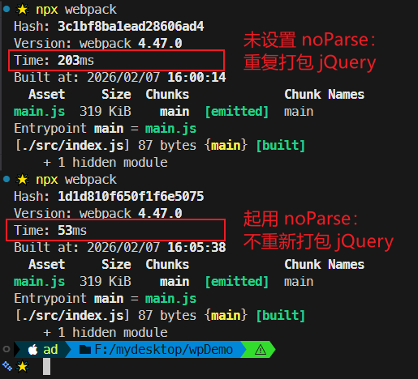


## 6 resolve

`resolve` 的相关配置主要用于控制模块解析过程。

### :one: modules

用法：

```js
module.exports = {
  resolve: {
    modules: ["node_modules"]  // 默认值
  }
}
```

当 `Webpack` 解析模块时，如果遇到导入语句 `require("jquery")`，`Webpack` 会从下列位置寻找依赖模块——

1. 当前目录下的 `node_modules` 目录

2. 上级目录下的 `node_modules` 目录

   ……

**【适用场景】**（`DeepSeek` 增补）：

- 当项目中有特殊的目录结构时（非默认位置）；

- 多项目共享组件库（例如引用上级目录的共享组件）；

- 提升绝对路径导入的可读性：

  ```js
  // 配置前
  import Button from '../../../components/Button';
  
  // 配置后（在 resolve.modules 中添加 'src'）
  import Button from 'components/Button';
  ```

- 优化 `TypeScript`/`JavaScript` 混合项目：

  ```js
  resolve: {
    modules: [
      'src',           // 优先搜索源码目录
      'node_modules'
    ],
    extensions: ['.ts', '.js', '.tsx', '.jsx']
  }
  ```


实测（`a8e2c6f`）：

先将 `jQuery` 自定义安装到其他目录下：

```bash
> npm i jquery@3 --prefix abc
```

此时 `jQuery` 位于 `./abc/node_modules/` 路径下（此时 `package.json` 文件也不会记录该依赖信息）。

然后保持 `resolve` 默认设置，此时 `Webpack` 打包报错：

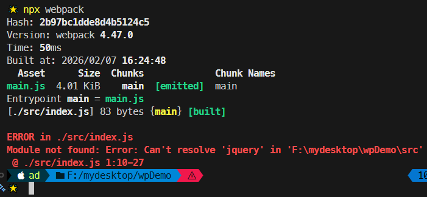

修改 `modules` 配置后恢复正常打包：

```js
// webpack.config.js:
module.exports = {
  resolve: {
    modules: ['abc/node_modules']
  }
};
```

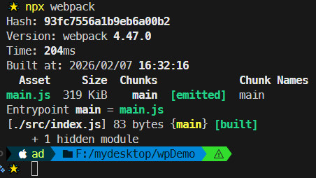


### :two: extensions

```js
module.exports = {
  resolve: {
    extensions: [".js", ".json"]  // 默认值
  }
}
```

当解析模块时，遇到无具体后缀的导入语句，例如 `require("test")`，会根据依次测试它的后缀名：

- `test.js`
- `test.json`


> [!tip]
>
> **面试题**
>
> ```js
> // 为什么没有书写后缀名，依然可以找到 a.js 模块？
> const a = require('./a');
> ```
>
> 答：因为 `Webpack` 会根据 `resolve.extensions` 配置自动补全模块的扩展名（即后缀名）。

实测 `.jsx` 后缀的自动识别（`b368e0c`）：

改造入口模块：

```js
// ./src/index.js:
require('./a');
console.log("module index");
// ./src/a.jsx:
console.log("module a.jsx");
module.exports = "a";

// webpack.config.js:
module.exports = {
  mode: "development",
  entry: "./src/index.js",
  resolve: {
    extensions: [
      '.js', 
      '.json', 
      '.jsx'  // used in React
    ]
  }
};
```

打包结果：

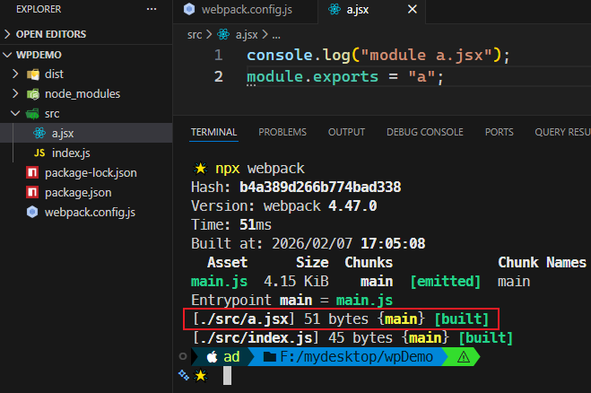

实际运行情况：

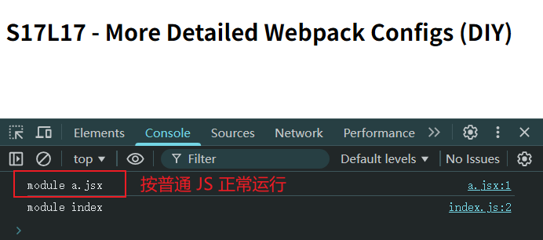


### :three: alias

示例配置：

```js
// const path = require('node:path');
alias: {
  "@": path.resolve(__dirname, 'src'),
  "_": __dirname
}
```

有了 `alias`（别名）后，导入语句中可以加入配置的键名，例如 `require("@/abc.js")`，`Webpack` 会将其看作是 `require(<src的绝对路径> + "/abc.js")`。

在大型项目中，源码结构往往比较深且复杂，别名配置可以让我们更加方便地导入依赖。

实测（`5c6d7c1`）：

```js
// ./src/index.js
require('@/components/sub1/sub2/sub3/foo');
const packageJson = require('_/package.json');

console.log("module index");
console.log('项目名称:', packageJson.name);
```

模拟深层路径依赖：

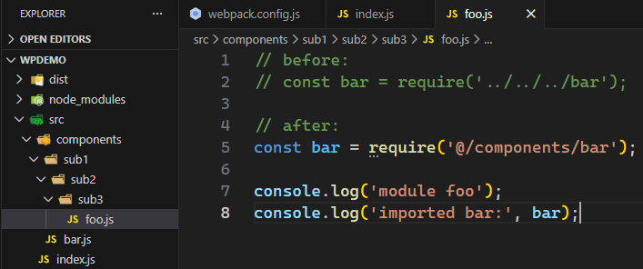

引入最终的打包文件效果：

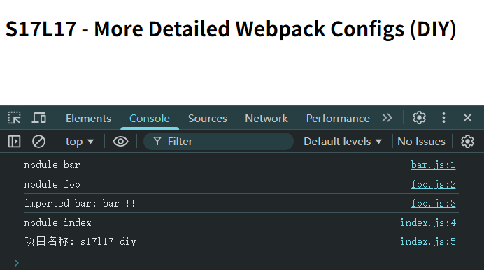


## 7 externals

```js
externals: {
    jquery: "$",  // 最好先确认 $ 是 jQuery 的全局变量，以免冲突
    lodash: "_"
}
```

这样会从最终的 `bundle` 中排除掉配置的这两个库的源码，例如：

```js
// ./src/index.js:
require("jquery");
require("lodash");
```

配置 `externals` 前，打包生成的 `bundle` 文件类似如下结构（包含大量第三方库的源码）：

```js
(function(){
    ...
})({
    "./src/index.js": function(module, exports, __webpack_require__){
        __webpack_require__("jquery")
        __webpack_require__("lodash")
    },
    "jquery": function(module, exports){
        //jquery 的大量源码
    },
    "lodash": function(module, exports){
        //lodash 的大量源码
    },
})
```

但有了上面的 `externals` 配置，打包结果则变成了：

```js
(function(){
    ...
})({
    "./src/index.js": function(module, exports, __webpack_require__){
        __webpack_require__("jquery")
        __webpack_require__("lodash")
    },
    "jquery": function(module, exports){
        module.exports = $;  // 来自之前的 CDN 加载的 jQuery 全局变量
    },
    "lodash": function(module, exports){
        module.exports = _;  // 来自之前的 CDN 加载的 Lodash 全局变量
    },
})
```

> [!note]
>
> **注意**
>
> 如果借助 `CDN` 暴露的全局变量名分别是 `jq` 和 `lo`，那么上述导出的值就应该也是 `jq` 和 `lo`。

适用场景：该配置适用于一些第三方库来自外部 `CDN` 的情况。这样就能实现——

- 在页面中使用 `CDN`；
- 让打包后的 `bundle` 体积变得更小；
- 完全不影响项目源码的编写。


**实测**：在源码中也用 `$` 和 `_` 作为标识符，是否也对最终页面的运行毫无影响？（`91ea391`）

引入 `CDN`：

```html
<script src="https://cdn.jsdelivr.net/npm/jquery@3.6.0/dist/jquery.min.js"></script>
<script src="https://cdn.jsdelivr.net/npm/lodash@4.17.23/lodash.min.js"></script>
```

改造入口模块：

```js
// ./src/index.js
const $ = require('jquery');
const _ = require('lodash');

$(function() {
  $('h1').css({
    'font-style': 'italic',
    'background': '#eee'
  });
});

const arr = _.map([1, 2, 3], n => n ** 2);
console.log('arr:', arr);
```

最终效果（项目代码中使用 `$` 和 `_` 完全不受影响）：

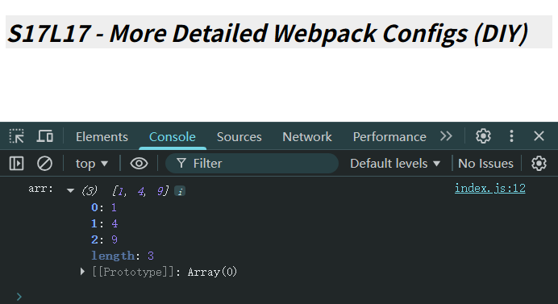

使用 `externals` 配置前后的打包结果对比：

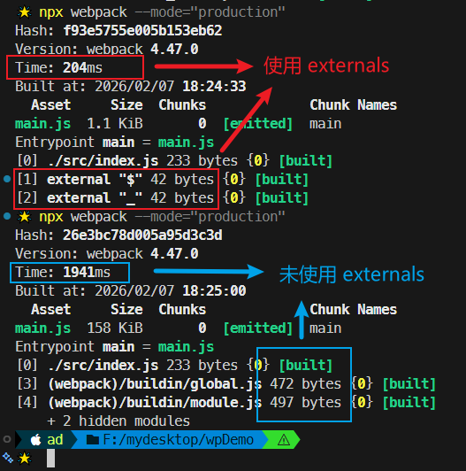


## 8 stats

`stats` 控制的是构建过程中控制台的输出内容，如是否显示打包时间、是否打印模块明细、是否展示总 `Hash` 值等。

详细配置参考官方文档：https://v4.webpack.js.org/configuration/stats/

实测（`24cd67a`）：

添加如下输出配置：

```js
// webpack.config.js:
module.exports = {
  stats: {
    colors: true, // 彩色输出
    modules: false,  // 不展示模块明细
    hash: false, // 不显示总 Hash 值
    builtAt: false  // 不显示打包时间
  }
}
```

实测结果：

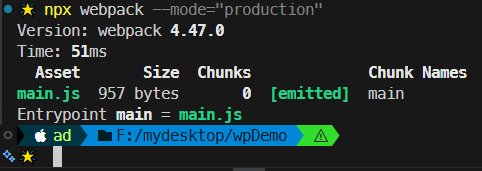


## 7 本章小结

本章重点在 `L05` 编译结果分析，以及 `L08` 编译过程。复习时从这两课开始，再贯通其他内容即可。


---

[^1]: 详见 `L09` 第一小节笔记内容。


