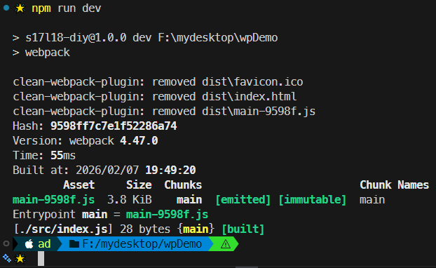

# L18：清除输出目录

---

本节对应第二篇第一课。

录制时间：`2020-01-17 13:00:00`


插件名：`clean-webpack-plugin`

作用：在 `Webpack` 生成新的打包结果前，清空之前的历史构建内容。

文档：

- `NPM` 文档：https://www.npmjs.com/package/clean-webpack-plugin
- `GitHub` 仓库：https://github.com/johnagan/clean-webpack-plugin

安装：

```bash
$ npm i -D clean-webpack-plugin
```

用法：

```js
// webpack.config.js:
const { CleanWebpackPlugin } = require('clean-webpack-plugin');
const options = {/* ... */};
module.exports = {
    plugins: [
        new CleanWebpackPlugin(/* options */),
    ]
}
```


实测效果（启用 `verbose` 选项）：



