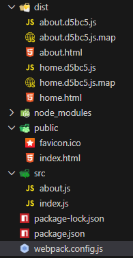
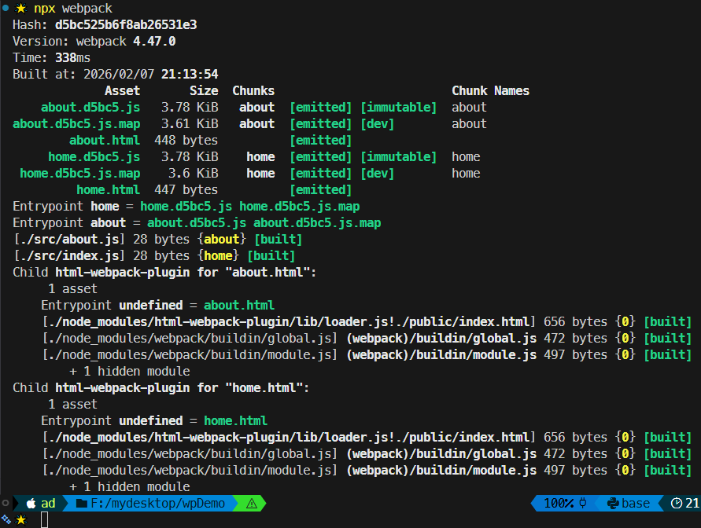

# L19：自动生成页面

---

本节对应第二篇第二课。

录制时间：`2020-01-17 13:50`


## 1 插件核心知识

插件名：`html-webpack-plugin`

作用：在 `Webpack` 打包时自动生成 `HTML` 页面引入打包结果，并且提供了丰富的配置项定制页面模板。

文档：

- `NPM` 文档：https://www.npmjs.com/package/html-webpack-plugin
- `GitHub` 仓库：https://github.com/jantimon/html-webpack-plugin

安装：

```bash
$ npm i -D html-webpack-plugin
```

用法：

```js
// webpack.config.js:
const HtmlWebpackPlugin = require('html-webpack-plugin');

const templateParameters = {
  favicon: '../public/favicon.ico',
  title: 'S17L19 - HTML Webpack Plugin | DIY',
  heading: 'S17L19 - HTML Webpack Plugin (DIY)'
};

module.exports = {
  mode: "development",
  devtool: 'source-map',
  entry: {
    home: './src/index.js',
    about: './src/about.js'
  },
  output: {
    filename: '[name].[hash:5].js',
  },
  plugins: [
    new CleanWebpackPlugin(),
    new HtmlWebpackPlugin({
      template: './public/index.html',
      chunks: ['home'],
      filename: 'home.html',
      templateParameters
    }),
    new HtmlWebpackPlugin({
      template: './public/index.html',
      chunks: ['about'],
      filename: 'about.html',
      templateParameters
    }),
  ]
};

```


## 2 实测备忘

:one: 实测时忘了配置插件参数 `filename`，导致无法生成多个文件。

:two: 网站图标路径通过模板参数引入，但是相对路径的写法（`../public/favicon.ico`）必须很仔细（不够智能）。

:three: 尝试通过 `templateParameters` 将模板中的三个动态内容用变量传入：

- 图标路径（注意相对路径的写法，插件不够智能）；
- 标签页标题；
- 页面标题。


实测效果（启用 `verbose` 选项）：

打包结果：



命令行输出情况：

