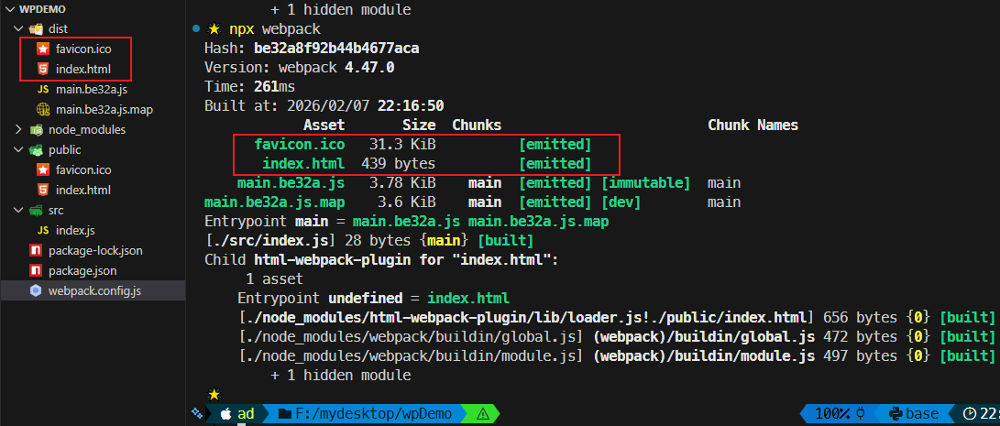
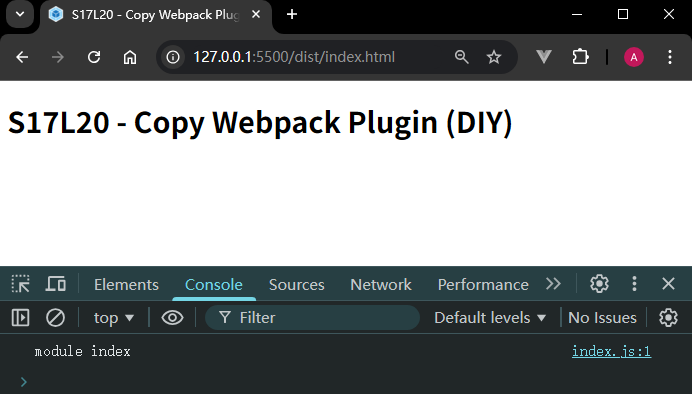

# L20：复制静态资源

---

本节知识能很好地解决 `L19` 实测遇到的问题。

本节对应第二篇第三课。

录制时间：`2020-01-17 15:20`


## 1 插件核心知识

插件名：`copy-webpack-plugin`

作用：打包时将指定的纯静态资源（如图片）统一复制到 `dist` 目录下，方便模板文件引用。

文档：

- `NPM` 文档：https://www.npmjs.com/package/copy-webpack-plugin
- `GitHub` 仓库：https://github.com/webpack/copy-webpack-plugin

安装（版本最好和视频保持一致）：

```bash
$ npm i -D copy-webpack-plugin@5
```

用法：

```js
// webpack.config.js:
const CopyPlugin = require("copy-webpack-plugin");
module.exports = {
  plugins: [
    new CopyPlugin([
      { from: './public', to: './' }
    ]),
  ],
};
```

注意：`to` 的相对位置是基于 `dist` 而言的。


## 2 实测备忘

:one: 首次实测没有控制插件版本，导致打包频繁报错；应严格与视频保持一致。

:two: 只需要把图标和模板都放到 `public` 目录下，到时候一并复制到 `dist` 下，相对路径就不会变化：

```html
<!-- ./public/index.html -->
<!DOCTYPE html>
<html lang="en">
  <head>
    <meta charset="UTF-8">
    <meta name="viewport" content="width=device-width, initial-scale=1.0">
    <link rel="shortcut icon" href="<%= favicon %>" type="image/x-icon">
    <title><%= title %></title>
  </head>
  <body>
    <h1 class="title"><%= heading %></h1>
  </body>
</html>
```

然后在 `Webpack` 中创建配置对象 `templateParameters`：

```js
// webpack.config.js:
const templateParameters = {
  favicon: './favicon.ico',
  title: 'S17L20 - Copy Webpack Plugin | DIY',
  heading: 'S17L20 - Copy Webpack Plugin (DIY)'
};
```

实测效果：



图标也正确加载：

