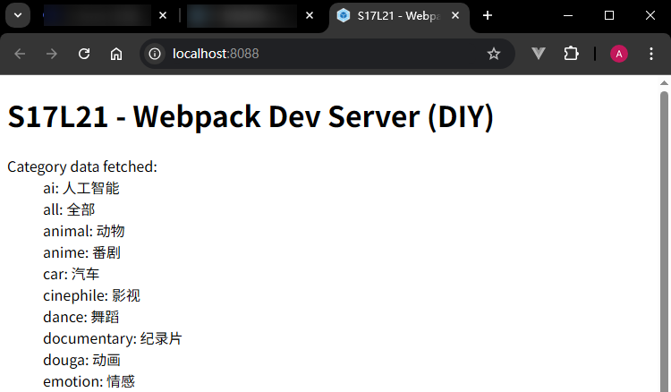

# L21：Webpack 开发阶段专用服务器配置

---

本节对应第二篇第四课。

录制时间：`2020-01-19 9:00`


## 1 概述

在 **开发阶段**，目前遇到的问题是打包、运行、调试过程过于繁琐，回顾一下我们的操作流程：

1. 编写代码

2. 控制台运行命令完成打包

3. 打开页面查看效果

4. 继续编写代码，回到步骤 2

   ……

并且，我们往往希望把最终生成的代码和页面部署到服务器上，来模拟真实环境。

为了解决这些问题，`Webpack` 官方制作了一个单独的库：**webpack-dev-server**。

> [!note]
>
> **注意**
>
> `webpack-dev-server` **既不是 plugin，也不是 loader**。

先来看看它怎么用

1. 安装：`npm i -D webpack-dev-server`

2. 执行 `webpack-dev-server` 命令：`npx webpack-dev-serve` 或者配置 `NPM` 运行脚本：

   ```json
   {
       "scripts": {
           "dev": "webpack-dev-server"
       }
   }
   ```

`webpack-dev-server` 命令几乎支持所有的 `Webpack` 命令参数，如 `--config`、`--env` 等等，你可以把它当作 `Webpack` 命令使用。

这个命令是 **专门为开发阶段服务的**，真正部署的时候还是得使用 `Webpack` 命令。

当我们执行 `webpack-dev-server` 命令后，它做了以下操作：

1. 内部执行 `Webpack` 命令，传递命令参数；
2. 开启 `watch` 监听模式；
3. 注册 `hooks`：类似于 `plugin`，`webpack-dev-server` 会向 `Webpack` 中注册一些钩子函数，主要功能如下：
   1. 将资源列表（`assets`）保存起来；
   2. 禁止 `Webpack` 输出文件；
4. 用 `express` 开启一个服务器，监听某个端口，当请求到达后，根据请求的路径，给予相应的资源内容。


**配置**

针对 `webpack-dev-server` 的配置，参考文档：

- 中文版：https://www.webpackjs.com/configuration/dev-server/
- 最新英文版（:star: 推荐）：https://v4.webpack.js.org/configuration/dev-server/


常见配置：

- `port`：配置监听端口
- `open [Browser Name]`：布尔值，启动后使用默认（或手动指定的）浏览器打开页面
- `index`：首页加载的具体页面（默认为 `"index.html"`）
- `proxy`：配置代理，常用于跨域访问
- `stats`：配置控制台输出内容


示例配置：

```js
module.exports = {
  devServer: {
    port: 8000,
    open: true,
    proxy: {
      '/api': { // 代理规则
        target: 'https://study.duyiedu.com',  // 注意：这里和课堂的转发地址不一样，课堂上的地址已弃用
        changeOrigin: true,  // 更改请求头中的 Host 和 Origin
      },
    },
  },
  stats: {
    modules: false,
    colors: true,
  },
};
```


## 2 实测备忘

:one: 用 `Bilibili` 分类接口实测 `proxy` 代理：`https://api.bilibili.com/x/kv-frontend/namespace/data?appKey=333.1339&nscode=10`，尝试使用 `pathRewrite` 改写转发路径：

```js
devServer: {
  proxy: {
    '/api': {
      target: 'https://api.bilibili.com',
      pathRewrite: {'^/api': '/x'},
      changeOrigin: true
    }
  },
}
```


:two: 必须设置 `changeOrigin` 才能访问成功。


:three: 变更开发服务器的默认首页位置（默认 `index.html`）分两步：

1. 设置 `devServer.index` 为 `"portal.html"`；
2. 修改 `HtmlWebpackPlugin` 插件的 `filename` 为 `'portal.html'`；


:four: 将模板页中的动态内容统一放到 `plugins/htmlWebpackPlugin` 模块下，方便后期维护：

```js
const HtmlWebpackPlugin = require('html-webpack-plugin');

const templateParameters = {
  favicon: './favicon.ico',
  title: 'S17L21 - Webpack Dev Server | DIY',
  heading: 'S17L21 - Webpack Dev Server (DIY)'
};

const htmlWebpackPlugin = new HtmlWebpackPlugin({
  templateParameters,
  template: './public/index.html',
  filename: 'portal.html',
  chunks: ['portal']
});

module.exports = {
  htmlWebpackPlugin
}
```


实测效果：

