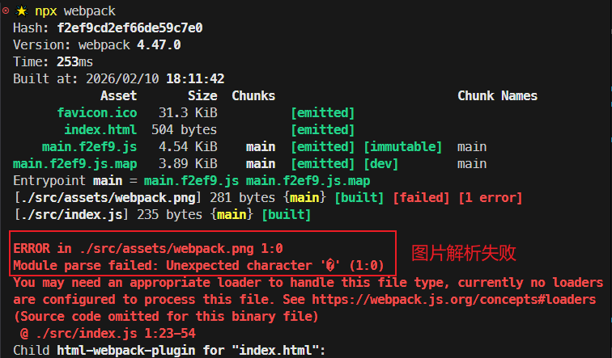
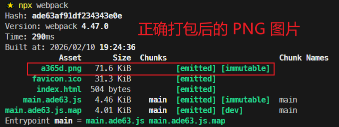
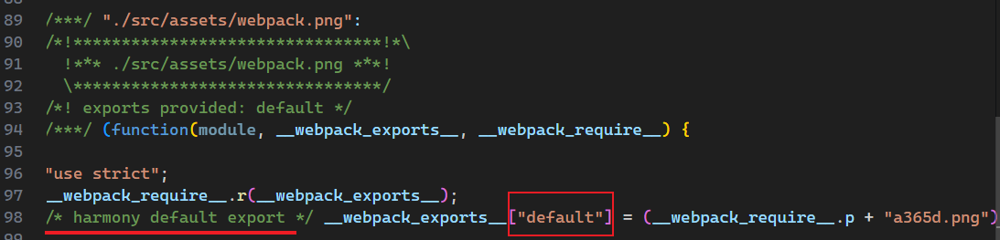
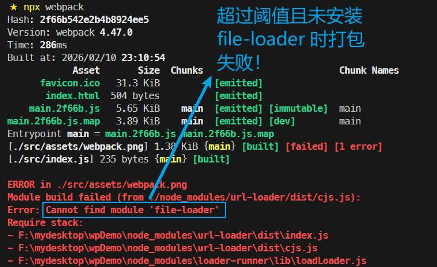

# L22：Webpack 对普通文件的处理

---

本节对应第二篇第五课。

录制时间：`2020-01-19 14:10`


本节重点介绍两个处理图片解析的 `loader` 加载器—— `file-loader` 和 `url-loader`，顺便复习巩固 `L11` 课介绍的 `loader` 知识。


## 1 file-loader

按惯例，借助 `JS` 嵌入页面的动态图片，一般放在 `src/assets` 目录下。如果不作任何额外处理，直接导入一张图片到 `JS` 模块肯定会报错：

```js
// ./src/index.js
const png = require('./assets/webpack.png');
if(Math.random() < 0.5) {
    const img = document.createElement('img');
    img.src = png;
    document.body.appendChild(img);
}
```

尝试用 `npx webpack` 打包，`Webpack` 因为无法自动解析图片而报错：



我们的目标，是利用 `Webpack` 自带的扩展机制，实现将图片解析成对应的文件路径、并在打包后正确渲染出该图片；而发布在 `NPM` 上的 `file-loader` 就实现了这一功能。其主要作用是：将文件中的 `import` / `require()` 解析为 `URL`，并将文件输出（`emit`）到输出目录。

> [!tip]
>
> `file-loader` 线上文档：https://www.npmjs.com/package/file-loader

具体用法：

按开发依赖安装：

```bash
npm i -D file-loader
```

添加 `loader` 配置：

```js
module.exports = {
  module: {
    rules: [{ 
      test: /\.(png)|(gif)|(jpg)$/, 
      use: [{
        loader: 'file-loader',
        options: {
          name: '[hash:5].[ext]'  // 这里 hash 是内容哈希，其含义是 loader 自身决定的，
                                  // 与 Webpack 中的定义无关
        }
      }]
    }]
  }
};
```

用 `npx webpack` 再次打包，报错消失：



但是查看打包后的 `JS` 文件，会发现 `file-loader` 会按 `ES6` 导出 + `CommonJS` 导入的方式处理图片路径：



因此 **必须从 `default` 属性中读取图片的 URL 信息**，否则图片依旧无法正常加载：

```js
// before
const png = require('./assets/webpack.png');
// after
const { default: png } = require('./assets/webpack.png');
```

`file-loader` 的简化处理流程：

生成目标文件到输出目录，然后将模块文件设置为【导出某个路径】：

```js
// file-loader
function loader(source){
  // source：文件内容（图片内容 buffer）
  // 1. 生成一个具有相同文件内容的文件到输出目录
  // 2. 返回一段代码 export default "文件名"
}
```


> [!tip]
>
> 关于 `__webpack_require__.p` 的含义，详见 `L23` 课笔记，本节不展开，暂时当成空字符串处理。


## 2 url-loader

主要功能：将目标文件经转换后导出为一个 `base64` 格式的字符串。

同样按开发依赖安装：

```bash
npm i -D url-loader
```

`url-loader` 的简化处理流程：

```js
// url-loader
function loader(source){
  // source：文件内容（图片内容 buffer）
  // 1. 根据 buffer 生成一个 base64 编码
  // 2. 返回一段代码 export default "base64编码"
}
```

`url-loader` 的一大特点是可以通过 `limit` 参数设置一个尺寸阈值（单位为字节 `Byte`），大小超过该阈值的图片交给 `file-loader` 处理；否则按 `base64` 编码转换为字符串。`limit` 也可以作为开关使用，此时参数值是一个 `Boolean` 类型的值。

`limit` 的设置应该适当，过大则代码量剧增，过小则小尺寸图片的请求量攀升，应结合实际情况考虑。

> [!tip]
>
> **复习与回顾**
>
> 复习 `L13` 课中的写法，该练习就是效仿 `url-loader` 的处理逻辑——
>
> ```js
> const loaderUtils = require('loader-utils');
> 
> function getBase64(buffer) {
>   return `data:image/png;base64,${buffer.toString('base64')}`;
> }
> 
> function getFilename(buffer, filename) {
>   const imgName = loaderUtils.interpolateName(this, filename, {
>     content: buffer
>   });
>   this.emitFile(imgName, buffer);
>   return imgName;
> }
> 
> const imgLoader = function(buffer) {
>   const {limit = 3000, filename = 'img-[contenthash:5].[ext]'} = loaderUtils.getOptions(this);
>   let result;
>   if(buffer.byteLength > limit) {
>     result = getFilename.call(this, buffer, filename);
>   } else {
>     result = getBase64(buffer);
>   }
>   return `module.exports = '${result}'`;
> };
> 
> imgLoader.raw = true;
> 
> module.exports = imgLoader;
> ```


> [!tip]
>
> **DIY 复盘**
>
> `file-loader` 相当于分为两个方向：
>
> - 生成并发送文件到指定位置
> - 返回该文件的路径
>
> `url-loader` 相当于帮 `file-loader` 做了预筛选，尺寸小的直接转 `Base64` 编码字符串，超过阈值的（通过 `limit` 配置）再交给 `file-loader`。


## 3 实测备忘

:one: `url-loader` 虽然内置了 `file-loader` 的相关功能，使用时还是需要同时安装 `file-loader`，否则超过 `limit` 阈值后会报错（`limit` 为 `50Kb`，图片实际约 `70Kb`）：




