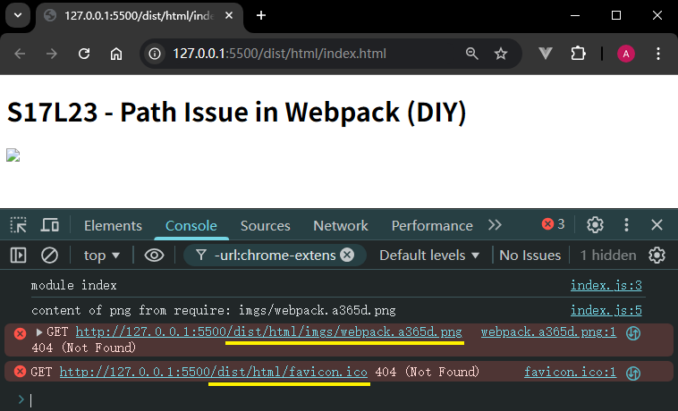
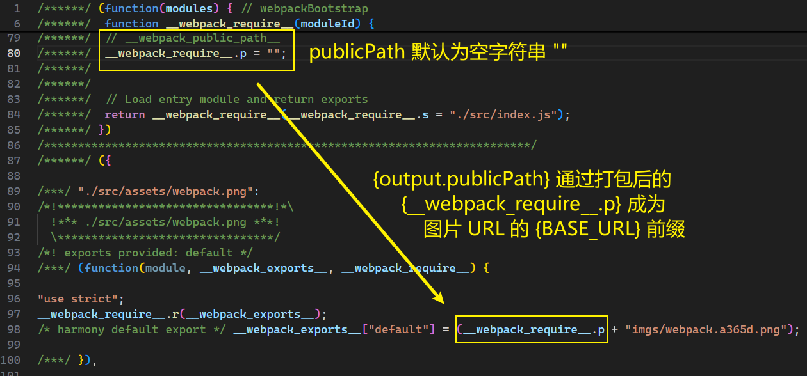
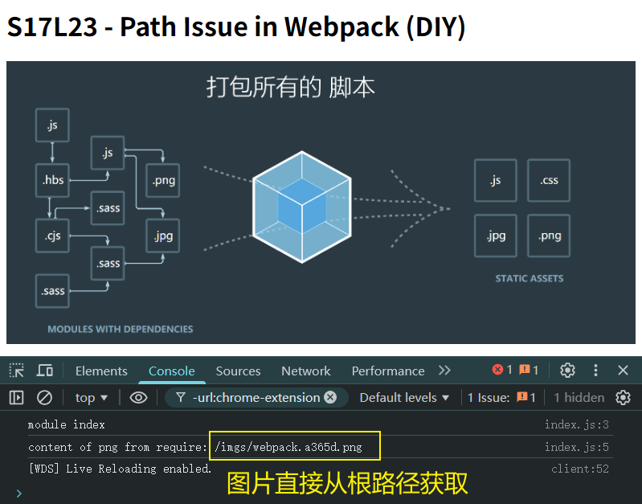
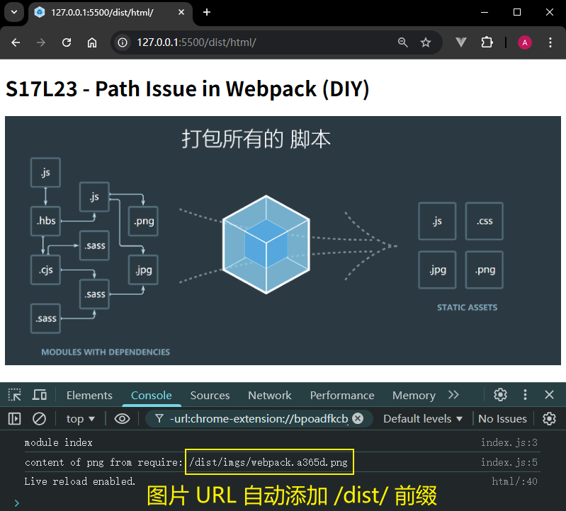
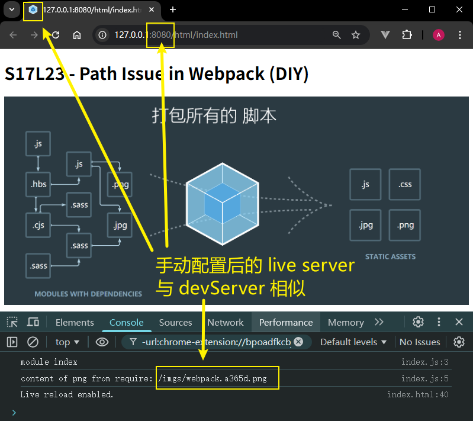
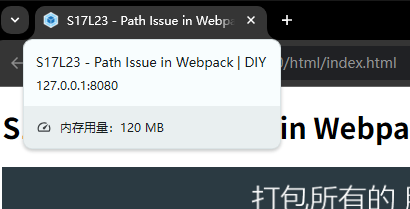
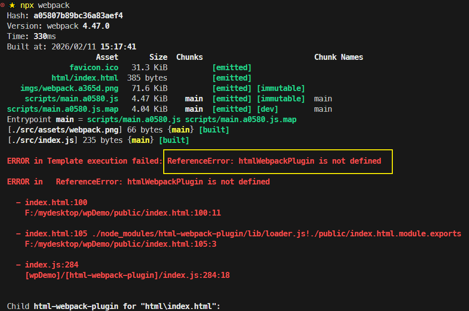

# L23：解决路径问题

---

本节对应第二篇第六课。

录制时间：`2020-01-20 11:20`


## 1 问题描述

在使用 `file-loader` 或 `url-loader` 时，可能会遇到一个 **非常有趣** 的路径问题——

比如，通过 `Webpack` 打包的目录结构如下（`97548fb4`）：

```yaml
dist      
|   favicon.ico
+---html
|       index.html         # <script src="../scripts/main.js" ></script> 
+---imgs
|       webpack.a365d.png  # file-loader 生成的文件
\---scripts
        main.5466e.js      # export default "img/a.png"
        main.5466e.js.map
```

其中：

- `JS` 文件通过 `Webpack` 配置：

  ```js
  module.exports = {
    output: {
      filename: 'scripts/[name].[hash:5].js',
    },
  }
  ```

- 和主页 `index.html` 相关的配置通过 `html-webpack-plugin` 插件实现（`L5`、`L6`）：

  ```js
  const HtmlWebpackPlugin = require('html-webpack-plugin');
  
  const htmlWebpackPlugin = new HtmlWebpackPlugin({
    template: './public/index.html',
    filename: 'html/index.html',
    favicon: './public/favicon.ico',
  });
  
  module.exports = {
    htmlWebpackPlugin
  }
  ```

- `PNG` 图片则通过 `file-loader` 的 `name` 参数配置（`L8`）：

  ```js
  module.exports = {
    module: {
      rules: [{
        test: /\.(png)|(gif)|(jpg)$/, 
        use: [{
          loader: 'file-loader',
          options: {
            name: 'imgs/[name].[hash:5].[ext]'
          }
        }] 
      }]
    }
  };
  ```

但是最终网站图标和页面图片都没有渲染，控制台给出了报错的图片资源使用的真实 `URL`：




## 2 解决方案

根本原因：当模块中的资源 `URL` 由某个 `loader` 或 `plugin` 生成时，该 `loader` 或 `plugin` 将默认基于 `dist` 目录生成相对路径，但是最终引用该资源的页面很可能不与 `dist` 目录平级，因此报错：

- 对于 `favicon` 图标：打包后的相对路径为 `href="favicon.ico"`，因此变成相对于引用它的 `dist/html/index.html` 文件所在的路径；
- 对于 `PNG` 图片：打包后的相对路径为 `imgs/webpack.a365d.png`，与 `favicon` 情况相同；

为此，`Webpack` 通过 `output.publicPath` 配置项，为这些相对路径提供了统一的 `{BASE_URL}`。

查看打包后的 `main.xxxx.js` 文件，可以看到 `publicPath` 的身影：



这也表明 `output.publicPath` 不过是作为一个普通字符串引入 `Webpack`（视频反复强调），其作用就是为这些第三方中间件生成的相对路径提供一个统一的 `BASE_URL`。

那么，`publicPath` 又以什么路径为根路径呢？

答案是：**本地服务器的【根路径】所映射的【本地文件夹】**。

这里就要分情况讨论了：

:one: 如果用 `Webpack` 的开发服务器启动本地服务，则根地址 `http://localhost:8080/` 映射的是 `dist` 目录，`publicPath` 的值就是 `"/"`。

执行命令如下：

```bash
# 添加 publicPath 后重新打包
npx webpack
# 再定义 scripts 脚本：{ "serve": "webpack-dev-server" }
# 最后启动 dev server
npm run serve
```

运行结果（`252d525`）：




:two: 第二种开启本地服务的常见方式是借助 `VSCode Live Server` 扩展。默认情况下，`Live Server` 的本地服务根路径映射的是当前项目的根目录，因此打包后的首页 `URL` 为：`http://127.0.0.1:5500/dist/html/index.html`；而其他静态资源的 `URL` 都是以 `/dist/` 开头的，因此 `publicPath` 的值应该设为 `/dist/`。

由于 `Webpack` 的开发服务器不会打包到 `dist` 目录，需要重新打包。这是最终的实测效果（`b9eedb7`）：




> [!tip]
>
> **关于 VSCode Liver Server 的手动配置**
>
> 由于本地服务的差异，`publicPath` 的取值也截然不同。为了让项目不受 `Liver Server` 默认配置的干扰，可以手动调整相关配置，与 `Webpack` 的开发服务器保持一致（实际工作中也可以和具体情况保持一致）。
>
> 操作方法：
>
> 在项目根目录新建配置文件 `.vscode/settings.json`，变更端口和根路径的映射目录：
>
> ```json
> {
> "liveServer.settings.port": 8080,
> "liveServer.settings.root": "/dist/"
> }
> ```
>
> 这样只要将 `publicPath` 改回 `"/"` 就和 `devServer` 保持一致了（`f9a61ad`）：
>
> 
>
> 更多自定义配置详见 `VSCode Live Server` 官方文档：[https://github.com/ritwickdey/vscode-live-server/blob/HEAD/docs/settings.md](https://github.com/ritwickdey/vscode-live-server/blob/HEAD/docs/settings.md)。


## 3 实测备忘

:one: 实测发现页面模板中的 `title` 标签没有正确渲染，原因是 `html-webpack-plugin` 手动指定模板文件后，必须在新模板中写出 `title` 标签的具体内容，否则不渲染（`L9`）：

```html
<!DOCTYPE html>
<html lang="en">
  <head>
    <meta charset="UTF-8">
    <meta name="viewport" content="width=device-width, initial-scale=1.0">
    <style>
      img { width: 100%; }
    </style>
    <title><%= htmlWebpackPlugin.options.title %></title>
  </head>
  <body>
    <h1 class="title"><%= htmlWebpackPlugin.options.heading %></h1>
  </body>
</html>
```

重新打包后的最终效果：




:two: 关于 `htmlWebpackOptions` 未定义的问题修复：如果 `html-webpack-plugin` 插件的配置对象中声明了 `templateParameters` 选项，则应该直接使用该选项内的自定义参数，原来的默认对象 `htmlWebpackPlugin` 就 **自动失效** 了（`4ea192d`）：



解决方案前后对照：

```js
// conflicted:
const htmlWebpackPlugin = new HtmlWebpackPlugin({
  title: 'S17L23 - Path Issue in Webpack | DIY',  // <%= htmlWebpackPlugin.options.title %>
  templateParameters: {
    heading: 'S17L23 - Path Issue in Webpack (DIY)',  // <%= heading %>
  }
});

// solution1: all in templateParameters
const htmlWebpackPlugin = new HtmlWebpackPlugin({
  // -- snip --
  templateParameters: {
    title: 'S17L23 - Path Issue in Webpack | DIY',  // <%= title %>
    heading: 'S17L23 - Path Issue in Webpack (DIY)',  // <%= heading %>
  }
});

// solution2: get rid of templateParameters
const htmlWebpackPlugin = new HtmlWebpackPlugin({
  // -- snip --
  title: 'S17L23 - Path Issue in Webpack | DIY',  // <%= htmlWebpackPlugin.options.title %>
  heading: 'S17L23 - Path Issue in Webpack (DIY)',  // <%= htmlWebpackPlugin.options.heading %>
});
```

在 `L23_publicPath` 分支的 `cefceb8` 提交可以看到 `solution1` 的修复版。

