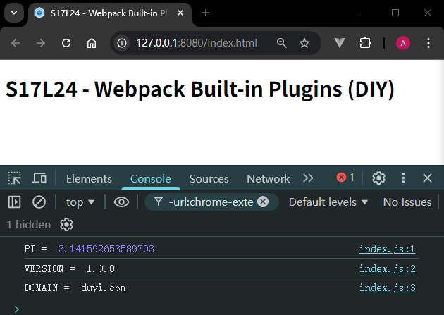
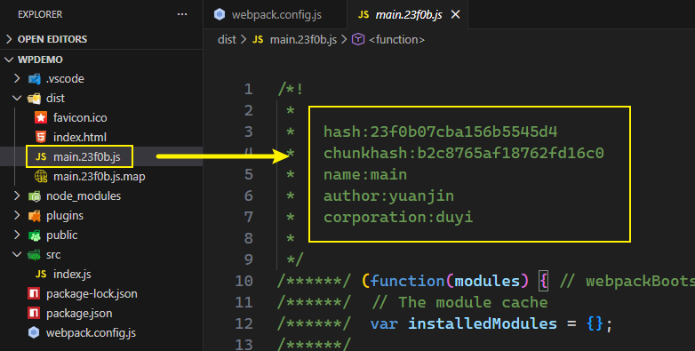
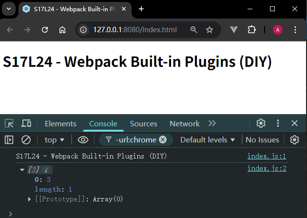
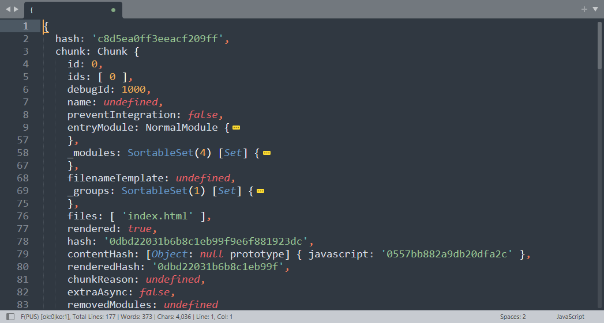
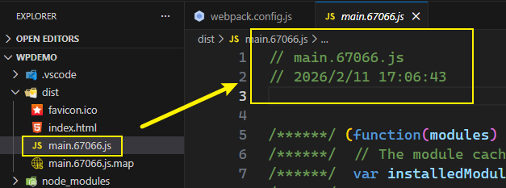

# L24：Webpack 中的内置插件

本节对应第二篇第七课。

录制时间：`2020-01-20 14:48`

---


本节介绍了 `Webpack` 常用的三个内置插件：`DefinePlugin`、`BannerPlugin` 以及 `ProvidePlugin`。原版官方文档整理如下：

|  内置插件名称   |                     Webpack 4                     |                   Webpack 5                    |
| :-------------: | :-----------------------------------------------: | :--------------------------------------------: |
| `DefinePlugin`  | https://v4.webpack.js.org/plugins/define-plugin/  | https://webpack.js.org/plugins/define-plugin/  |
| `BannerPlugin`  | https://v4.webpack.js.org/plugins/banner-plugin/  | https://webpack.js.org/plugins/banner-plugin/  |
| `ProvidePlugin` | https://v4.webpack.js.org/plugins/provide-plugin/ | https://webpack.js.org/plugins/provide-plugin/ |
|  内置插件汇总   |        https://v4.webpack.js.org/plugins/         |        https://webpack.js.org/plugins/         |


## 1 插件概要

所有的 `Webpack` 内置插件均以 `Webpack` 静态属性的方式存在，均可使用如下方式创建插件实例：

```js
const webpack = require("webpack");

const plugin = new webpack.<plugin_name>(options);
```


### 1.1 DefinePlugin

全局常量定义插件，顾名思义，该插件通常用于定义一些全局的常量值，例如：

```js
new webpack.DefinePlugin({
    PI: `Math.PI`, // PI = Math.PI
    VERSION: `"1.0.0"`, // VERSION = "1.0.0"
    DOMAIN: JSON.stringify("duyi.com")
})
```

这样一来，在源码中，我们可以直接使用插件中提供的常量，当 `Webpack` 编译完成后，会自动替换为常量的值：

```js
// ./src/index.js:
console.log('PI = ', PI);
console.log('VERSION = ', VERSION);
console.log('DOMAIN = ', DOMAIN);

// ./dist/main.23f0b.js:
console.log('PI = ', Math.PI);
console.log('VERSION = ', "1.0.0");
console.log('DOMAIN = ', "duyi.com");
```

实测效果（`c3ab6d4`）：




### 1.2 BannerPlugin

该插件可以在每个 `Chunk` 生成的文件头部添加一段注释，一般用于添加作者、公司、版权等信息：

```js
new webpack.BannerPlugin({
  banner: `
  hash:[hash]
  chunkhash:[chunkhash]
  name:[name]
  author:yuanjin
  corporation:duyi
  `
})
```

实测效果（`77d6ff9`）：




### 1.3 ProvidePlugin

自动加载模块，而不必到处 `import` 或 `require`：

```js
new webpack.ProvidePlugin({
  $: 'jquery',
  _: 'lodash'
})
```

然后在任意源码中测试：

```js
// ./src/index.js:
console.log($('.title').text()); // <= 起作用
console.log(_.drop([1, 2, 3], 2)); // <= 起作用

// ./dist/main.67066.js
"./src/index.js": (function(module, exports, __webpack_require__) {
    (function($, _) {
        console.log($('.title').text()); // <= 起作用
        console.log(_.drop([1, 2, 3], 2)); // <= 起作用
    }.call(
      this, 
      __webpack_require__(/*! jquery */ "./node_modules/jquery/dist/jquery.js"), 
      __webpack_require__(/*! lodash */ "./node_modules/lodash/lodash.js")))
});
```

可以看到，`Webpack` 最终在源码外围使用 `IIFE` 分别传入了 `$` 和 `_`，从而避免了全局变量污染。

实测效果（`680c4f5`）：




## 2 实测备忘

实测发现 `BannerPlugin` 的 `banner` 还可以是一个函数声明：

```js
new BannerPlugin({
  banner: function(data) {
    console.dir(data);
    return `
  hash:[hash]
  chunkhash:[chunkhash]
  name:[name]
  author:yuanjin
  corporation:duyi
`;
  },
}),
```

其中的参数 `data` 包含了打包过程中的相关信息，可以生成与当前 `Chunk` 相关的更加丰富的内容：



根据 `DeepSeek` 的提示，还可以选择性添加 `banner` 标语信息：

```js
new webpack.BannerPlugin({
  banner: (data) => {
    // 只为特定文件添加banner
    if (data.filename.endsWith('.js')) {
      return `// ${data.filename}\n// ${new Date().toLocaleString()}\n\n`;
    }
    return ''; // 其他文件不加banner
  },
  raw: true
});
```

最终效果（`c742971`）：



