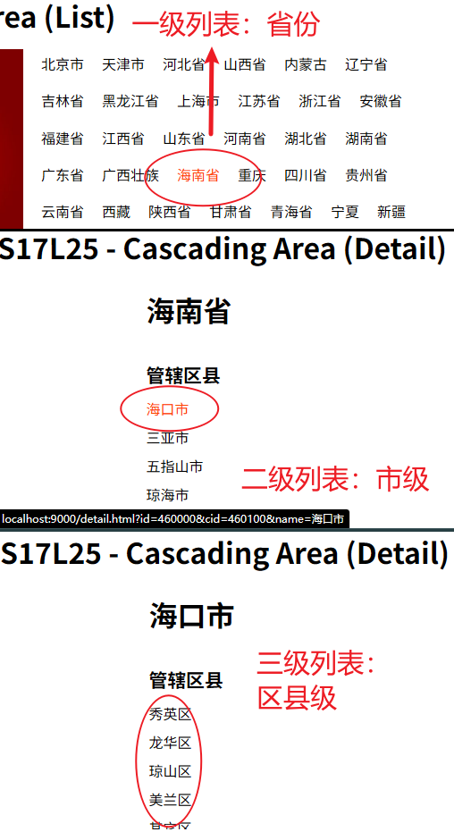
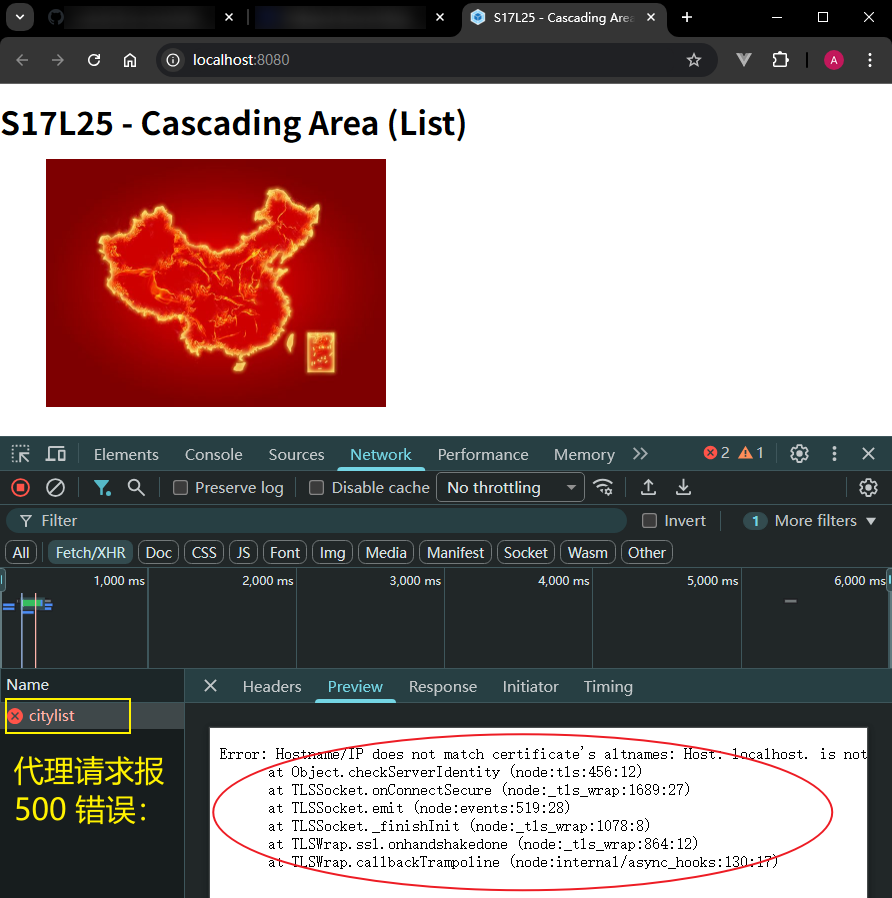
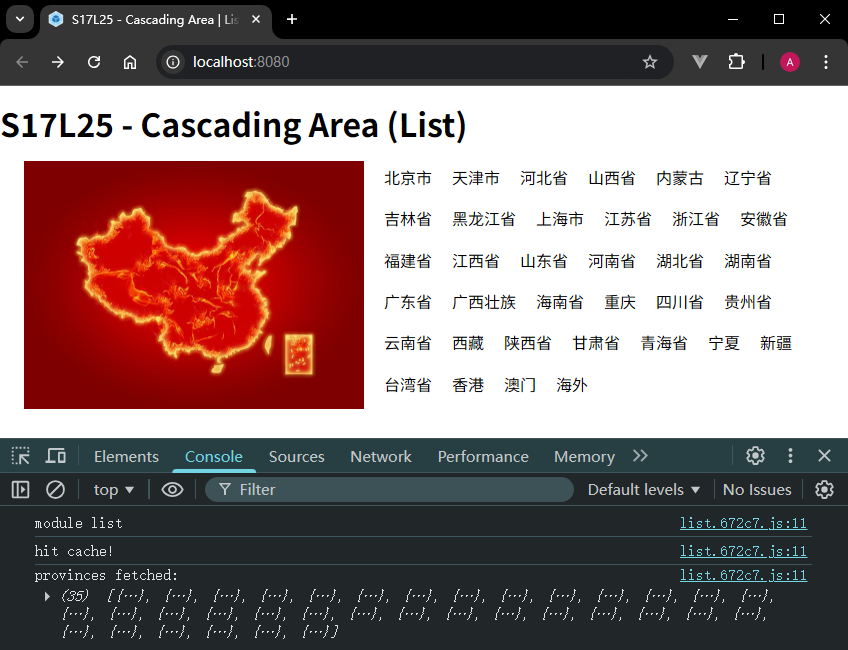

# L25：Webpack 实战：省市页面联动效果

本节对应第二篇第八课。

录制时间：`2020-01-20 15:12`。

---


本节通过一个省市列表页联动的案例，将第二章学过的七节课（`L18` 至 `L24`）知识点串联起来，以求巩固基础，进一步强化模块化思想在前端开发上的落地实践，提高综合应用能力。


## 1 配置文件的分离

考虑到 `Webpack` 配置受不同开发环境影响，将总配置文件 `webpack.config.js` 拆分出多个模块：

- `webpack.config.base.js`：存放 **各环境通用** 的 `Webpack` 配置；
- `webpack.config.dev.js`：存放 **开发环境专用** 的 `Webpack` 配置；
- `webpack.config.prod.js`：存放 **生产环境专用** 的 `Webpack` 配置；

然后手动合并模块：

```js
const baseCfg = require('./webpack.config.base');
const devCfg = require('./webpack.config.dev');
const prodCfg = require('./webpack.config.prod');

module.exports = function(env) {
  if (env && env.prod) {
    const options = {...baseCfg, ...prodCfg };
    return options;
  } else {
    const options = {...baseCfg, ...devCfg };
    return options;
  }
};
```

> [!warning]
>
> **注意：手动合并配置引发的问题**
>
> 手动合并配置必须处理好数组型配置的相互覆盖问题。为此，视频中通过单独扩展数组避免直接覆盖：
>
> ```js
> module.exports = function (env) {
>     if (env && env.prod) {
>         //生产环境
>         const config = {
>             ...baseConfig,
>             ...prodConfig
>         }
>         config.plugins = [...baseConfig.plugins, ...prodConfig.plugins]
>         return config;
>     }
>     // -- snip --
> }
> ```
>
> 实测方案：不在 `base` 配置放置 `plugins` 数组，冗余写入不同的环境（后期维护困难）。
>
> 为此，`DeepSeek` 推荐第三方工具库 `webpack-merge` 实现智能合并（`cfb5595`，强烈推荐 :star: :star: :star: :star: :star:）：
>
> ```js
> // webpack.config.js:
> const baseCfg = require('./webpack.config.base');
> const devCfg = require('./webpack.config.dev');
> const prodCfg = require('./webpack.config.prod');
> const { merge } = require('webpack-merge');
> 
> module.exports = (env) => (env && env.prod)
>   ? merge(baseCfg, prodCfg)
>   : merge(baseCfg, devCfg);
> ```


## 2 数据源的获取

使用 `ApiFox` 授权后的 `API` 接口页查看相关数据。原视频的数据源已作废，但是新接口不支持查询参数筛选过滤，需要在前端手动处理：

```js
// ./utils/areaService.js:
async function getCachedData() {
  const cache = localStorage.getItem('areas');
  
  if(cache) {
    console.log('hit cache!');
    return JSON.parse(cache);
  }

  console.log('fetch remote data:', Date.now());
  const res = await fetch(url);
  const { data } = await res.json();
  const result = [...data];
  localStorage.setItem('areas', JSON.stringify(result));
  return result;
}
```

实测时为了避免多次请求，使用 `localStorage` 实现本地缓存。


## 3 新增数据下钻功能

实测时新增数据下钻功能：只要当前数据节点存在二级列表，就能继续展开详情页；否则为普通文本标签：

```js
// ./src/list/index.js:
function renderList(data, name, pid) {
  /*<h1 class="title">四川省</h1>
      <dl>
        <dt>管辖城市</dt> */
  const $title = $('h1.title').empty(),
    $box = $('dl'),
    $frag = $(document.createDocumentFragment());

  $title.html(name);

  let isCity;
  for(const {id, label, isLeaf} of data) {
    const $dd = $('<dd>')
      .attr('data-id', id);
    if(isLeaf) {
      isCity = false;
      $dd.html(label);
    } else {
      isCity = true;
      $dd.html(`<a href="/detail.html?id=${pid}&cid=${id}&name=${label}">${label}</a>`)
    }
    $frag.append($dd);
  }
  $box.html(`<dt>管辖${isCity ? '城市' : '区县'}</dt>`)
    .append($frag);
}
```

由于接口不提供查询功能，只能手动模拟：

```js
// ./utils/areaService.js:
export async function getCities(pid, cid) {
  console.log({pid, cid});
  const areas = await getCachedData();
  const province = areas.find(p => p.value === pid);
  if(!cid) {
    return province.children.map(c => ({
      id: c.value,
      label: c.label,
      isLeaf: !Array.isArray(c.children)
    }));
  }
  const city = province.children.find(c => c.value === cid);
  return city.children.map(c => ({
      id: c.value,
      label: c.label,
      isLeaf: !Array.isArray(c.children)
    }))
}
```

最终效果（`489cb5c`）：




## 4 实测 Live Server 的代理模式（失败）

`VSCode Live Server` 扩展虽然提供了代理模式，可以实现类似 `devServer` 转发请求解决跨域问题：

```json
// ./.vscode/settings.json:
{
  "liveServer.settings.port": 8080,
  "liveServer.settings.host": "localhost",
  "liveServer.settings.file": "list.html",
  "liveServer.settings.root": "/dist/",
  "liveServer.settings.proxy": {
    "enable": true, //set it true to enable the feature.
    "baseUri": "/api", //from where you want to proxy.
    "proxyUri": "https://study.duyiedu.com/api" //the actual url.
  }
}
```

注意：`live server` 会自动清空代理请求的 `URL`（即 `"/api"` 自动重写为 `""`），因此必须在 `L10` 中补全。

但由于插件内部受 `NodeJS` 的限制，无法转发 `https` 请求，正常代理会报 500 错误，因此最终尝试失败（`6caddd5`）：



变通方案：将 `devServer` 中的缓存数据手动复制到 `live server` 的 `localStorage` 中：

```js
// under dev server:
console.log(localStorage.getItem('areas'))
// copy the JSON string
// under live server:
localStorage.setItem('area', '<JSONstr>')
// refresh the list page
```

最终效果（`6caddd5`）：



