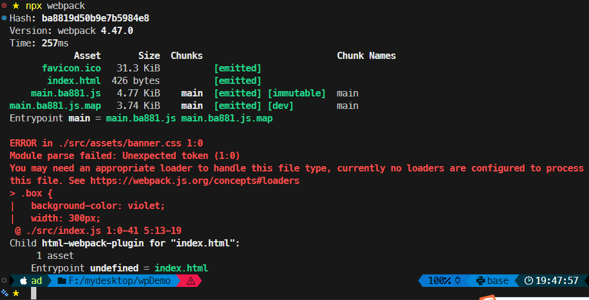
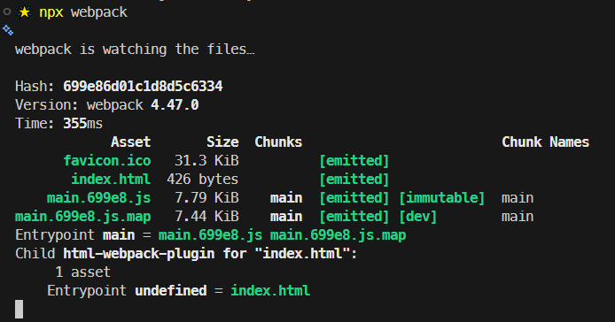
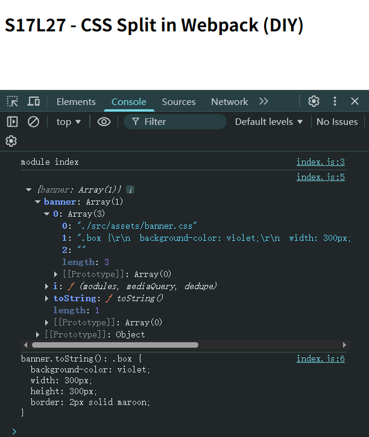
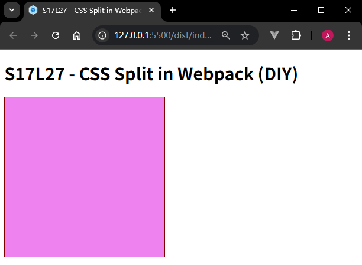
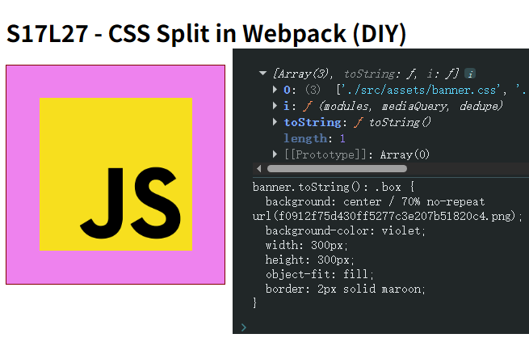
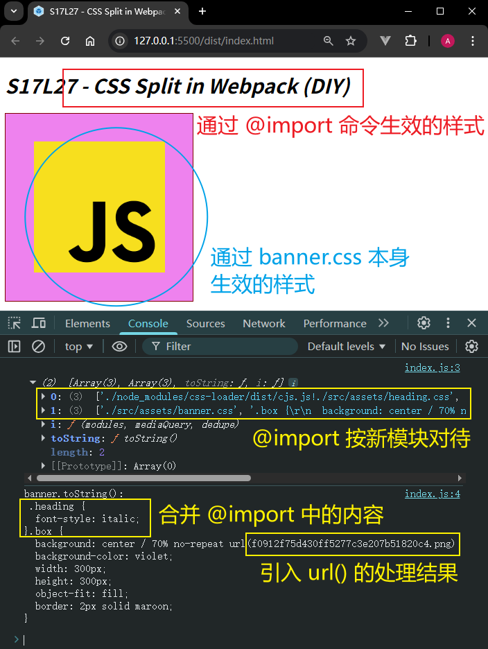
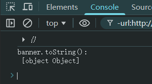
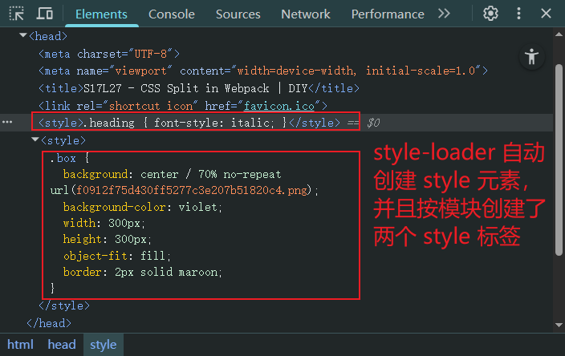
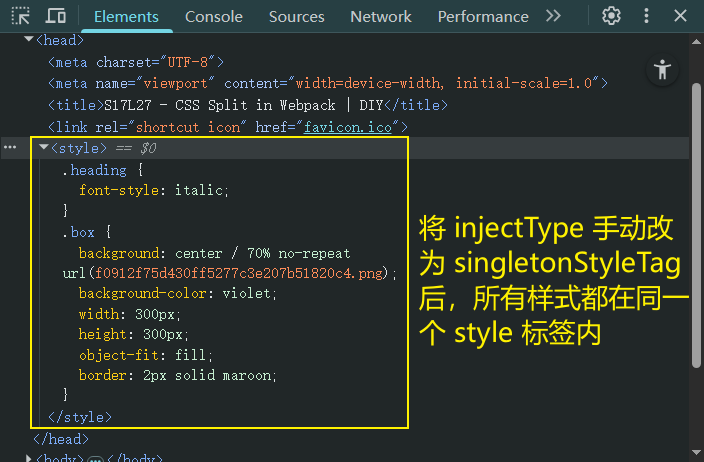

# L27：利用 Webpack 拆分 CSS

本节对应第三章第二课。

录制时间：`2020-01-21 17:00:00`

---

本节主要介绍 `css-loader` 与 `style-loader` 的用法及工作原理。这两个 `loader` 的 `NPM` 平台文档整理如下：

- `css-loader`：[https://www.npmjs.com/package/css-loader](https://www.npmjs.com/package/css-loader)
- `style-loader`：[https://www.npmjs.com/package/style-loader](https://www.npmjs.com/package/style-loader)


## 1 css-loader

要拆分 `CSS`，就必须把 `CSS` 当成像 `JS` 那样的模块；而要把 `CSS` 当成模块，就必须用一个构建工具（即 `Webpack`）来合并代码。

而 `Webpack` 本身只能读取 `CSS` 文件的内容、将其当作 `JS` 代码进行分析，因此，直接打包会报错。

此时，可以用一个 `loader` 来将 `CSS` 代码转换为 `JS` 代码，这就是 `css-loader`。

`css-loader` 的作用，就是将 `CSS` 代码转换为 `JS` 代码。

它的处理原理极其简单：**将 CSS 代码作为字符串导出**。

【示例一】纯 `CSS` 样式：

```css
.red {
    color: "#f40";
}
```

经过 `css-loader` 转换后变成 `JS` 代码如下：

```js
module.exports = `.red{
    color: "#f40";
}`
```

> [!note]
>
> **注意**
>
> 上面的 `JS` 代码是经简化处理后的结果，并非实际的 `css-loader` 转换结果；`css-loader` 转换后的代码会有些复杂，同时会导出更多的信息，但核心思想不变。

### 实测【示例一】

配置 `css-loader` 前后效果：

```js
// ./src/index.js:
import banner from './assets/banner.css';

console.log('module index');

console.log({banner});
console.log('banner.toString():', banner.toString());

/* ./src/assets/banner.css:
.box {
  background-color: violet;
  width: 300px;
  height: 300px;
  border: 2px solid maroon;
}
*/
```

配置 `loader` 前（`7b32678`）：



配置后（`451e978`，更换版本到 `v3.6.0`）：



`css-loader` 只负责转成不报错的 `JS` 代码，页面样式并未生效：



生效需要自行处理（`b7dade9`）：

```js
// ./src/index.js:
import banner from './assets/banner.css';

console.log('module index');

const style = document.createElement('style');
style.innerHTML = banner.toString();
document.head.appendChild(style);
```

页面效果：




【示例二】引用了图片 `URL` 的样式：

```css
.red {
    color: "#f40";
    background: url("./bg.png")
}
```

经过 `css-loader` 转换后变成如下 `JS` 代码：

```js
var import1 = require("./bg.png");
module.exports = `.red{
    color: "#f40";
    background: url("${import1}")
}`;
```

这样一来，经过 `Webpack` 的后续处理，会把依赖 `./bg.png` 添加到模块列表，然后再将代码转换为以下形式：

```js
var import1 = __webpack_require__("./src/bg.png");
module.exports = `.red{
    color: "#f40";
    background: url("${import1}")
}`;
```

### 实测【示例二】

对 `CSS` 中存在图片引用的情况进行实测。代码详见 `L27_cssLoader` 分支节点 `35042e9`：

```js
// ./src/index.js:
import banner from './assets/banner.css';

console.log(banner);
console.log('banner.toString():', banner.toString());

const style = document.createElement('style');
style.innerHTML = banner.toString();
document.head.appendChild(style);

/* ./src/assets/banner.css:
.box {
  background: center / 70% no-repeat url("./bg.png");
  background-color: violet;
  width: 300px;
  height: 300px;
  object-fit: fill;
  border: 2px solid maroon;
}*/
```

配置 `file-loader` 后（同样降版本为 `v5.1.0` 与视频同步）：




【示例三】引用了其他 `CSS` 文件的样式：

```css
@import "./reset.css";
.red{
    color: "#f40";
    background: url("./bg.png")
}
```

会转换为：

```js
var import1 = require("./reset.css");
var import2 = require("./bg.png");
module.exports = `${import1}
.red{
    color: "#f40";
    background: url("${import2}")
}`;
```

总结，`css-loader` 的工作内容：

1. 将 `CSS` 文件的内容作为 **字符串** 导出；
2. 将 `CSS` 中的其他依赖作为 `require` 导入，以便 `Webpack` 进行依赖分析。

### 实测【示例三】

对 `CSS` 样式文件中存在 `@import` 命令的情况进行实测，代码详见 `L27_cssLoader` 分支节点 `e9f4199`：

```css
/* ./src/assets/heading.css */
.heading {
  font-style: italic;
}

/* ./src/assets/banner.css */
@import './heading.css';

.box {
  background: center / 70% no-repeat url("./bg.png");
  background-color: violet;
  width: 300px;
  height: 300px;
  object-fit: fill;
  border: 2px solid maroon;
}
```

`JS` 模块依旧按纯手动创建 `style` 元素注入新样式：

```js
import banner from './assets/banner.css';

console.log(banner);
console.log('banner.toString():\n', banner.toString());

const style = document.createElement('style');
style.innerHTML = banner.toString();
document.head.appendChild(style);
```

最终，打包后的样式文本中多了 `@import` 命令导入的新样式，并且导入的 `banner` 对象多了一个数组元素：




## 2 style-loader

由于 `css-loader` 仅提供将 `CSS` 转换为字符串导出的能力，剩余工作需要其他 `loader` 或 `plugin` 来完成。

`style-loader` 可以在 `css-loader` 转换后的代码基础上，将 `css-loader` 导出的字符串 **加入到页面 style 元素中**。

【示例四】使用 `css-loader` + `style-loader` 组合：

```css
.red {
    color: "#f40";
}
```

经 `css-loader` 转换后变成 `JS` 代码：

```js
module.exports = `.red {
    color: "#f40";
}`
```

经过 `style-loader` 转换后变成：

```js
module.exports = `.red {
    color: "#f40";
}`
var style = module.exports;
var styleElem = document.createElement("style");
styleElem.innerHTML = style;
document.head.appendChild(styleElem);
module.exports = {}
```

> [!important]
>
> **再次强调**
>
> **以上代码均为简化后的代码，并不代表真实的代码**。
>
> `style-loader` 有能力避免同一个样式的重复导入。

### 实测【示例四】

对组合使用 `css-loader` + `style-loader` 的情况进行实测，代码详见 `cc78b8b`：

```js
// webpack.config.js:
module.exports = {
  module: {
    rules: [
      { test: /\.css$/, use: ['style-loader', 'css-loader'] },
      { test: /\.(png)|(jp?g)|(gif)$/, use: ['file-loader'] },
    ]
  },
}

// ./src/index.js
import banner from './assets/banner.css';

console.log(banner);
console.log('banner.toString():\n', banner.toString());
```

实测时代码与【示例三】的实测代码保持一致，最大的不同在于，`style-loader` 默认将 `banner` 对象中的样式文本创建为 **多个** `style` 标签放到 `head` 元素中；并且删除了 `banner` 对象中的数组成员，`banner` **完全退化为一个普通对象**：





并且打包后的 `main1d199.js` 文件也新增了很多辅助逻辑，可读性大幅降低（详见 `cc78b8b`）。

要让 `style-loader` 将所有样式放进同一个 `style` 元素中，必须手动配置 `injectType` 参数，将默认的 `styleTag` 改为 `singletonStyleTag`（详见 `db23b08`）：

```js
// webpack.config.js:
module.exports = {
  module: {
    rules: [
      { test: /\.css$/, use: ['style-loader?injectType=singletonStyleTag', 'css-loader'] },
      { test: /\.(png)|(jp?g)|(gif)$/, use: ['file-loader'] },
    ]
  },
}
```




## 3 实测备忘

:one: 当 `CSS` 中存在 `url(./assets/bg.png)` 引入的图片资源时，误把 `file-loader` 配置到 `/\.css$/` 规则下，导致 `CSS` 文件最终打包后仅有图片资源的真实路径（`[hash].png`）；正确做法应该是对图片单独添加模块匹配规则 `/\.(png)|(jp?g)|(gif)$/`，并在该规则下使用 `file-loader`：

```js
module.exports = {
  // -- snip --
  module: {
    rules: [
      { test: /\.css$/, use: ['css-loader'] },
      { test: /\.(png)|(jp?g)|(gif)$/, use: ['file-loader'] },
    ]
  },
  // -- snip --
}
```

