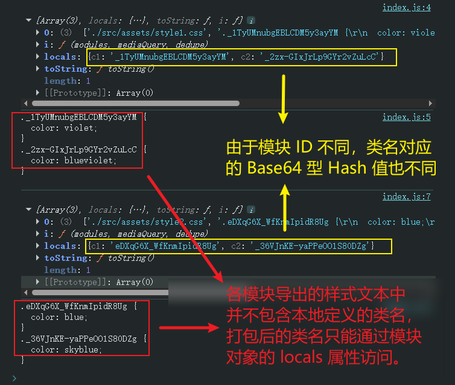
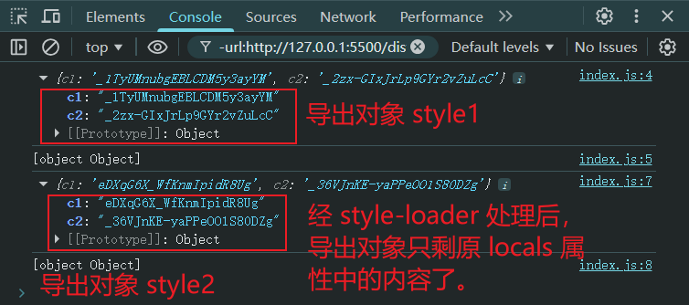
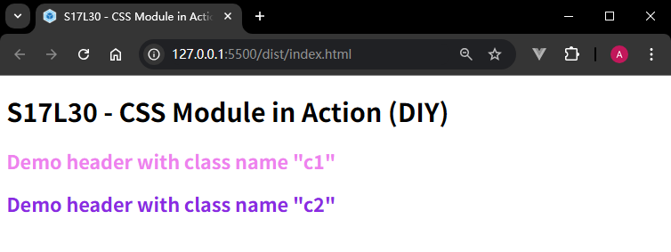
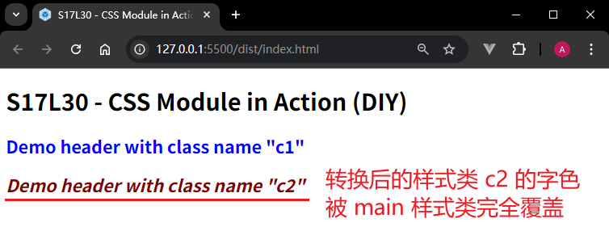
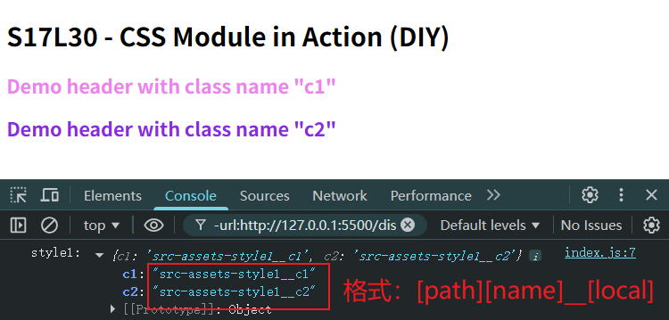

# L30：CSS Module 样式方案

本节对应第三章第五课。

本节大致录制时间：`2020-01-31 14:30:00`。

---

> [!tip]
>
> **引子**
>
> `BEM` 通过命名约定来限制类名太过死板，而 `CSS-in-JS` 虽足够灵活，但又不方便书写。
>
> `CSS Module` 则开辟了一种全新的思路来解决类名冲突的问题。


本节内容将为后续的《`Vue` 从入门到实战》课程奠定坚实的基础。该课程在实现 `my-site` 项目中的自定义弹框时，曾多次提到 `CSS Module` 的相关知识点。因此本节需要通过详细的实测训练来加深对 `CSS Module` 设计思路的理解。


## 1 再谈前端技术栈的庞杂

学到这里，估计很多人都会对前端技术栈庞杂深感无力。之所以庞总，归根结底是由于目前前端 **缺乏像后端开发那样的最佳实践**：同一类问题往往有多种解决方案，并无普遍认可的唯一写法。这样的局面主要是因为前端发展偏晚（大概从 `NodeJS` 诞生后开始步入正轨），上至大厂下至开发者都在探索心目中的最佳实践，始终没有定论。学习时一定要放平心态，要明白这是技术发展过程中的必经之路，躺平是没有用的。

相反，在经历了这种群龙无首的局面后，一旦前端出现最终的最佳实践，就会比后面再进入前端学习的人视野更加开阔，对技术的领悟力和熟练应用水平也完全不在一个层级，会更有竞争优势。而现在的前端竞争优势，主要就体现在知识面的广博——不求面面俱到，但求知道大致方向，遇到问题知道在哪里找到解决方案，这才是最重要的。


## 2 CSS Modules 的设计思路

 `CSS Module` 遵循以下思路解决类名冲突问题：

1.  `CSS` 的类名冲突往往发生在大型项目中；
2. 大型项目往往会使用构建工具（如 `Webpack`）搭建工程；
3. 构建工具允许将 `CSS` 样式切分为更加精细的模块；
4. 同 `JS` 变量一样，每个 `CSS` 模块文件中难以出现冲突的类名，冲突的类名往往发生在不同的 `CSS` 模块文件中；
5. 因此，只需要 **确保构建工具在合并样式代码后不会出现类名冲突** 即可。


## 3 CSS Module 的实现原理

在 `Webpack` 中，作为处理 `CSS` 的 `css-loader` 践行了 `CSS Module` 的核心思想，要开启 `CSS Module` 功能，需要将 `css-loader` 的 `modules` 选项设置为`true`：

```js
module.exports = {
    module: {
        rules: [{ test: /\.css$/, use:["style-loader", "css-loader?modules"] }]
    },
}
```

 `css-loader` 的实现方式如下：


原理极其简单，开启 `CSS Module` 后， `css-loader` 会将样式中的类名转换为一个唯一的 `Hash` 值。该 `Hash` 值根据 **模块路径和类名** 生成，因此对于不同的 `CSS` 模块，哪怕类名相同，转换后的 `Hash` 值也不一样：


### 【实测一】观察 css-loader 在 CSS Module 下的样式打包结果

设计如下样式及测试元素：

```html
<style>
/* ./src/assets/style1.css */
.c1 { color: violet; }
.c2 { color: blueviolet; }

/* ./src/assets/style2.css */
.c1 { color: blue; }
.c2 { color: skyblue; }
</style>
<h2 class="c1">Demo header with class name "c1"</h2>
<h2 class="c2">Demo header with class name "c2"</h2>
<script>
// ./src/index.js
import style1 from './assets/style1.css';
import style2 from './assets/style2.css';

console.log(style1);
console.log(style1.toString());

console.log(style2);
console.log(style2.toString());
    
// webpack.config.js:
module.exports = {
  module: {
    rules: [
      { test: /\.css$/, use: [
        // 'style-loader',
        'css-loader?modules' 
      ]},
    ]
  },
}
</script>
```

实测控制台输出结果：



具体源码详见 `L30_cssModule` 的 `6f3bfb4` 节点。


## 4 CSS Module 视角下的样式的用法

`CSS Module` 带来了一个新的问题：源码的类名和最终生成的类名是不一样的，而开发者只知道自己写的源代码中的类名，并不知道最终的类名是什么。

究竟该如何将转化后的类名应用到具体的 `HTML` 元素上呢？

为此， `css-loader` 通过 **导出原类名和最终类名的对应关系** 解决了这个问题。该关系是通过一个 `JS` 对象描述的：


这样一来，就可以在 `JS` 代码中访问 `CSS` 模块导出的结果，进而应用类名了。

为了更加方便地应用类名，`style-loader` 进一步去掉了其他信息，仅暴露该对应关系供开发者使用。

### 【实测二】观察配置 style-loader 后的输出结果

核心代码（起用 `style-loader`）：

```js
// webpack.config.js:
module.exports = {
  module: {
    rules: [
      { test: /\.css$/, use: [
        'style-loader',
        'css-loader?modules' 
      ]},
    ]
  },
}
```

最终结果（`644bf99`）：



要让样式生效，必须在 `index.js` 自行添加样式类（`c2df579`）：

```js
// ./src/index.js
import style1 from './assets/style1.css';

const dom = {
  c1: document.querySelector('.c1'),
  c2: document.querySelector('.c2'),
};

dom.c1.classList.add(style1.c1);
dom.c2.classList.add(style1.c2);
```

最终效果：




## 5 其它精细配置

### 5.1 全局类名

某些类名是全局的、静态的，不需要进行转换，只需在类名位置使用一个特殊的语法即可 [^1]：

```css
:global(.main){
    ...
}
```

使用了 `global` 标记的类名不会被 `loader` 转换；相反，没有使用 `global` 标记的类名，表示默认使用了 `local` 标记：

```css
:local(.main){
    ...
}
```

使用了 `local` 标记的类名表示局部类名，是可能会造成冲突的类名，会被起用了 `CSS Module` 功能的 `loader` 进行转换。

### 【实测三】使用 global 标记一个全局样式类

实测 `:global()` 标记的用法：

```css
/* ./src/assets/style2.css */
.c1 {
  color: blue;
}
.c2 {
  color: skyblue;
}
:global(.main) {
  font-style: italic;
  color: maroon;
}
```

实测结果（`65a94d1`）：



同为样式类，难道 `.main` 的优先级比转换后的本地样式类 `.c2` 高吗？其实不然，样式覆盖的根本原因在于 **源码顺序**：`.main` 在 `CSS` 文件中的位置比 `.c2` 更靠后，因此具有更高的优先级；如果放到 `.c2` 前面，则冲突的字色会以后声明的 `.c2` 为准：

```css
/* ./src/assets/style2.css */
:global(.main) {
  font-style: italic;
  color: maroon;
}
.c1 {
  color: blue;
}
.c2 {
  color: skyblue;
}
```

最终效果（`1b8c3a4`）：


### 5.2 最终类名的定制

绝大部分情况下，我们都不需要控制最终的类名，因为控制它没有任何意义。但如果一定要控制最终的类名，需要配置 `css-loader` 的 `localIdentName`（默认值为 `'[hash:base64]'`）：

```js
module.exports = {
  module: {
    rules: [
      {
        test: /\.css$/i,
        loader: "css-loader",
        options: {
          modules: {
            localIdentName: "[path][name]__[local]--[hash:base64:5]",
          },
        },
      },
    ],
  },
};
```

更多配置参数详见 `NPM` 官方文档：[https://www.npmjs.com/package/css-loader](https://www.npmjs.com/package/css-loader)。

### 【实测四】自定义样式类的指纹格式

按照 `NPM` 上的配置文档尝试推荐的自定义格式（方便在开发环境下定位样式问题）：

```js
// webpack.config.js:
module.exports = {
  module: {
    rules: [
      { test: /\.css$/i, use: [ 
        'style-loader',
        { 
          loader: 'css-loader', 
          options: {
            modules: {
              localIdentName: "[path][name]__[local]"
            }
          }
        }
      ]},
    ]
  },
}

// ./src/index.js:
import style1 from './assets/style1.css';

const dom = {
  c1: document.querySelector('.c1'),
  c2: document.querySelector('.c2'),
};
console.log('style1:', style1);
dom.c1.classList.add(style1.c1);
dom.c2.classList.add(style1.c2);
```

最终效果（`3107a97`）：




## 6 其他注意事项

- `CSS Module` 往往配合构建工具使用；
- `CSS Module` **仅处理顶级类名**，**尽量不要书写嵌套的类名**，也没有这个必要；
- `CSS Module` **仅处理类名**，不处理其他选择器；
- `CSS Module` 还会处理 `id` 选择器，只不过任何时候都没有非使用 `id` 选择器不可的理由；
- 使用了 `CSS Module` 后，只要能做到让类名 **顾名思义** 即可，无需遵守其他任何的命名规范。


## 7 实测备忘

:one: 实测 `global` 标记的用法时，同为样式类的 `main` 和 `c2` 的最终样式始终以 `main` 为准，根本原因在与源码顺序：`main` 的声明位置比 `c2` 更靠后。


---

[^1]: 原本猜测这可能是 `CSS` 最新的 `@layer` 语法的灵感出处。但 `DeepSeek` 进行了纠正：`:global()` 严格说来是为原生的 `@scope` 写法提供灵感，而非 `@layer`。