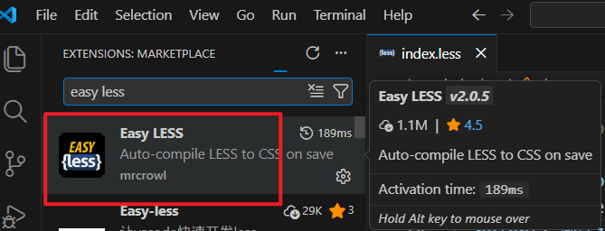

# L31：CSS 预编译器入门

本节对应第三章第六课。

本节大致录制时间：`2020-02-03 11:48`。

---


> [!tip]
>
> `Less` 及 `Sass` 相关文档汇总：
>
> - `Less` 官网：http://lesscss.org/
> - `Less` 中文文档1（非官方）：http://lesscss.cn/
> - `Less` 中文文档2（非官方）：https://less.bootcss.com/
> - `Sass` 官网：https://sass-lang.com/
> - `Sass` 中文文档1（非官方）：https://www.sass.hk/
> - `Sass` 中文文档2（非官方）：https://sass.bootcss.com/


## 1 基本原理

编写 `CSS` 时，受限于 `CSS` 语言本身，常常难以处理一些问题：

- 重复的样式值：例如常用颜色、常用尺寸；
- 重复的代码段：例如绝对定位居中、清除浮动；
- 嵌套样式的重复书写。

由于官方迟迟不对 `CSS` 语言本身做出改进，一些第三方机构开始想办法来解决这些问题。

其中一种方案，便是 **预编译器**。

预编译器的原理很简单，即使用一种更加优雅的方式来书写样式代码，通过一个编译器，将其转换为可被浏览器识别的传统 `CSS` 代码：


目前，最流行的预编译器有 `Less` 和 `Sass`，由于二者极为相似（`Less` 团队成员来自 `Sass` 团队），因此仅学习一种即可（本课程学习 `Less`）：


## 2 Less 的安装与使用

从原理可知，要使用 `Less`，必须要安装 `Less` 编译器。

`Less` 编译器是基于 `node` 开发的，可以通过 `npm` 下载安装：

```shell
npm i -D less
```

安装完成后，可用 `Less` 提供的一个 `CLI` 命令行工具 `lessc` 完成编译：

```shell
lessc file_name_in_Less compiled_file_name
```

例如，新建一个 `index.less` 文件，内容如下：

```less
// Less 代码
@red: #f40;

.redcolor {
    color: @red;
}
```

运行命令：

```bash
$ lessc index.less index.css
```

可以看到编译后的代码：

```css
.redcolor {
  color: #f40;
}
```


## 3 Less 的基本用法

具体用法详见官方文档：[https://lesscss.org/](https://lesscss.org/)

- 变量：可将所有变量放入 `vars.less` 统一管理；
- 混合：可携带参数、并配置默认值（定义时带括号可不写入编译结果中）；
- 嵌套：`CSS` 已提供原生支持；
- 运算：对 `CSS` 原生的 `calc()` 未作扩展；
- 函数：`lighten()`、`darken()` 等；
- 作用域：满足就近原则；
- 注释：建议多用单行注释（不带入编译结果），方便调试；
- 导入：编译会保留 `CSS` 原生的导入写法；对于 `Less` 模块，可先导入基础设置（`base.less`），再导入微调样式（`theme.less`），这样可快速实现局部样式切换。


## 4 实测备忘

:one: 安装 `Easy LESS` 扩展插件后，`VSCode` 会在保存 `Less` 文件时自动转为 `CSS` 文件：



要修改默认配置，需在 `VSCode` 配置文件 `settings.json` 中修改如下内容：

```json
{
  "less.compile": {
    "out": false  // true 为自动转换
  },
}
```


:two: 使用 `Less` 变量进行四则运算时，需要注意相对单位与 `CSS` 原生的 `calc()` 有所不同：

```less
@size: 20px;

.box {
  width: @size + 1rem;
  font-size: calc(@size + 1em);
}

// compiled CSS:
.box {
  width: 21px;
  font-size: calc(20px + 1em);
}
```

在 `Less` 加减法中，相对单位会自动和变量的单位保持一致。
