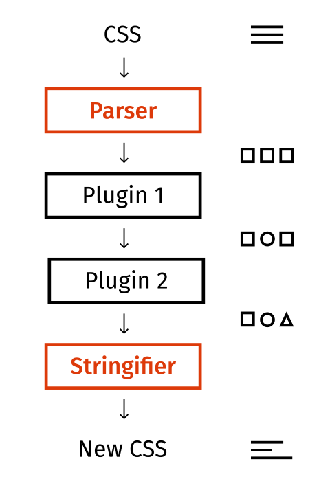
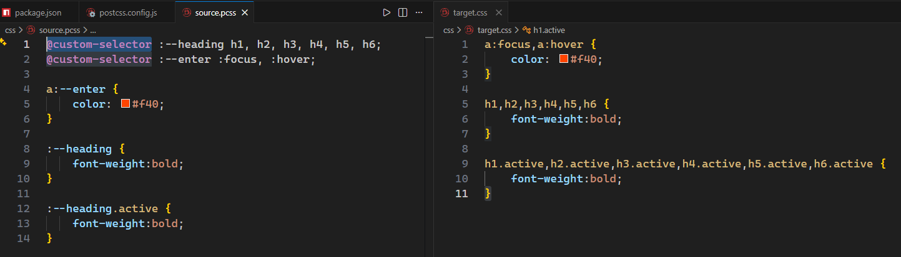
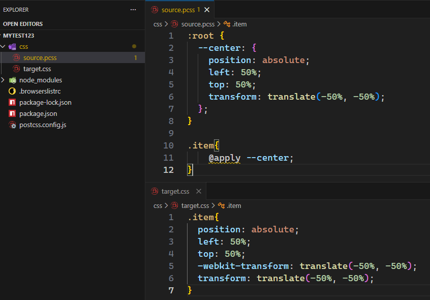
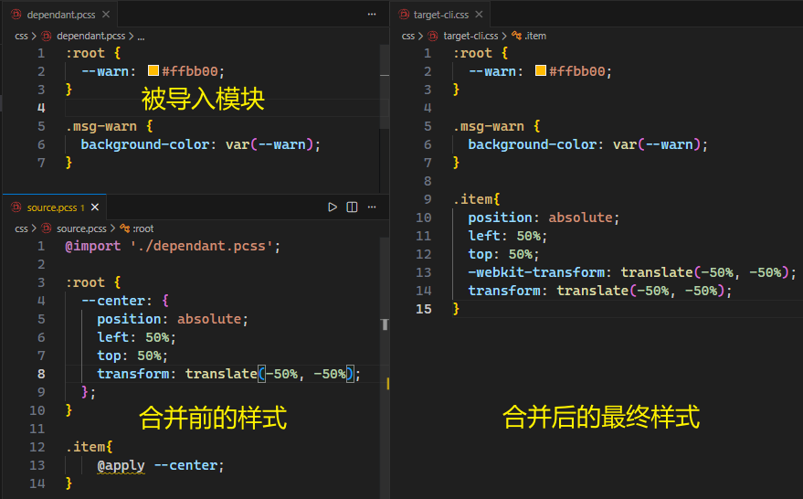
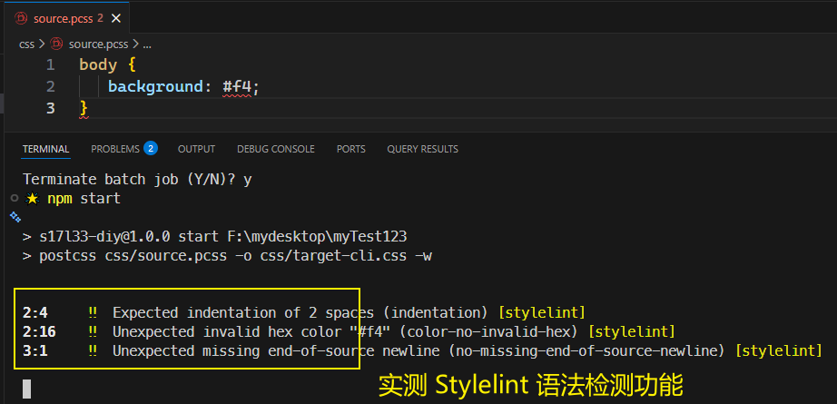
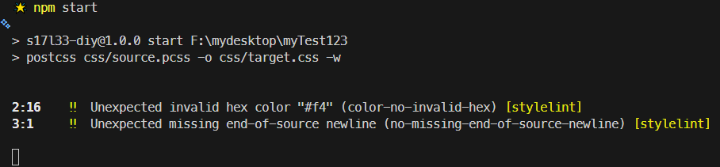

# L33：PostCSS 入门

本节对应第三章第八课。

本节大致录制时间：`2020-02-04 14:30:00`。

---

> [!tip]
>
> **小贴士**
>
> 本节主要介绍 `PostCSS` 基本概念、原理及用法，与 `Webpack` 无关。
>
> `PostCSS` 官方文档：
>
> `VSCode` 实用扩展：`postcss-sugarss-language`


## 1 什么是 PostCSS

学到现在不难发现，`CSS` 工程化面临着诸多问题，而对应的解决方案又五花八门。

光是把 `CSS` 单拎出来看，样式本身就有很多问题需要处理。

既然有这么多事情要处理，何不把这些事情集中到一起统一处理呢？

`PostCSS` 就是基于这样的理念出现的。它类似于一个编译器，可以将样式源码编译成最终的 `CSS` 代码：


看上去是不是和 `Less`、`Sass` 一样呢？

但 `PostCSS` 和 `Less`、`Sass` 的思路不同，它其实只做一些代码分析之类的事情，然后将分析结果交给其插件，具体的代码转换操作是通过插件实现的。


官方的一张图更能说明 `PostCSS` 的处理流程：



> 这一点有点像 `Webpack`，`Webpack` 本身仅做依赖分析、抽象语法树分析，其他的操作是靠插件和加载器完成的。

`PostCSS` 官网：https://postcss.org/

`GitHub` 地址：https://github.com/postcss/postcss


## 2 安装

`PostCSS` 是基于 `node` 编写的，因此可以使用 `NPM` 安装：

```shell
npm i -D postcss
```

`PostCSS` 库提供了对应的 `JS API` 用于转换代码。若想使用 `PostCSS` 的一些高级功能，或想开发 `PostCSS` 插件，就要通过调用 `API` 接口的方式使用 `PostCSS`。

> [!tip]
>
> `API` 官方文档：http://api.postcss.org/。

不过绝大部分时候，我们都是使用者，并不希望通过 `API` 接口的方式来使用 `PostCSS`。

因此，我们可以再安装一个 `postcss-cli`，通过命令行来完成编译：

```shell
npm i -D postcss-cli
```

`postcss-cli` 提供一个命令，它调用 `PostCSS` 中的 `API` 接口来完成编译。命令格式为：

```shell
postcss 源码文件 -o 输出文件
```


## 3 配置文件

和 `Webpack` 类似，`PostCSS` 有自己的配置文件，该配置文件会影响 `PostCSS` 的某些编译行为。

配置文件的默认名称：`postcss.config.js`：

```js
module.exports = {
    map: false, // 关闭 source-map，也可以为 inline
}
```


## 4 插件

光用 `PostCSS` 意义不大，要让它真正发挥作用，需要各种插件。

> [!tip]
>
> `PostCSS` 官方插件市场：https://postcss.org/docs/postcss-plugins（原 ~~https://www.postcss.parts/~~ 已过期）。

下面罗列一些 `PostCSS` 的常用插件。


### 4.1 postcss-preset-env

`GitHub`：[https://github.com/csstools/postcss-plugins/tree/main/plugin-packs/postcss-preset-env](https://github.com/csstools/postcss-plugins/tree/main/plugin-packs/postcss-preset-env)

过去使用 `PostCSS` 时，往往会使用大量的插件，它们各自解决一些问题。这样导致的结果是插件的安装和配置都特别繁琐。

于是出现了插件 `postcss-preset-env`，即 `PostCSS` 的 **预设环境**。它整合了很多常用插件，并帮助开发者完成基本配置。通常只需要安装该插件，就相当于安装了很多插件。

安装方法：

```bash
npm install postcss-preset-env --save-dev
```

然后在 `PostCSS` 的配置文件中加入以下内容：

```js
module.exports = {
    plugins: {
        "postcss-preset-env": {} // {} 中可以填写插件的配置
    }
}
```

该插件的功能很多，下面重点介绍——


#### 4.1.1 自动添加厂商前缀

某些新的 `CSS` 样式需要在旧版本浏览器中使用厂商前缀方可实现。例如：

```css
::placeholder {
    color: red;
}
```

该功能在不同的旧版浏览器中仍需写作：

```css
::-webkit-input-placeholder {
    color: red;
}
::-moz-placeholder {
    color: red;
}
:-ms-input-placeholder {
    color: red;
}
::-ms-input-placeholder {
    color: red;
}
::placeholder {
    color: red;
}
```

要完成这件事情，需要使用 `autoprefixer` 库；而 `postcss-preset-env` 内置了该工具库。

如果需要调整 **兼容的浏览器** 范围，可以通过下面的方式进行配置：

**方式1：在 postcss-preset-env 中加入 browsers 配置**

```js
module.exports = {
    plugins: {
        "postcss-preset-env": {
            browsers: [
                "last 2 version",
                "> 1%"
            ]
        } 
    }
}
```

**方式2【推荐】：添加单独的 .browserslistrc 文件**

创建文件 `.browserslistrc`，填写配置内容：

```
last 2 version
> 1%
```

**方式3【推荐】：在 package.json 的配置中加入 browserslist 选项**

```json
"browserslist": [
    "last 2 version",
    "> 1%"
]
```

`browserslist` 是一个多行的（数组形式的）标准字符串。它的书写规范多而繁琐，详见：https://github.com/browserslist/browserslist

一般情况下，大部分网站都使用下面的格式进行书写：

```
last 2 version
> 1% in CN
not ie <= 8
```

- `last 2 version`：浏览器的兼容最近期的两个版本
- `> 1% in CN`：匹配中国大于1%的人使用的浏览器， `in CN`可省略
- `not ie <= 8`：排除掉版本号小于等于8的IE浏览器

默认情况下，**匹配的结果求的是各规则的并集**（实测结果详见 `8dcaa11`）。

可以通过网站 https://browserl.ist/ 对配置结果覆盖的浏览器进行查询，查询时，多行之间使用 **英文逗号** 分隔（经实测已不需要手动添加）。

> [!tip]
>
> `browserslist` 的数据来自 [CanIUse](http://caniuse.com/) 网站，由于数据并非实时的，所以不会特别准确。

实测 https://browserl.ist/ 在线查询结果：


#### 4.1.2 未来的 CSS 语法

`CSS` 的某些前沿语法正在制定过程中，没有形成真正的标准，如果希望使用这部分语法，为了浏览器兼容性，需要进行编译。

过去，完成该语法编译的是 `cssnext` 库，不过有了 `postcss-preset-env` 后，它自动包含了该功能。

你可以通过 `postcss-preset-env` 的 `stage` 配置，告知 `postcss-preset-env` 需要对哪个阶段的 `CSS` 语法进行兼容处理，它的默认值为 `2`：

```js
"postcss-preset-env": {
    stage: 0
}
```

一共有五个阶段可配置：

- Stage 0：**Aspirational**，只是一个早期草案，极其不稳定；
- Stage 1：**Experimental**，仍然极其不稳定，但是提议已被 `W3C` 公认；
- Stage 2：**Allowable**，虽然还是不稳定，但已经可以使用了；
- Stage 3：**Embraced**，比较稳定，可能将来会发生一些小的变化，它即将成为最终的标准；
- Stage 4：**Standardized**，所有主流浏览器都应该支持的 `W3C` 标准。

了解了以上知识后，接下来了解一下未来的 `CSS` 语法，尽管某些语法仍处于非常早期的阶段，但是有该插件存在，编译后仍然可以被浏览器识别。


##### 1 变量

未来的 `CSS` 语法是天然支持变量的。

在 `:root{}` 中定义常用变量 [^1]，使用 `--` 前缀命名变量：

```css
:root {
    --lightColor: #ddd;
    --darkColor: #333;
}

a {
    color: var(--lightColor);
    background: var(--darkColor);
}
```

实测转换后的 `CSS` 样式（`5df6ae8`）：

```css
:root {
    --lightColor: #ddd;
    --darkColor: #333;
}

a {
    color: #ddd;
    color: var(--lightColor);
    background: #333;
    background: var(--darkColor);
}
```

> [!note]
>
> **注意**
>
> 经 `PostCSS` 编译后，仍然可以看到自己写的 `CSS` 新语法，因为它们的存在并不影响浏览器渲染，尽管浏览器可能并不认识。
>
> 如果不希望在结果中看到这些新语法，可以配置 `postcss-preset-env` 的 `preserve` 为 `false`。
>
> 实测 `preserve: false` 效果（`3f4458e`）：
>
> ```css
> /* ./css/target.css */
> a {
>     color: #ddd;
>     background: #333;
> }
> ```


##### 2 自定义选择器

```css
@custom-selector :--heading h1, h2, h3, h4, h5, h6;
@custom-selector :--enter :focus,:hover;

a:--enter{
    color: #f40;
}

:--heading{
    font-weight:bold;
}

:--heading.active{
    font-weight:bold;
}
```

编译后：

```css
a:focus,a:hover{
    color: #f40;
}

h1,h2,h3,h4,h5,h6{
    font-weight:bold;
}

h1.active,h2.active,h3.active,h4.active,h5.active,h6.active{
    font-weight:bold;
}
```

实测效果（`90c77a0`）：




##### 3 嵌套

与 `Less` 相同，只不过嵌套的选择器前必须使用符号 `&`（目前已原生支持）：

```less
.a {
    color: red;
    & .b {
        color: green;
    }

    & > .b {
        color: blue;
    }

    &:hover {
        color: #000;
    }
}
```

编译后：

```css
.a {
    color: red
}

.a .b {
    color: green;
}

.a>.b {
    color: blue;
}

.a:hover {
    color: #000;
}
```

实测代码详见 `51b3365`（由于 `CSS` 已原生支持 `&` 嵌套，无需截图对比）。


### 4.2 postcss-apply

`GitHub` 仓库地址：https://github.com/pascalduez/postcss-apply

该插件支持在 `CSS` 中 **书写属性集**。该特性类似于 `Less` 中的混入，可以利用 `CSS` 的新语法定义一个 `CSS` 代码片段，然后在需要时应用它：

```less
:root {
  --center: {
    position: absolute;
    left: 50%;
    top: 50%;
    transform: translate(-50%, -50%);
  };
}

.item{
    @apply --center;
}
```

配置 `postcss-apply` 插件：

```js
// postcss.config.js:
module.exports = {
  plugins: {
    "postcss-apply": {}
  }
}
```

然后调用 `postcss-cli` 接口命令：`npx postcss css/source.pcss -o css/target.css -w`

编译后：

```css
.item{
  position: absolute;
  left: 50%;
  top: 50%;
  -webkit-transform: translate(-50%, -50%);
  transform: translate(-50%, -50%);
}
```

实际上，该功能也属于 `cssnext`，不知为何 `postcss-preset-env` 未提供支持。

实测时，因未向 `PostCSS` 配置文件注册该插件，导致原文件中的 `@apply` 语法转换失败，但 `JS` 脚本还能正常转换（使用 `node` 命令直接运行 `JS` 文件，详见 `51b0c65`）：

```css
/* ./css/target-cli.css: failed to register plugin when testing */
:root {
  --center: {
    position: absolute;
    left: 50%;
    top: 50%;
    -webkit-transform: translate(-50%, -50%);
            transform: translate(-50%, -50%);
  };
}

.item{
    @apply --center;
}

/*---------------------------------------------------*/

/* ./css/target-js.css: passed */
.item{
  position: absolute;
  left: 50%;
  top: 50%;
  transform: translate(-50%, -50%);
}
```

更正后与视频效果相同（`ade54c3`）：




> [!tip]
>
> **`DeepSeek` 给出的解释**
>
> 简单来说，`postcss-preset-env` 的目标是让你【安全地使用未来的、**标准化** 的 `CSS` 语法】。它就像一台时光机，让你在今天就能用上明天浏览器才会原生支持的特性。因此，它只收录那些已进入 `W3C` 标准化流程的 `CSS` 功能。
>
> 而 `postcss-apply` 插件所实现的 `@apply` 规则，则走上了一条不同的路：
>
> 1. **曾有的希望**：`@apply` 规则最初确实是在 **CSS 的自定义属性（CSS Custom Properties for Cascading Variables）规范** 的草案中提出的。当时人们希望它能像 `Sass` 的 `@mixin` 一样，复用一整段样式。
> 2. **方案的废弃**：然而，这个想法在后续的规范讨论中被 **彻底放弃** 了。因为经过深入讨论，规范制定者们发现，这个机制会带来很多难以解决的问题，比如**严重的命名冲突**、**代码的复杂度过高**，以及 **和浏览器渲染机制的冲突** 等。
> 3. **分道扬镳**：由于 `@apply` 最终没能成为标准，`cssnext`（`postcss-preset-env` 的前身）也就顺理成章地将其移除——因为它还没走到标准化那一步，就在半道上被舍弃了。


### 4.3 postcss-color-function

`GitHub` 仓库地址：https://github.com/postcss/postcss-color-function

该插件支持在源码中使用一些颜色函数：

```less
body {
  /* 使用颜色 #aabbcc，不做任何处理，等同于直接书写 #aabbcc */
  color: color(#aabbcc);
  /* 将颜色 #aabbcc 透明度设置为 90% */
  color: color(#aabbcc a(90%));
  /* 将颜色 #aabbcc 的红色部分设置为 90% */
  color: color(#aabbcc red(90%));
  /* 将颜色 #aabbcc 调亮 50%（更加趋近于白色），类似于 Less 中的 lighten() 函数 */
  color: color(#aabbcc tint(50%));
  /* 将颜色 #aabbcc 调暗 50%（更加趋近于黑色），类似于 Less 中的 darken() 函数 */
  color: color(#aabbcc shade(50%));
}
```

编译后：

```css
body {
  /* 使用颜色 #aabbcc，不做任何处理，等同于直接书写 #aabbcc */
  color: color(#aabbcc);
  /* 将颜色 #aabbcc 透明度设置为 90% */
  color: color(#aabbcc a(90%));
  /* 将颜色 #aabbcc 的红色部分设置为 90% */
  color: color(#aabbcc red(90%));
  /* 将颜色 #aabbcc 调亮 50%（更加趋近于白色），类似于 Less 中的 lighten() 函数 */
  color: color(#aabbcc tint(50%));
  /* 将颜色 #aabbcc 调暗 50%（更加趋近于黑色），类似于 Less 中的 darken() 函数 */
  color: color(#aabbcc shade(50%));
}
```

实测效果与笔记相同，代码详见 `0e08d82`。


### 4.4 [扩展] postcss-import

`GitHub` 仓库地址：https://github.com/postcss/postcss-import

该插件可以让你在 `PostCSS` 文件中导入其他样式代码，通过该插件可以将它们合并。

安装（找到视频录制时的最新版 `v12.0.1`）：

```bash
npm i -D postcss-import@12.0.1
```

然后注册该插件：

```js
// postcss.config.js
module.exports = {
  plugins: {
    "postcss-import": {}
  }
}
```

`DIY` 实测代码：

```css
@import './dependant.pcss';

:root {
  --center: {
    position: absolute;
    left: 50%;
    top: 50%;
    transform: translate(-50%, -50%);
  };
}
.item{
    @apply --center;
}
```

实测结果（`802e075`）：



> [!note]
>
> **注意**
>
> 由于后续课程会将 `PostCSS` 整合到 `Webpack` 中，而 `Webpack` 本身具有分析依赖的功能，所以该插件的实际意义不大。


### 4.5 Stylelint

官网：https://stylelint.io/

`GitHub` 仓库：https://github.com/stylelint/stylelint

在实际开发中，书写 `CSS` 代码难免有失规范，`Stylelint` 插件可以及时发现问题并提示开发者。

安装命令：

```bash
npm install stylelint --save-dev
```

然后注册到 `PostCSS` 中：

```js
// postcss.config.js:
module.exports = {
  plugins: {
    "stylelint": {}
  }
}
```

由于不同的公司可能使用不同的 `CSS` 书写规范，为不失灵活性，`Stylelint` 本身并没有提供统一的规则验证方案，使用时需要开发者自行配置 **规则验证方案**。

通常，我们会安装第三方工具库 `stylelint-config-standard` 来提供标准的 `CSS` 规则。

老规矩，先从 `NPM` 安装开发依赖：

```bash
npm install stylelint-config-standard --save-dev
```

然后注册到 `Stylelint` 的配置文件中，让该规则验证方案生效（`Stylelint` 的配置文件为 `.stylelintrc`）：

```json
// .stylelintrc
{
  "extends": "stylelint-config-standard"
}
```

这样，运行 `postcss` 命令就会触发 `Stylelint` 的 `CSS` 语法规范检测，具体检测方案从配置文件 `.stylelintrc` 中的 `stylelint-config-standard` 中读取。

如果代码中出现不规范的地方，编译时将会报出错误：

```css
body {
    background: #f4;
}
```


发生了两处错误：

1. 缩进应该只有两个空格；
2. 十六进制的颜色值不正确；

如果某些规则并非你所期望的，可以在配置中进行设置：

```json
{
    "extends": "stylelint-config-standard",
    "rules": {
        "indentation": null
    }
}
```

设置为 `null` 可以禁用该规则，或者设置为 `4`，表示一个缩进有四个空格。更多配置详见 `stylelint` 文档：https://stylelint.io/。


实测代码（详见 `b3346fd`）：

```css
/* ./css/source.pcss */
body {
   background: #f4;
}
```

运行结果：



手动禁用某条规则：

```json
// .stylelintrc
{
  "extends": "stylelint-config-standard",
  "rules": {
    "indentation": null
  }
}
```

再次运行 `postcss` 命令转换样式，实测结果（`8bc2fa7`）：



但是这种错误报告需要在 **运行 PostCSS 编译命令时** 才会发生，如果希望在代码编写时自动在 `VSCode` 里报错呢？

那就得安装 `VSCode` 的插件 `Stylelint` 即可，它会读取你工程中的配置文件，按照配置进行实时报错：


> [!tip]
>
> **小贴士**
>
> 实际上，如果安装了 `Stylelint` 插件，可以不需要在 `PostCSS` 中使用该插件了。
>
> `P.S.`：实测过程中发现最新的 `Stylelint` 仅支持 `PostCSS v8.x` 版本，于是又降级到和视频同步才正常运行。这也是使用该工具的一个障碍：版本不兼容，导致牵一发动全身（实际可能会完全自行解决相关工具版本问题，只能借助 `AI` 工具解决）。


---

[^1]: `:root` 表示 `html` 元素，视频中只说了特殊位置，但没有点明其具体含义。在其中声明的自定义变量将全局可用。

