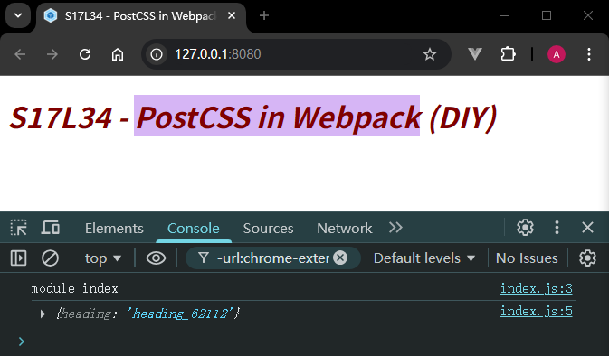

# L34：在 Webpack 中使用 PostCSS

本节对应第三章第九课。

本节大致录制时间：`2020-02-06 13:20:00`。

---


本节演示了 `PostCSS` 集成到 `Webpack` 中的具体方法，过程略显凌乱，实测时最好能梳理一下步骤。


## 1 要点概述

（主要操作步骤梳理）

- `webpack`
- `webpack-cli`
- `html-webpack-plugin`
- `css-loader` / `style-loader` / `postcss-loader` / `postcss`
- 添加 `PostCSS` 配置文件，以及 `postcss-preset-env`
  - 浏览器兼容性：`.browserslistrc`

- `webpack-dev-server`
- 需要 `CSS` 语法检测：`.stylelint`，并安装 `stylelint-config-standard`
- 开启 `CSS Module`


## 2 实测备忘

整合流程梳理：

:one: 安装相关依赖：

```bash
# 1. 安装 Webpack 相关依赖
npm i -D webpack@4 webpack-cli@3 webpack-dev-server@3
# 2. 安装打包页面、复制图标等三个插件
npm i -D html-webpack-plugin@3 clean-webpack-plugin@3 copy-webpack-plugin@5
# 安装 loader
npm i -D postcss@7 postcss-loader@3 css-loader@3 style-loader@1
# 安装 PostCSS 相关插件
npm i -D postcss-preset-env@6
# （可选）安装 CSS 样式书写规范检测工具 Stylelint
npm i -D stylelint@13 stylelint-config-standard@19
```


:two: 创建相关配置文件：

```js
// package.json
{
  "scripts": {
    "dev": "webpack",
    "build": "webpack --mode production",
    "serve": "webpack-dev-server"
  }
}

// postcss.config.js
module.exports = {
  map: false,
  plugins: {
    "postcss-preset-env": {
      preserve: false,
      stage: 0
    },
    "stylelint": {},
  },
}

// .browserslistrc
last 2 version
> 1%
not ie <= 8

// .stylelintrc
{
  "extends": "stylelint-config-standard",
  "rules": {
    "no-descending-specificity": null
  }
}

// webpack.config.js：详见 50fffe5
```

最终效果（`50fffe5`）：




:three: 错把 `::seletion` 写作 `::placeholder`，最终对比 `Typora` 主题才发现问题。


:four: 尝试将依赖版本升级到 `Webpack 5`，`NodeJS` 改用最新版 `v24.13.0`，其余依赖也使用最新版本（2026-2-15）：

```json
// package.json
{
  "devDependencies": {
    "clean-webpack-plugin": "^4.0.0",
    "copy-webpack-plugin": "^13.0.1",
    "css-loader": "^7.1.3",
    "html-webpack-plugin": "^5.6.6",
    "postcss": "^8.5.6",
    "postcss-loader": "^8.2.0",
    "postcss-preset-env": "^11.1.3",
    "style-loader": "^4.0.0",
    "stylelint": "^17.3.0",
    "stylelint-config-standard": "^40.0.0",
    "webpack": "^5.105.2",
    "webpack-cli": "^6.0.1",
    "webpack-dev-server": "^5.2.3"
  },
  "volta": {
    "node": "24.13.0"
  }
}
```

其他变化较大的地方：

- 无需 `CleanWebpackPlugin` 插件，`output.clean` 取而代之；

- `Stylelint` 检查更仔细，建议统一使用 `kebab-case` 命名变量；

- `CopyWebpackPlugin` 配置有变，和 `HtmlWebpackPlugin` 冲突的 `favicon` 图标必须显式取消复制：

  ```js
  const copyPlugin = new CopyWebpackPlugin({
    patterns: [
      {
        from: "./public",
        to: "./",
        globOptions: {
          // 忽略 index.html，让 HtmlWebpackPlugin 处理
          ignore: ["**/index.html"],
        },
      },
    ],
  });
  ```

- 导入 `.pcss` 的写法有变：

  ```js
  import * as styles from "./assets/index.pcss";
  // -- snip --
  console.log(styles);
  ```

  最终效果（`c5a0431`）：


