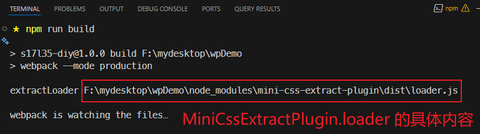
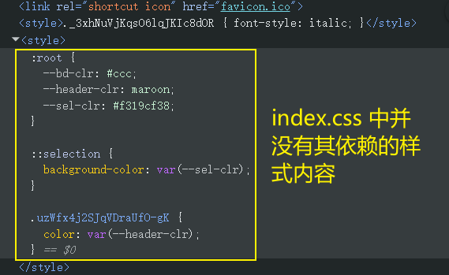
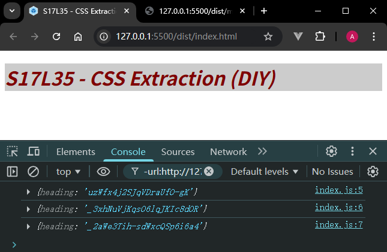
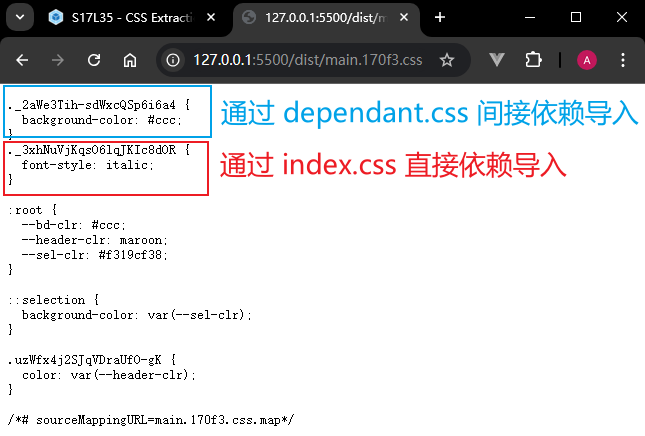

# L35：抽离 CSS 文件

本节对应第三章第十课（最后一节）。

---


本节介绍了从前端工程化项目中提取 `CSS` 样式为独立文件的基本原理，以及 `mini-css-extract-plugin` 插件的用法。


## 1 概要

复习：`CSS` 代码经 `css-loader` 转换后会交给 `style-loader` 作进一步处理。

`style-loader` 会通过一段 `JS` 代码将样式加到页面的 `style` 元素中。

实际开发中，人们往往希望依赖的样式最终形成一个 `CSS` 文件，此时就需要一个插件：`mini-css-extract-plugin`（详见：https://www.npmjs.com/package/mini-css-extract-plugin）。

核心原理：该库包含一个 `plugin` 和一个 `loader` ——

- `plugin`：负责生成 `CSS` 文件；
- `loader`：负责记录要生成的 `CSS` 文件的内容，同时导出开启 `css-module` 后的样式对象；

用法示例：

```js
const MiniCssExtractPlugin = require('mini-css-extract-plugin');
const {loader: extractLoader} = MiniCssExtractPlugin;
console.log('extractLoader', extractLoader);

module.exports = {
  plugins: [
    new MiniCssExtractPlugin({
      filename: '[name].[hash:5].css'
    }),
  ],
  module: {
    rules: [
      { test: /\.css$/i, use: [extractLoader, 'css-loader?modules']},
    ]
  },
}
```

根据实测打包结果（`99a4a2c`），`MiniCssExtractPlugin.loader` 就是一个普通字符串，描述了插件内部 `loader` 的具体位置：




### 配置生成的文件名

同 `output.filename` 的含义一样，即根据 `Chunk` 生成的样式文件名。

配置生成的文件名，例如：`[name].[contenthash:5].css`。

默认情况下，每个 `Chunk` 对应一个 `CSS` 文件。


## 2 实测备忘

:one: 使用 `@import` 规则导入 `CSS` 时，若定义了路径别名（如 `@`），则用于 `CSS` 文件中必须带 `~` 符号；而在 `JS` 文件中导入 `CSS` 模块则不能添加。这两种情况下如果使用相对路径，则都不用加 `~`：

`CSS` 中导入必须加 `~`：

```css
/* ./src/assets/dependant.css */
@import '~@/assets/another.css';

.heading {
  font-style: italic;
}
```

`JS` 中导入则不用；并且使用相对路径导入也不用加 `~`：

```js
/* ./src/index.js: */
import module1 from '@/assets/index.css';
import module2 from '@/assets/dependant.css';
import module3 from './assets/another.css';

console.log(module1);
console.log(module2);
console.log(module3);

const header = document.querySelector('.heading');
header.classList.add(module1.heading, module2.heading, module3.heading);
```

注意：该插件只负责生成 `CSS` 文件和对应的 `link` 标签，样式的具体应用还得靠 `JS` 模块来指定。


:two: 配置路径解析别名的方法：

```js
const path = require('node:path');
module.exports = {
  resolve: {
    alias: {
      '@': path.resolve(__dirname, 'src'),
    }
  },
}
```


:three: `style-loader` 不会在当前 `CSS` 模块自动合并其依赖的子模块样式；若非要用 `@import` 导入，最后的 `style` 元素内也不会包含依赖的样式内容（`12b55a0`）：



使用 `mini-css-extract-plugin` 后，子模块的样式会自动打包到同一个 `CSS` 文件中（`67d022f`）：





