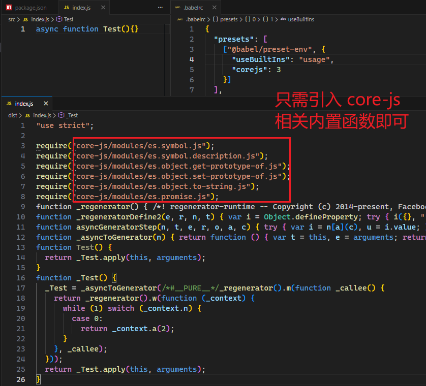
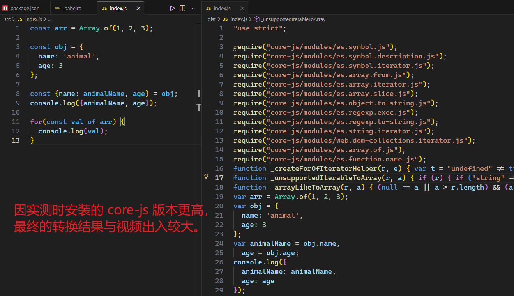

# L37：Babel 预设环境的配置

本节对应视频第四章第二课。

本节大致录制于 `2020-02-07 10:10:00`。

---


## 1 概述

`Babel` 官方提供了多种预设方案，最常见的一种叫 `@babel/preset-env`，其他预设方案负责其他细分领域的代码转换（从官网摘录，仅供了解）——

- [@babel/preset-env](https://babeljs.io/docs/babel-preset-env) for compiling ES2015+ syntax
- [@babel/preset-typescript](https://babeljs.io/docs/babel-preset-typescript) for [TypeScript](https://www.typescriptlang.org/)
- [@babel/preset-react](https://babeljs.io/docs/babel-preset-react) for [React](https://reactjs.org/)
- [@babel/preset-flow](https://babeljs.io/docs/babel-preset-flow) for [Flow](https://flow.org/)


### 1.1 安装与配置

首先安装 `@babel/preset-env`（视频中版本为 `v7.8.4`）：

```bash
npm i -D @babel/preset-env
```

然后写入配置文件：

```json
{
  "presets": [
    "@babel/preset-env"
  ]
}
```

`@babel/preset-env` 能让开发者使用最新的 `JS` 语法而无需针对每种语法转换设置具体的插件。


### 1.2 兼容的浏览器

`@babel/preset-env` 需要根据兼容的浏览器范围来确定如何编译，具体通过配置文件 `.browserslistrc` 来描述（类似 `PostCss`）：

```
last 3 version
> 1%
not ie <= 8
```


### 1.3 更多个性化配置

和 `postcss-preset-env` 一样，`@babel/preset-env` 自身也有一些配置，具体详见官方文档：

- 英文原版（:star: 推荐）：https://babeljs.io/docs/babel-preset-env
- 中文版：https://www.babeljs.cn/docs/babel-preset-env#options

配置模板格式：

```json
{
  "presets": [
    ["@babel/preset-env", {
      "配置项1": "配置值",
      "配置项2": "配置值",
      "配置项3": "配置值"
    }]
  ]
}
```

其中较常见的配置项是 `useBuiltIns`（默认为 `false`），其主要作用是 **根据项目代码中实际用到的 ES6 版本及以上的新 API，按需自动引入对应的 polyfill（垫片、兼容包），从而避免全量引入 polyfill 造成打包体积过大**。

用法解释：由于 `@babel/preset-env` 仅转换新的语法，但并不对新的 `API` 作任何处理（即新引入的对象、构造函数等），例如：

```js
// before
new Promise(resolve => {
    resolve()
})

// after
new Promise(function (resolve) {
  resolve();
});
```

若旧版浏览器不提供 `Promise` 的构造函数，此时该代码就会报错。

但在配置 `useBuiltIns` 选项后，`Babel` 预设就能在编译结果中注入这些用到的新 `API`；其值为 `usage` 时，表示根据 `API` 的使用情况按需导入 `API`；若值为默认的 `false`，则表示不注入任何新 `API`：

```json
{
  "presets": [
    ["@babel/preset-env", {
      "useBuiltIns": "usage",
      "corejs": 3
    }]
  ]
}
```

这里的 `"corejs": 3` 是为了覆盖 `@babel/preset-env` 默认设置（默认为 `2`）；而实际安装的版本是 `v3.6.4`，因此必须手动修改，否则找不到对应的库。


### 1.4 特殊语法的转换

例如 `async / await` 语法糖的转换，单靠 `core-js` 无法处理：

```js
async function Test() {}
```

录制该视频时，Babel 尚需通过引入 `regenerator-runtime/runtime` 来替代当时全新的 `async / await` 语法糖；实测时 `core-js` 早已升级，最终只需要使用 `core-js` 中的库函数就能实现相应功能：



总之一个原则，如果转换后的结果出现了新的第三方 `JS` 库，则需要安装相应的依赖才能正常运行。


## 2 实测备忘

:one: 实测 `Array.of()`、解构赋值、对象属性简写、`for-of` 遍历（`088b37a`）：



