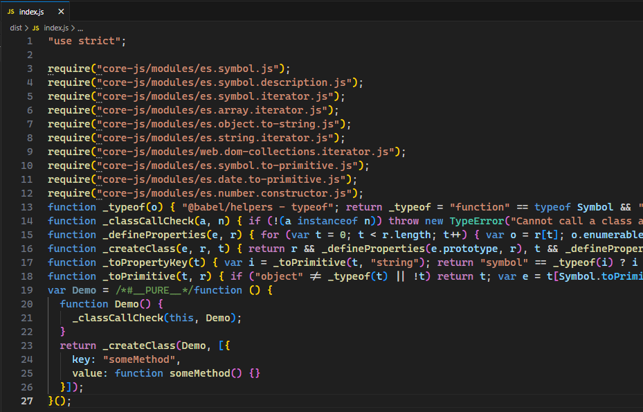
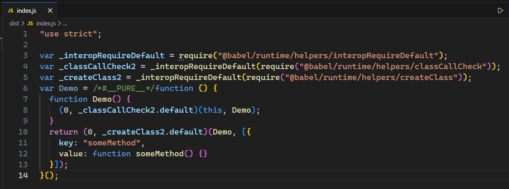

# L38：Babel 插件

本节为第四章第三课。

---


> [!tip]
>
> **课前补充**
>
> `@babel/polyfill` 已过时，目前被 `core-js` 和 `generator-runtime` 所取代。
>
> **DIY 补遗**：学习时 `generator-runtime` 也已过时，绝大多数兼容逻辑已在 `core-js` 中实现。


## 1 关于执行顺序

除了 **预设（presets）** 可以转换代码之外，**插件（plugins）** 也可以转换代码。它们的执行顺序是：

- 插件 `plugins` 会在预设 `presets` 前运行；
- 插件内的执行顺序：**从前往后** 依次执行；
- 预设内的执行顺序：**从后往前**（类似 `Webpack` 中的 `loader` 加载器）。


## 2 Babel 的插件机制

通常情况下，`@babel/preset-env`只转换那些已经形成正式标准的语法，对于某些处于早期阶段、还没有确定的语法不做转换。

如果要转换这些语法，就要单独使用 **插件**（`plugins`）。

与 `Babel` 预设方案一样，插件自身的详细配置也是通过一个数组实现的：

```json
{
  "plugins": [
    ["@babel/name-of-babel-plugin", {
      "配置项1": "配置值",
      "配置项2": "配置值",
      "配置项3": "配置值"
    }]
  ]
}
```

下面随便列举一些典型的 `Babel` 插件——


### 2.1  @babel/plugin-proposal-class-properties

该插件可以在类中初始化某个字段：

```js
class A {
    a = 1;
    constructor(){
        this.b = 3;
    }
}
```

`DIY`：该特性已在 `ES2022` 中正式确定。


### 2.2 @babel/plugin-proposal-function-bind

该插件可以让你轻松的为某个方法绑定 `this`：

```js
function Print() {
    console.log(this.loginId);
}

const obj = {
    loginId: "abc"
};

obj::Print(); // 相当于 Print.call(obj);
```

实测结果（）：

```js
"use strict";

function Print() {
  console.log(this.loginId);
}
var obj = {
  loginId: "abc"
};
Print.call(obj); // 相当于 Print.call(obj);
```


> [!tip]
>
> 遗憾的是，目前 `VSCode` 无法识别该语法，会在代码中报错（已废弃语法，`DeepSeek` 不建议修复该问题），虽然并不会有什么实际性危害，但是影响观感。
>
> `DeepSeek` 解释：
>
> 这个提案（包括 `::` 绑定操作符）之所以没有推进下去，主要原因是：
>
> - **存在更成熟的替代方案**：`ES5` 时代就已经有了标准的 `Function.prototype.bind`、`call` 和 `apply` 。`ES6` 又有了箭头函数，这些已经能很好地解决 `this` 绑定问题。
> - **提案停滞**：在 `TC39` 的讨论中，这个语法糖的必要性和具体设计一直没有达成最终共识，因此停留在了早期阶段（即 **Stage 1** 提案阶段）。


### 2.3 @babel/plugin-proposal-optional-chaining

```js
const obj = {
  foo: {
    bar: {
      baz: 42,
    },
  },
};

const baz = obj?.foo?.bar?.baz; // 42

const safe = obj?.qux?.baz; // undefined
```

`DIY`：该写法已在 `ES2020` 中完全支持。


### 2.4 babel-plugin-transform-remove-console

该插件会移除源码中的控制台输出语句：

```js
console.log("foo");
console.error("bar");
```

编译后：

```js
// 无输出
```


> [!note]
>
> **小窍门：配置插件时的简写形式**
>
> 旧版插件安装后，注册插件时可以省略 `babel-plugin-` 前缀；而新版插件（带命名空间的写法）可以省略 `plugin-` 字样，例如：
>
> ```js
> // .babelrc
> {
>   "plugins": [
>     // npm i -D @babel/plugin-proposal-function-bind
>     "@babel/proposal-function-bind",
>     // npm i -D babel-plugin-transform-remove-console
>     "transform-remove-console"
>   ]
> }
> ```


### 2.5 @babel/plugin-transform-runtime

用于提供一些有助于转换代码的公共 `API`，以减小转换后的文件体积——

```js
class Demo {
  someMethod() {}
}
```

实测效果：

插件配置前：



配置该插件后（`5cd4d31`，所有转换函数都从该插件引入）：



