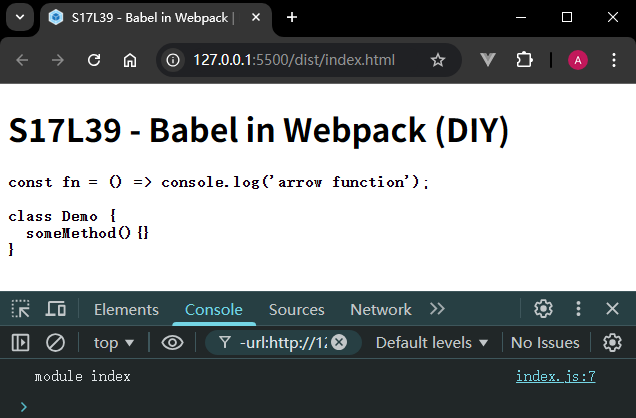

# L39：在 Webpack 中使用 Babel

本节为第四章第四课。

---


本节只配置了 `Babel` 的 `preset` 预设环境，实践时可根据需要添加插件。


## 1 概述

将 `Babel` 集成到 `Webpack` 主要通过 `babel-loader` 实现代码的转换。

官方文档：https://www.npmjs.com/package/babel-loader


操作流程梳理：

:one: 安装 `Webpack` 相关依赖：

```bash
npm i -D webpack@4 webpack-cli@3
```

:two: 安装 `Babel` 相关依赖：

```bash
npm i -D @babel/core@7 @babel/preset-env@7 babel-loader@8 core-js@3
```

:three: 配置 `Babel` 插件：

```json
// .babelrc
{
  "presets": [
    ["@babel/preset-env", {
      "useBuiltIns": "usage",
      "corejs": 3
    }]
  ]
}
```

:four: 配置 `babel-loader`：

```js
// webpack.config.js:
module.exports = {
  module: {
    rules: [{ 
      test: /\.js$/i, 
      exclude: /node_modules/,
      use: ['babel-loader']
    }]
  },
}
```

注：`exclude` 配置项是根据官方文档添加的。

:five: 添加配置文件：`.babelrc`、`.browserslistrc`，再次检查 `webpack.config.js` 等。

:six: 编辑 `index.js`，启动 `Webpack`。


## 2 实测备忘

实测效果：



