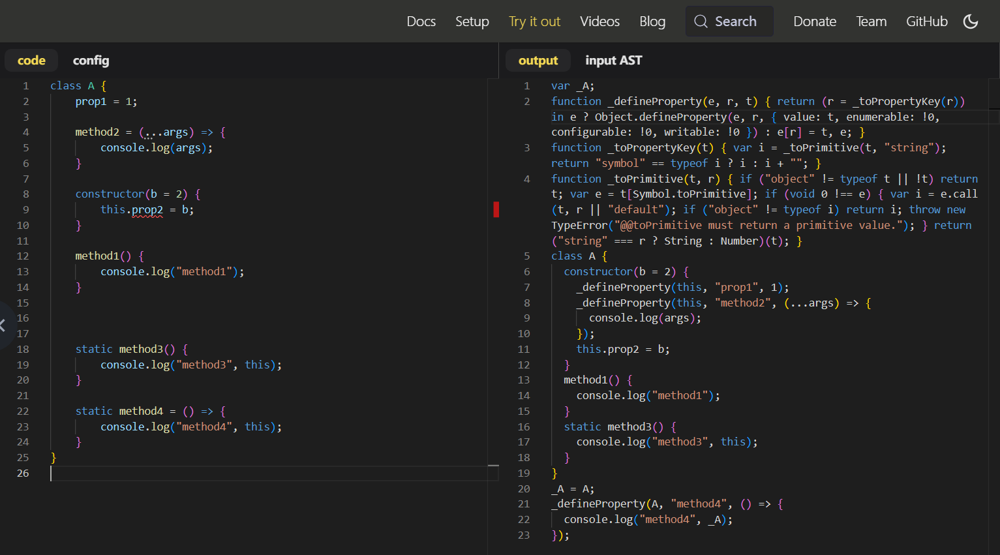

# L40：【扩展】源码剖析：Babel 对 class 类的转换

本节为第四章第五课，根据答疑整理，非学习重点。

---


本节通过一个典型的 `class` 类的定义，深入剖析 `Babel` 转换后的源码的具体逻辑。

原始 `class` 语法糖定义：

```js
class A {
    prop1 = 1;

    method2 = (...args) => {
        console.log(args);
    }

    constructor(b = 2) {
        this.prop2 = b;
    }

    method1() {
        console.log("method1");
    }

    static method3() {
        console.log("method3", this);
    }

    static method4 = () => {
        console.log("method4", this);
    }
}
```

`Babel` 线上转换地址：[https://babeljs.io/repl](https://babeljs.io/repl)

实测效果图：



利用左侧边栏的格式化选项，得到的实际结果为：

```js
var _A;
function _defineProperty(e, r, t) {
  return (
    (r = _toPropertyKey(r)) in e
      ? Object.defineProperty(e, r, {
          value: t,
          enumerable: !0,
          configurable: !0,
          writable: !0
        })
      : (e[r] = t),
    e
  );
}
function _toPropertyKey(t) {
  var i = _toPrimitive(t, "string");
  return "symbol" == typeof i ? i : i + "";
}
function _toPrimitive(t, r) {
  if ("object" != typeof t || !t) return t;
  var e = t[Symbol.toPrimitive];
  if (void 0 !== e) {
    var i = e.call(t, r || "default");
    if ("object" != typeof i) return i;
    throw new TypeError("@@toPrimitive must return a primitive value.");
  }
  return ("string" === r ? String : Number)(t);
}
class A {
  constructor(b = 2) {
    _defineProperty(this, "prop1", 1);
    _defineProperty(this, "method2", (...args) => {
      console.log(args);
    });
    this.prop2 = b;
  }
  method1() {
    console.log("method1");
  }
  static method3() {
    console.log("method3", this);
  }
}
_A = A;
_defineProperty(A, "method4", () => {
  console.log("method4", _A);
});
```

对应的默认配置为：

```json
{
  "filename": "repl.jsx",
  "presets": [
    [
      "env",
      {
        "targets": "defaults, not ie 11, not ie_mob 11",
        "modules": false,
        "bugfixes": true
      }
    ],
    [
      "react",
      {
        "runtime": "automatic"
      }
    ],
    [
      "stage-2",
      {
        "decoratorsVersion": "2023-11",
        "pipelineProposal": "hack"
      }
    ]
  ],
  "sourceType": "module"
}
```

