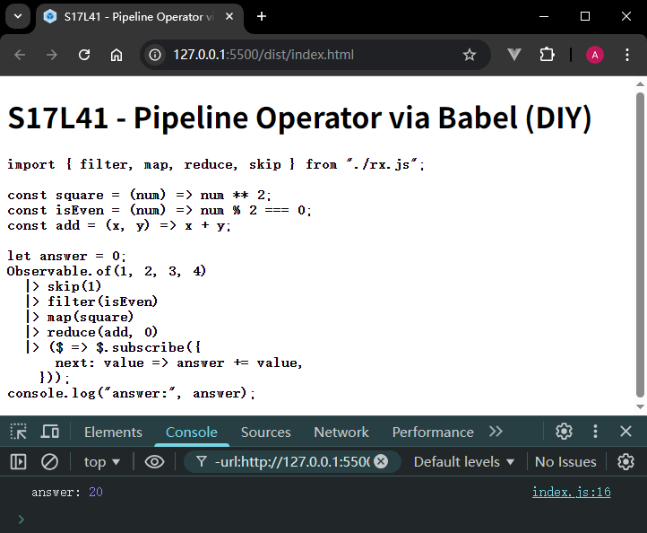
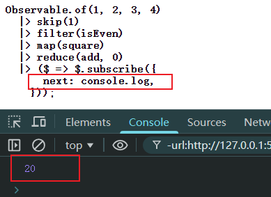

# L41：【扩展】源码剖析：Babel 对 class 类的转换

本节为第四章第六课，根据答疑整理，非学习重点。

---


## 1 核心逻辑

本节结合 `ES6` 中的 `generator` 生成器，深入分析了 `Babel` 对 `async / await` 语法糖的转换逻辑。

核心转换思路：用 `yield` 代表 `await`，用 `function*` 代表 `async`，然后不停调用 `yield` 直到遍历结束，最后用 `resolve` 确定 `Promise` 的状态（`Promise` 是返回值）。

生成器的底层原理：迭代器 + 可迭代协议 + 状态机


## 2 实测备忘

结合《`The Joy of JavaScript`》中对 `pipeline` 的提案，在 `Babel` 环境下进行实测：

```js
// src/index.js:
import { filter, map, reduce, skip } from "./rx.js";

const square = (num) => num ** 2;
const isEven = (num) => num % 2 === 0;
const add = (x, y) => x + y;

let answer = 0;
Observable.of(1, 2, 3, 4)
  |> skip(1)
  |> filter(isEven)
  |> map(square)
  |> reduce(add, 0)
  |> ($ => $.subscribe({
      next: value => answer += value,
    }));
console.log("answer:", answer);
```

实测第一版效果（`faf21ba`）：



若按 `P295` 页示例代码，将 `next()` 方法改为控制台输出，则结果为（`2542591`）：



