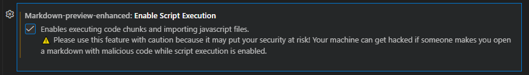
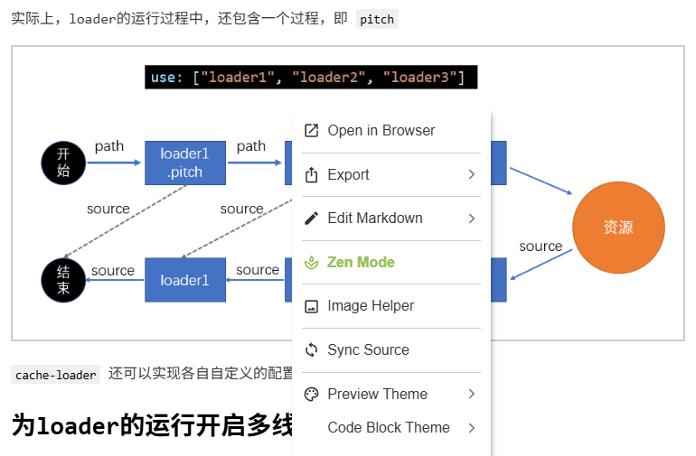
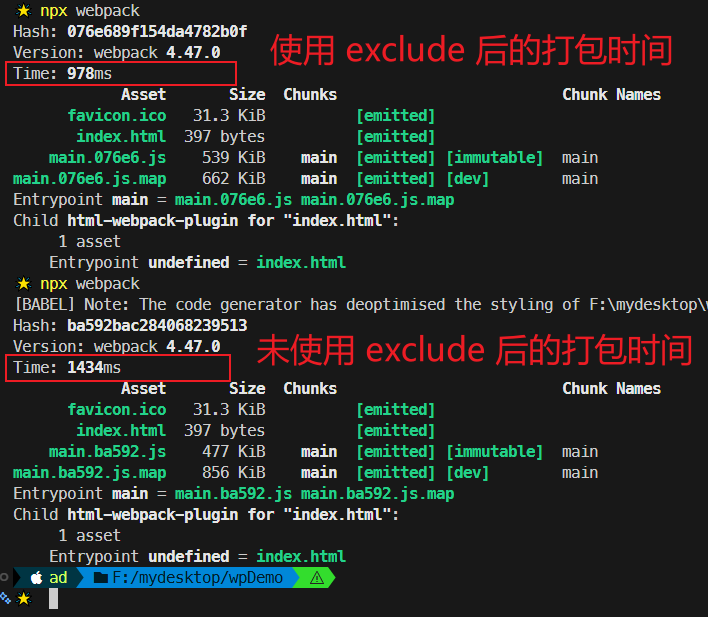
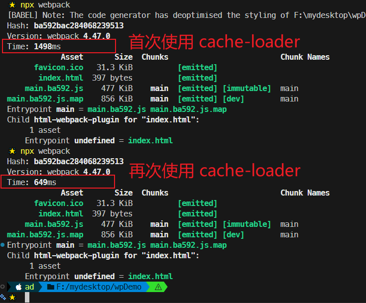
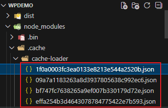
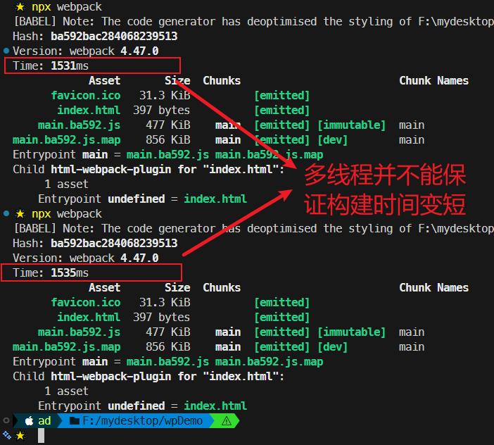

# L44：对 loader 的优化

本节对应第五章第三课，大致录制时间：`2020-02-21 13:33:00`。

---


## 0 文档预览插件的自定义设置

- `VSCode` 扩展名称：`Markdown Preview Enhanced`（作者：`Yiyi Wang`）
- `GitHub` 仓库：https://github.com/shd101wyy/vscode-markdown-preview-enhanced
- 定制 `parser` 官方文档：https://shd101wyy.github.io/markdown-preview-enhanced/#/extend-parser
- 定制 `CSS` 样式官方文档：https://shd101wyy.github.io/markdown-preview-enhanced/#/customize-css

操作步骤：

1. 在 `VSCode` 设置中允许 `JS` 脚本执行；

   

2. 组合键 <kbd>Ctrl</kbd> + <kbd>Shift</kbd> + <kbd>P</kbd> 后输入 `markdown preview enhanced`，找到自定义 `parser` 菜单项并添加如下定制脚本：

   ```js
   const scripts = `
   <script>
       function setCurrent(){
           const links = document.querySelectorAll(".md-sidebar-toc a")
           for(const link of links){
               link.style.color="";
           }
           const hash = location.hash;
           const a = document.querySelector('a[href="'+hash+'"]');
           if(a){
               a.style.color = "#f40";
           }
       }
       setCurrent();
       window.onhashchange = setCurrent;
   </script>
   `;
   var fs = require("fs");
   module.exports = {
     onWillParseMarkdown: function(markdown) {
       return new Promise((resolve, reject) => {
         const reg = /\!\[(.*)\]\((\S+)\)/gm;
         markdown = markdown.replace(reg, function(match, g1, g2) {
           var width = "100%";
           if (g1) {
             var w = g1.split("|");
             if (w.length > 1) {
               width = w[1] + "px";
               g1 = w[0];
             }
           }
           return `
   <p class="markdown-p-center">
     
   </p>
   <p class="markdown-img-description">
     ${g1}
   </p>
     `;
         });
         resolve(markdown);
       });
     },
     onDidParseMarkdown: function(html) {
       return new Promise((resolve, reject) => {
         return resolve(scripts + html);
       });
     }
   };
   ```

3. 组合键 <kbd>Ctrl</kbd> + <kbd>Shift</kbd> + <kbd>P</kbd> 后输入 `markdown preview enhanced`，找到自定义 `CSS` 菜单项并添加如下自定义样式：

   ```less
   /* Please visit the URL below for more information: */
   /*   https://shd101wyy.github.io/markdown-preview-enhanced/#/customize-css */ 
   
   .markdown-preview.markdown-preview {
     // modify your style here
     // eg: background-color: blue;  
     font-family: "consolas", "Noto Sans S Chinese";
     font-size: 1em;
   }
   
   .markdown-img-description{
       text-align: center;
       margin-top: -1em;
       color: #666;;
       margin-bottom: 2em;
   }
   
   html body img{
       border:2px solid #ccc;
   }
   
   .markdown-p-center{
       text-align: center;
   }
   ```

实测效果（仅对原课件文件夹生效）：




## 1 进一步限制 loader 的应用范围

**思路**：对某些库 **人为限定** 是否使用（或跳过）`loader`。

例如：`babel-loader` 可以转换 `ES6` 或更高版本的语法，可是有些库本身就是用 `ES5` 语法书写的，无需转换；使用 `babel-loader` **反而会浪费构建时间**（如 `lodash`）。

> [!tip]
>
> `lodash` 是在 `ES5` 之前出现的库，使用的是 `ES3` 语法。

通过 `module.rule.exclude` 或 `module.rule.include`，排除或仅包含需要应用 `loader` 的场景：

```js
module.exports = {
    module: {
        rules: [
            {
                test: /\.js$/,
                exclude: /lodash/,
                use: "babel-loader"
            }
        ]
    }
}
```

如果暴力一点，甚至可以排除掉 `node_modules` 目录中的所有模块，或仅转换 `src` 目录下的模块：

```js
module.exports = {
    module: {
        rules: [
            {
                test: /\.js$/,
                exclude: /node_modules/,
                // 或
                // include: /src/,
                use: "babel-loader"
            }
        ]
    }
}
```

实测 `exclude` 效果（`7bd53ef`）：



> [!tip]
>
> 这种做法是对 `loader` 的范围进行进一步的限制，和 `noParse` 选项并不冲突。


## 2 缓存 loader 结果

该配置基于一个假设：若文件内容不变，则经过同一 `loader` 解析后，解析结果也不变。

于是，可以将 `loader` 的解析结果保存下来，让后续的解析直接使用保存的结果。

`cache-loader` 可以实现这样的功能：

```js
module.exports = {
  module: {
    rules: [
      {
        test: /\.js$/,
        use: ['cache-loader', ...loaders]
      },
    ],
  },
};
```

有趣的是，`cache-loader` 放到最前面，却能够决定后续的 `loader` 是否运行；实际上，`loader` 的运行过程中，还包含一个过程，即 `pitch`：


`cache-loader` 还可以实现各自自定义的配置，具体方式见 [npm 官方文档](https://www.npmjs.com/package/cache-loader)。

实测效果（`448896e`）：



缓存文件的默认存放位置：




## 3 为 loader 的运行开启多线程

`thread-loader` 会开启一个 **线程池**，其中包含 **适量的线程**。

该 `loader` 会把位于源代码后的 `loader` 全部放到线程池的线程中运行，以提高构建效率。

也因为后续的 `loader` 会放到新的线程中，所以后续 `loader` 将无法：

- 使用 `Webpack` 的 `API` 接口生成文件；
- 无法使用自定义的插件 `API` 接口；
- 无法访问 `Webpack` 的配置对象 `options`。

> [!tip]
>
> 实际开发中，`thread-loader` 具体的放置位置可通过测试来决定。

**特别注意**，开启和管理线程需要消耗时间，在小型项目中使用 `thread-loader` 反而会增加构建时间。

实测效果（`b508be9`）：



这证明了上面的说法：在小型项目中使用 `thread-loader` 反而会增加构建时间。
