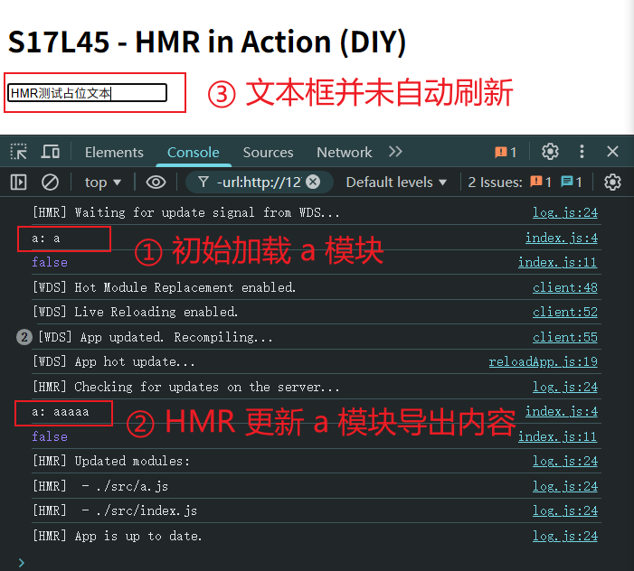

# L45：构建阶段性能优化之 HMR 热替换

本节对应第五章第四课，大致录制时间：`2020-02-21 14:20:00`。

---


> [!tip]
>
> 热替换并不能缩短 **构建时间**（可能还会稍微增加），但可以缩短 **代码改动到效果呈现的时间间隔**。

当使用 `webpack-dev-server` 时，考虑代码改动到效果呈现的过程：


而使用了热替换后，流程发生了变化：


## 1 使用和原理

:one: 更改配置：

```js
module.exports = {
  devServer:{
    hot: true // 开启 HMR
  },
  plugins:[ 
    // 可选
    new webpack.HotModuleReplacementPlugin()
  ]
}
```

2. 更改代码

```js
// index.js
// -- snip --
if(module.hot){ // 是否开启了热更新
  module.hot.accept() // 接受热更新
}
```

首先，这段代码会 **参与最终运行**！

当开启了热更新后，`webpack-dev-server` 会向打包结果中注入 `module.hot` 属性。

默认情况下，`webpack-dev-server` 不管是否开启了热更新，当重新打包后，都会调用 `location.reload` 刷新页面。

但如果运行了 `module.hot.accept()`，将改变这一行为。

`module.hot.accept()` 的作用：让 `webpack-dev-server` 通过 `socket` 管道，把服务器更新的内容发送到浏览器（涉及两次 `WS` 请求）：


然后，将结果交给插件 `HotModuleReplacementPlugin` 注入的代码执行。

插件 `HotModuleReplacementPlugin` 会根据响应覆盖原始代码，然后让代码重新执行。

**所以，热替换发生在代码运行期（之前打包好的文件内容没有变化）**。

实测效果（`04ad97f`）：




## 2 样式热替换

对于样式也是可以使用热替换的，但需要使用 `style-loader`。

因为热替换发生时，`HotModuleReplacementPlugin` 只会简单的重新运行模块代码。

因此 `style-loader` 的代码一运行，就会重新设置 `style` 元素中的样式。

而 `mini-css-extract-plugin`，由于它生成文件是在 **构建期间**，运行期间并会也无法改动文件，因此它对于热替换是 **无效的**。

实测效果（`de3768a`）：

