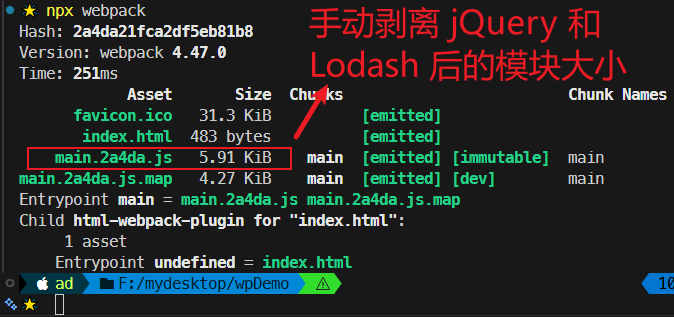

# L46：手动分包

本节对应第五章第五课，大致录制时间：`2020-02-24 13:30:00`。

---

> [!tip]
>
> 本节内容可与 `L17` 课 `externals` 配置项对比学习。`L17` 是通过引入 `CDN` 缩小打包体积；本节则是通过手动剥离公共的第三方库到一个单独的文件夹（例如 `dll`），从变动频繁与否的角度进行分包，而总打包体积并没有多少优化。


## 1 基本原理

手动分包的总体思路是：

1. 先单独打包公共模块：


公共模块会被打包成为动态链接库（即 `dll`，全称 `Dynamic Link Library`），并生成资源清单。

2. 根据入口模块进行正常打包

打包时，如果发现模块中使用了资源清单中描述的模块，则不会形成下面的代码结构

```js
// 源码，入口文件 index.js
import $ from "jquery"
import _ from "lodash"
_.isArray($(".red"));
```

由于资源清单中包含 `jquery` 和 `lodash` 两个模块，因此打包结果的大致格式是：

```js
(function(modules){
  //...
})({
  // index.js 文件的打包结果并没有变化
  "./src/index.js":
  function(module, exports, __webpack_require__){
    var $ = __webpack_require__("./node_modules/jquery/index.js")
    var _ = __webpack_require__("./node_modules/lodash/index.js")
    _.isArray($(".red"));
  },
  // 由于资源清单中存在，jQuery 的代码并不会出现在这里
  "./node_modules/jquery/index.js":
  function(module, exports, __webpack_require__){
    module.exports = jquery;
  },
  // 由于资源清单中存在，Lodash 的代码并不会出现在这里
  "./node_modules/lodash/index.js":
  function(module, exports, __webpack_require__){
    module.exports = lodash;
  }
})
```


## 2 打包公共模块

打包公共模块是一个 **独立的** 打包过程

1. 单独打包公共模块，暴露变量名：

```js
// webpack.dll.config.js
module.exports = {
  mode: "production",
  entry: {
    jquery: ["jquery"],
    lodash: ["lodash"]
  },
  output: {
    filename: "dll/[name].js",
    library: "[name]"
  }
};
```

2. 利用 `DllPlugin` 生成资源清单

```js
// webpack.dll.config.js
module.exports = {
  plugins: [
    new webpack.DllPlugin({
      path: path.resolve(__dirname, "dll", "[name].manifest.json"), //资源清单的保存位置
      name: "[name]"//资源清单中，暴露的变量名
    })
  ]
};
```

运行后，即可完成公共模块打包。


## 3 使用公共模块

1. 在页面中手动引入公共模块（类比 `L17` 中的 `CDN` 链接）：

```html
<script src="./dll/jquery.js"></script>
<script src="./dll/lodash.js"></script>
```

2. 重新设置 `clean-webpack-plugin`

如果使用了插件 `clean-webpack-plugin`，为了避免误删公共模块，需要进行以下配置：

```js
new CleanWebpackPlugin({
  // 要清除的文件或目录
  // 排除掉dll目录本身和它里面的文件
  cleanOnceBeforeBuildPatterns: ["**/*", '!dll', '!dll/*']
})
```

> 目录和文件的匹配规则使用的是 [Globbing patterns](https://github.com/sindresorhus/globby#globbing-patterns)

3. 使用 `DllReferencePlugin` 控制打包结果

```js
module.exports = {
  plugins:[
    new webpack.DllReferencePlugin({
      manifest: require("./dll/jquery.manifest.json")
    }),
    new webpack.DllReferencePlugin({
      manifest: require("./dll/lodash.manifest.json")
    })
  ]
}
```


## 4 总结

**手动打包的过程**：

1. 开启 `output.library` 暴露公共模块
2. 用 `DllPlugin` 创建资源清单
3. 用 `DllReferencePlugin` 使用资源清单

**手动打包的注意事项**：

1. 资源清单不参与运行，可以不放到打包目录中
2. 记得手动引入公共 `JS`，以及避免被删除
3. 不要对小型的公共JS库使用

**优点**：

1. 极大提升自身模块的打包速度
2. 极大的缩小了自身文件体积
3. 有利于浏览器缓存第三方库的公共代码

**缺点**：

1. 使用非常繁琐
2. 如果第三方库中包含重复代码，则效果不太理想


实测效果（`73e7f90`）：

