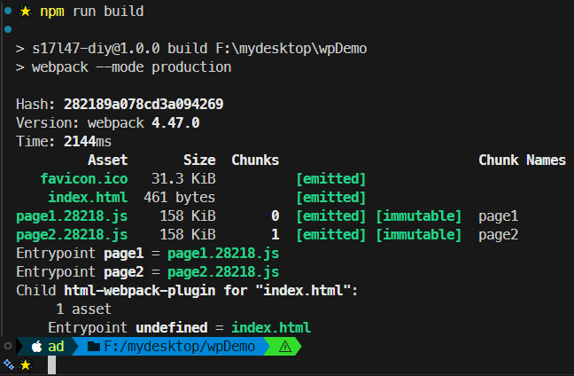
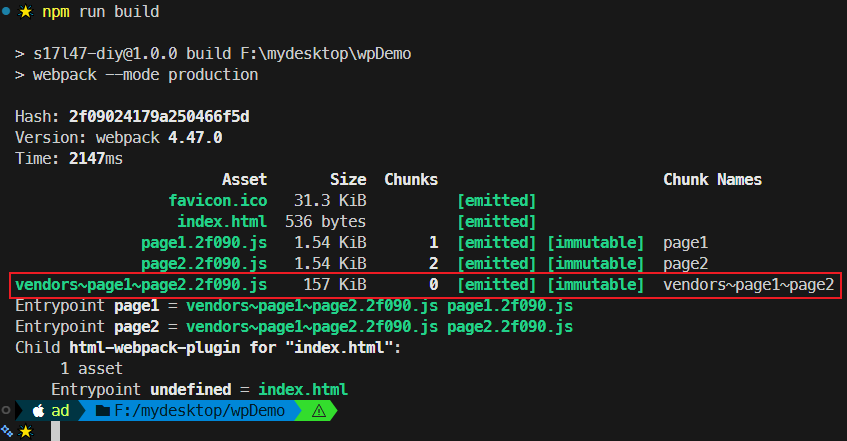
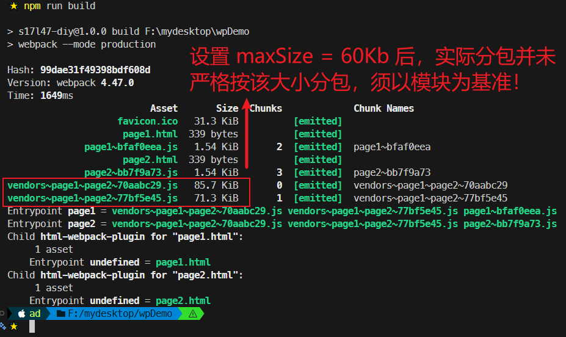
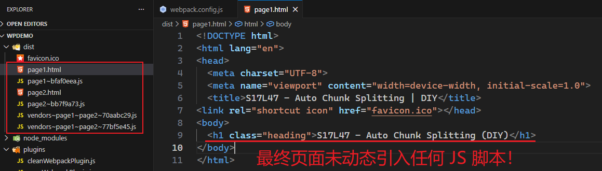
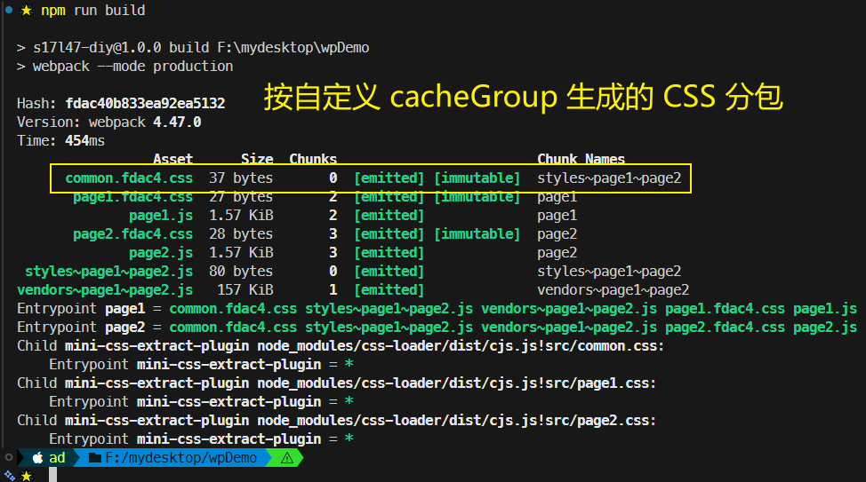
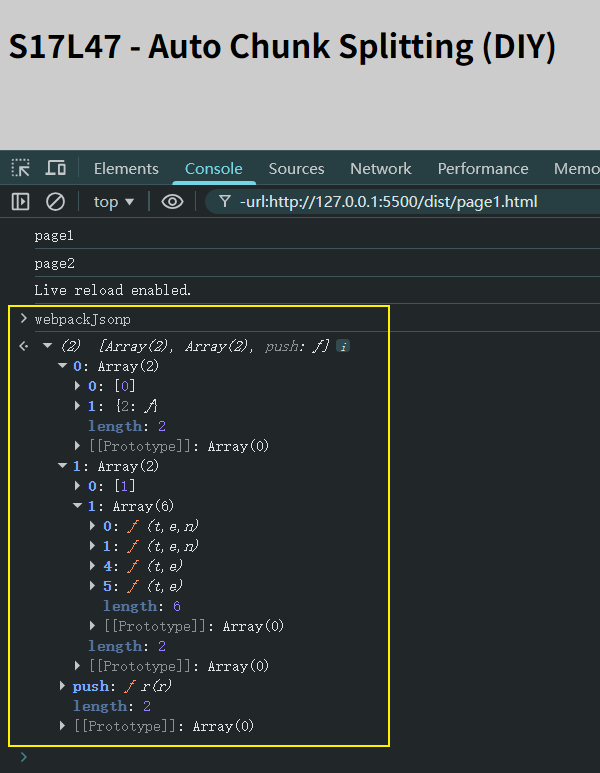

# L47：Webpack 优化之——自动分包

本节对应第五章第六课，大致录制时间：`2020-02-25 16:20:00`。

---


## 1 基本原理

不同与手动分包，自动分包是从 **实际的角度** 出发，从一个更加 **宏观的角度** 来控制分包，而一般不对具体哪个包要分出去进行控制。

因此使用自动分包，不仅非常方便，而且更加贴合实际的开发需要。

要控制自动分包，关键是要配置一个合理的 **分包策略（chunk strategy）**。

有了分包策略之后，不需要额外安装任何插件，`Webpack` 会自动按该策略分包。

> [!tip]
>
> 实际上，`Webpack` 在内部是用 `SplitChunksPlugin` 进行分包的（详见 [官方文档](https://webpack.js.org/plugins/split-chunks-plugin/)）。
>
> 过去有一个库 `CommonsChunkPlugin` 也可以实现分包，不过由于该库某些地方并不完善，到了 `Webpack4` 之后，已被 `SplitChunksPlugin` 取代。


从分包流程中至少可以看出以下几点：

- 分包策略至关重要，它决定了如何分包；
- 分包时，`Webpack` 开启了一个 **新的 Chunk**，对分离的模块进行打包；
- 打包结果中，公共的部分被提取出来形成了一个单独的文件，它是新 `Chunk` 的产物；


## 2 分包策略的基本配置

`Webpack` 提供了 `optimization` 配置项，用于配置一些优化信息。

> [!tip]
>
> 分包策略一般是针对 **生产环境** 而言的，开发环境无需分包（开启 `HMR` 即可）。

实测：配置前先在生产环境打包作为参照（`bd4172c`）：



其中 `splitChunks` 是分包策略的配置：

```js
module.exports = {
  optimization: {
    splitChunks: {
      // 分包策略
    }
  }
}
```

事实上，分包策略有其默认的配置，我们只需要轻微改动，即可应对绝大多数分包场景。

1. `chunks`

该配置项用于配置需要应用分包策略的 `Chunk`。

我们知道，分包是从已有的 `Chunk` 中分离出新的 `Chunk`，那么哪些 `Chunk` 需要分离呢？

`chunks` 有三个取值，分别是：

- `all`：对于所有的 `Chunk` 都要应用分包策略
- `async`：【默认】仅针对异步 `Chunk` 应用分包策略（详见 `L50`）
- `initial`：仅针对普通 `Chunk` 应用分包策略

所以，你只需要配置 `chunks` 为 `all` 即可。

实测效果（`c18c1c8`）：




2. `maxSize`

该配置可以控制包的 **最大字节数**。

如果某个包（包括分出来的包）超过了该值，则 `Webpack` 会尽可能地将其分离成多个包。

但是不要忽略的是，分包的 **基础单位是模块**，如果一个完整的模块超过了该体积，它是无法做到再切割的，因此，尽管使用了这个配置，完全有可能某个包还是会超过这个体积。

另外，该配置看上去很美妙，实际意义其实不大：因为分包的目的在于 **提取大量的公共代码**，从而减少总体积，充分利用浏览器缓存。

虽然该配置可以把一些包进行再切分，但是实际的 **总体积** 和 **传输量** 并没有发生变化。

> [!tip]
>
> 如果要进一步减少公共模块的体积，只能是 **压缩**（详见 `L48`）和 `Tree Shaking`（详见 `L49`）。

实测：设置 `maxSize` 前，按两个入口配置分包（`5e209b7`）：


实测：设置 `maxSize` 后，实际分包并未严格按 `60Kb` 分包，当以具体模块大小为准（`f5e5d80`）：



但由于 `HtmlWebpackPlugin` 插件的设计缺陷，按 `maxSize` 重新分包的 `JS` 文件无法动态注入生成的 `HTML` 页面中（具体解决方案详见本节第 5 点）：




## 3 分包策略的其他配置

如果不想使用其他配置的默认值，可以手动进行配置：

- `automaticNameDelimiter`：新 `Chunk` 名称的分隔符，默认值为 `~`；
- `minChunks`：一个模块被多少个 `Chunk` 使用时，才会进行分包，默认值 `1`；
- `minSize`：当分包达到多少字节后才允许被真正的拆分，默认值 `30000`（`DIY`：这是 `Webpack 4` 版默认值，`Webpack 5` 版已改为 `20000`）；


## 4 缓存组

之前配置的分包策略是全局的；而实际上，分包策略是基于 **缓存组** 的。

每个缓存组提供一套独有的策略，`Webpack` 按照缓存组的 **优先级（priority）** 依次处理每个缓存组，被缓存组处理过的分包无需再次分包。

默认情况下，`Webpack` 提供了 `vendors` 和 `default` 两个缓存组：

```js
module.exports = {
  optimization:{
    splitChunks: {
      //全局配置
      cacheGroups: {
        // 属性名是缓存组名称，会影响到分包的 Chunk 名
        // 属性值是缓存组的配置，缓存组继承所有的全局配置，也有自己特殊的配置
        vendors: { 
          test: /[\\/]node_modules[\\/]/, // 当匹配到相应模块时，将这些模块进行单独打包
          priority: -10 // 缓存组优先级，优先级越高，该策略越先进行处理，默认值为 0
        },
        default: {
          minChunks: 2,  // 覆盖全局配置，将最小 Chunk 引用数改为 2
          priority: -20, // 优先级
          reuseExistingChunk: true // 重用已经被分离出去的 Chunk
        }
      }
    }
  }
}
```

很多时候，缓存组对于我们来说没什么意义，因为默认的缓存组就已经够用了。但是我们同样可以利用缓存组来完成一些事情，比如对公共样式的抽离：

```js
module.exports = {
  optimization: {
    splitChunks: {
      chunks: "all",
      cacheGroups: {
        styles: {
          test: /\.css$/, // 匹配样式模块
          minSize: 0, // 覆盖默认的最小尺寸，这里仅仅是作为测试
          minChunks: 2 // 覆盖默认的最小 Chunk 引用数
        }
      }
    }
  },
  module: {
    rules: [{ test: /\.css$/, use: [MiniCssExtractPlugin.loader, "css-loader"] }]
  },
  plugins: [
    new CleanWebpackPlugin(),
    new HtmlWebpackPlugin({
      template: "./public/index.html",
      chunks: ["index"]
    }),
    new MiniCssExtractPlugin({
      filename: "[name].[hash:5].css",
      // 配置来自被分割 Chunk 的文件名
      chunkFilename: "common.[hash:5].css" 
    })
  ]
}
```

实测自定义 `cacheGroup` 后的 `CSS` 分包（`44b4e42`）：




## 5 配合多页应用

虽然现在单页应用是主流，但免不了还是会遇到多页应用。

由于在多页应用中需要为每个 `HTML` 页面指定需要的 `Chunk`，这就造成了问题：

```js
new HtmlWebpackPlugin({
  template: "./public/index.html",
  chunks: ["index~other", "vendors~index~other", "index"]
})
```

我们必须手动的指定被分离出去的 `Chunk` 名称，这不是一种好办法

幸好 `html-webpack-plugin` 的新版本中解决了这一问题：

```shell
npm i -D html-webpack-plugin@next
```

做出以下配置即可：

```js
new HtmlWebpackPlugin({
  template: "./public/index.html",
  chunks: ["index"]
})
```

它会自动的找到被 `index` 分离出去的 `Chunk`，并完成引用。

> [!note]
>
> 目前这个版本仍处于测试解决，还未正式发布。

> [!tip]
>
> `DeepSeek`：
>
> 这个问题已经有了更成熟、更完善的解决方案。社区中诞生了一个专门为此设计的插件——**`chunks-webpack-plugin`**，它被官方推荐用于解决多页应用中的自动分包注入问题。
>
> **更完善的解决方案：`chunks-webpack-plugin`**
>
> 这个插件的核心优势在于，它能自动分析 `Webpack` 打包后的各个 `chunk`（代码块）之间的依赖关系，并准确地知道每个入口页面最终需要加载哪些 `chunk`（包括由 `SplitChunksPlugin` 拆分出的公共依赖），然后自动生成对应的资源注入标签（如 `<link>` 和 `<script>`）。
>
> #### **它如何解决你的问题？**
>
> 回顾你笔记中的痛点：
>
> ```js
> // 旧方式：需要手动列出所有间接依赖的chunk
> new HtmlWebpackPlugin({
>   chunks: ["index~other", "vendors~index~other", "index"]
> })
> ```
>
> 使用 `chunks-webpack-plugin` 后，你不再需要手动维护这个长长的、由 Webpack 自动生成的 `chunk` 列表。它的工作流程是：
>
> 1. **解析入口**：读取你在 `webpack.config.js` 中配置的多个入口点（例如 `home` 和 `news`）。
> 2. **分析依赖**：自动分析每个入口点依赖的所有 `chunk`，包括它自身以及通过 `splitChunks` 拆分出的公共模块（例如 `vendors~home~news.js`）。
> 3. **生成片段**：为每个入口点生成两个 HTML 片段文件，例如：
>    - `home-styles.html`：包含该页面所有 CSS 的 `<link>` 标签。
>    - `home-scripts.html`：包含该页面所有 JS 的 `<script>` 标签。
>    - `news-styles.html` 和 `news-scripts.html` 同理。
> 4. **手动引入**：在你的原始 HTML 模板中，通过服务器端包含（如 SSI、Twig 的 `include`）或构建工具的文件合并功能，将这些片段文件引入。这种方式将“自动注入”和“模板编写”解耦，给了开发者极大的灵活性。
>
> #### **配置示例**
>
> 1. **安装插件**：`npm install --save-dev chunks-webpack-plugin`；
>
> 2. **修改 `webpack.config.js`**：
>
>    ```js
>    // webpack.config.js
>    const ChunksWebpackPlugin = require('chunks-webpack-plugin');
>    
>    module.exports = {
>      entry: {
>        home: './src/home.js',
>        news: './src/news.js'
>      },
>      // ... 其他配置 (output, module, etc.)
>      optimization: {
>        splitChunks: {
>          chunks: 'all', // 开启自动分包
>        },
>      },
>      plugins: [
>        new ChunksWebpackPlugin({
>          // 配置生成的片段文件名格式，例如 'templates/home-styles.html'
>          filename: 'templates/[name]-[type].html' 
>        }),
>        // 你不再需要为每个页面配置 HtmlWebpackPlugin 的复杂 chunks 了
>        // 可以继续使用 HtmlWebpackPlugin，但仅用于生成基本的 HTML 结构
>      ],
>    };
>    ```
>
> 3. **在 HTML 模板中引入**：在你的 `home.html` 模板文件中，你需要做的只是引入生成的片段：
>
>    ```html
>    <!DOCTYPE html>
>    <html>
>    <head>
>        <meta charset="UTF-8">
>        <title>Home Page</title>
>        <!-- 引入自动生成的 CSS 链接片段 -->
>        <!--#include file="templates/home-styles.html" -->
>    </head>
>    <body>
>        <div id="app"></div>
>        <!-- 引入自动生成的 JS 脚本片段 -->
>        <!--#include file="templates/home-scripts.html" -->
>    </body>
>    </html>
>    ```


## 6 原理概述

自动分包的原理其实并不复杂，主要经过以下步骤：

1. 检查每个 `Chunk` 编译的结果；
2. 根据分包策略，找到那些满足策略的模块；
3. 根据分包策略，生成新的 `Chunk` 打包这些模块（代码有所变化）；
4. 把打包出去的模块从原始包中移除，并修正原始包代码。

在代码层面，有以下变动：

1. 分包的代码中，加入一个全局变量 `webpackJsonp`，类型为 **数组**，其中包含公共模块的代码；
2. 原始包的代码中，使用数组中的公共代码。

实测全局变量 `webpackJsonp`（`3b91ea0`）：

