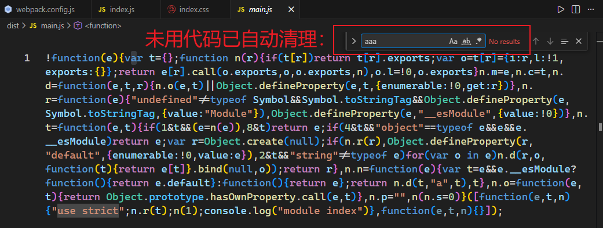
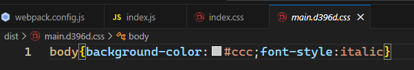

# L48：Webpack 优化之——代码压缩

本节为第五章第七课，大致录制时间为 `2020-02-26 14:00:00`。

---


## 1 前言

:one: 为什么要进行代码压缩

代码压缩的另一个专业术语叫 **代码混淆**，旨在减少代码体积、破坏代码可读性、提升破解成本。


:two: 何时进行代码压缩

生产环境下。


:three: 使用什么压缩工具

目前最流行的代码压缩工具主要有两个：`UglifyJs` 和 `Terser`

`UglifyJs` 是一个传统的代码压缩工具，已存在多年，曾经是前端应用的必备工具，但由于它不支持 `ES6` 语法，所以目前的流行度已有所下降（本节另附 `DeepSeek` 对该事件的回顾，详见《*DeepSeek 对 UglifyJS 不支持 ES6 语法的回复*》）。

`Terser` 是一个新起的代码压缩工具，支持 `ES6+` 语法，因此被很多构建工具内置使用。`Webpack` 安装后会内置 `Terser`，当启用生产环境后即可用其进行代码压缩。

因此，我们选择 `Terser`。


**关于副作用 side effect**

副作用：函数运行过程中，可能会对外部环境造成影响的功能

如果函数中包含以下代码，该函数叫做副作用函数：

- 异步代码
- `localStorage`
- 对外部数据的修改

如果一个函数没有副作用，同时，函数的返回结果仅取决于传入的参数，则该函数叫做 **纯函数（pure function）**。

示例：

```js
// src code:
const myRandomNumber = Math.random();
function test() {
  var a = Math.random();
  return a;
}
console.log(test());
console.log(test());
console.log(test());

// tersed:
// with {toplevel: true, module: true}
Math.random();function o(){return Math.random()}console.log(o()),console.log(o()),console.log(o());
```

**纯函数非常有利于代码优化**。

也可手动指定哪些函数是纯函数：

```js
// src code:
const myRandomNumber = Math.random();
function sum(a, b) {
    const c = Math.random();
    return a + b + c;
}
sum(1, 2);
sum(1, 2);
sum(1, 2);

/* tersed:
{
  compress: {
    pure_funcs: ['Math.random', 'sum']
  }
}
*/
// (无输出)
```

通过注释手动标记纯函数：

```js
// src code:
const myRandomNumber = /*#__PURE__*/Math.random();
```


## 2 Terser

相关资源整理：

- 官网：https://terser.org/
- 文档：

`Terser` 官网：https://terser.org/

在 `Terser` 的官网可尝试它的压缩效果：https://try.terser.org/

示例：

```js
// src code:
let a = Math.random();
if(a > 0.5) {
    a = 1;
} else {
    a = 2;
}

// tersed:
// with {toplevel: true, module: true}
let a=Math.random();a=a>.5?1:2;
```

有了 `Terser` 工具后，写代码只需从可读性和可维护性出发，完全不用提前担心压缩打包方面的问题了。


## 3 Webpack + Terser

`Webpack` 自动集成了 `Terser`。

用到的插件：`terser-webpack-plugin`（详见 [NPM 官方文档](https://www.npmjs.com/package/terser-webpack-plugin)）

压缩 `CSS` 的插件：`optimize-css-assets-webpack-plugin`（详见 [NPM 官方文档](https://www.npmjs.com/package/optimize-css-assets-webpack-plugin)）

如果你想更改、添加压缩工具，又或者是想对 `Terser` 进行配置，使用下面的 `Webpack` 配置即可：

```js
const TerserPlugin = require('terser-webpack-plugin');
const OptimizeCSSAssetsPlugin = require('optimize-css-assets-webpack-plugin');
module.exports = {
  optimization: {
    // 是否要启用压缩，默认情况下，生产环境会自动开启
    minimize: true, 
    minimizer: [ // 压缩时使用的插件，可以有多个
      new TerserPlugin(), 
      new OptimizeCSSAssetsPlugin()
    ],
  },
};
```


> [!tip]
>
> **关于 DCE**
>
> `DCE` 全称 `Dead Code Elimination`，指代无法访问到的代码。`Terser` 也会对 `DCE` 代码进行处理：
>
> ```js
> // src code:
> function sum(a, b) {
>     return a + b;
>     var c = 1;
>     var d = 4;
>     console.log(c + d);
> }
> console.log(sum(1, 2));
> console.log(sum(1, 2));
> console.log(sum(1, 2));
> 
> // tersed:
> // with {toplevel: true, module: true}
> function o(o,l){return o+l}console.log(o(1,2)),console.log(o(1,2)),console.log(o(1,2));
> ```
>
> 再如：
>
> ```js
> // src code:
> if(true) {
>     console.log(1);
> } else {
>     console.log(2);
> }
> 
> // tersed:
> // with {toplevel: true, module: true}
> console.log(1);
> ```


## 4 实测备忘

实测 `Terser` 在生产环境下对 `index.js` 模块的压缩（引用了 `CSS` 样式）：

```js
import './index.css';
console.log('module index');

const a = 'aaa';
const b = 'bbb';
const c = a + b;

// index.css
/*
body {
  background-color: #ccc;
  font-style: italic;
}
*/
```

实测 `JS` 模块压缩情况：



`CSS` 压缩情况：

