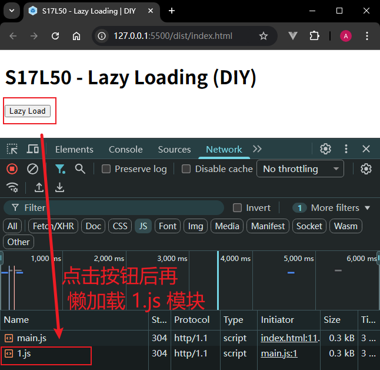
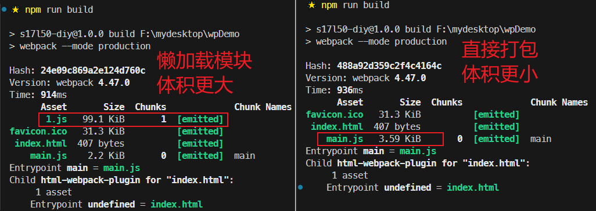
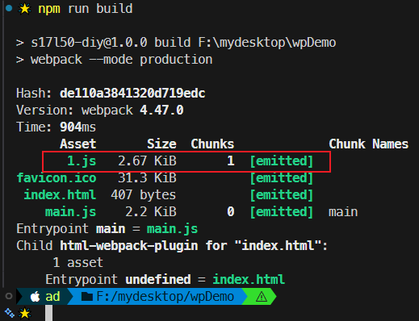
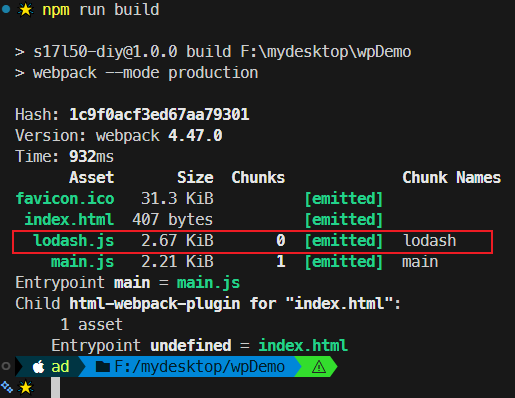

# L50：懒加载

本节为第五章第九课，大致录制时间：`2020-02-27 14:25:00`。

---


## 1 要点概述

`JS` 模块的懒加载机制即 **按需加载模块**：让初始没有用到的模块无需提前加载。具体实现方式是使用 `import('...')` 语法动态导入。

例如：点击按钮后再加载对应的处理逻辑模块——

```js
// ./src/index.js
console.log("module index");

const btn = document.querySelector("button");
btn.addEventListener("click", async (ev) => {
  const { chunk } = await import("lodash-es"); // 返回一个 Promise 实例
  console.log(chunk([1, 2, 3, 4, 5, 6], 2));
});
```

但是这样一来 `Webpack` 无法实施静态分析，因此无法应用 `Tree Shaking` 优化。

解决方案：让懒加载的模块是一个人为构建的静态模块：

```js
// ./src/util.js
export { chunk } from "lodash-es";

// ./src/index.js
console.log("module index");

const btn = document.querySelector("button");
btn.addEventListener("click", async (ev) => {
  const { chunk } = await import("./util"); // 返回一个 Promise 实例
  console.log(chunk([1, 2, 3, 4, 5, 6], 2));
});
```

> [!tip]
>
> **点评**
>
> 可见，`Tree Shaking` 和懒加载方案都需要人为限定代码书写方式来实现，从根本上说本非最佳方案（最佳方案应将优化技术与代码编写方式完全解耦）。只可惜目前还达不到最理想的情况，这跟前端的运行环境较复杂有关（甚至较之后端更甚）。


## 2 实测备忘

效果图（`8796431`）：



此外，实测还发现懒加载后的打包文件明显更大，效果上甚至还不如不用懒加载（未使用懒加载的对照版本代码详见 `ba2e490`）：



经人为改造后的懒加载导入支持 `Tree Shaking` 优化（`d175735`）：



实测自定义分包名称（使用 `/* webpackChunkName: "lodash" */`，详见`dfaffee`）：



根据 `DeepSeek` 的回复，本例 `lodash` 还可以直接导入指定的函数模块，即 `lodash-es/chunk`。经实测，效果和使用 `./util` 完全相同：

```js
console.log("module index");

const btn = document.querySelector("button");
btn.addEventListener("click", async (ev) => {
  const { chunk } = await import(/* webpackChunkName: "lodash" */'lodash-es/chunk');
  console.log(chunk([1, 2, 3, 4, 5, 6], 2));
});
```

