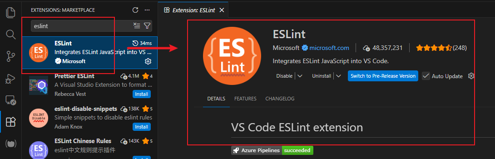
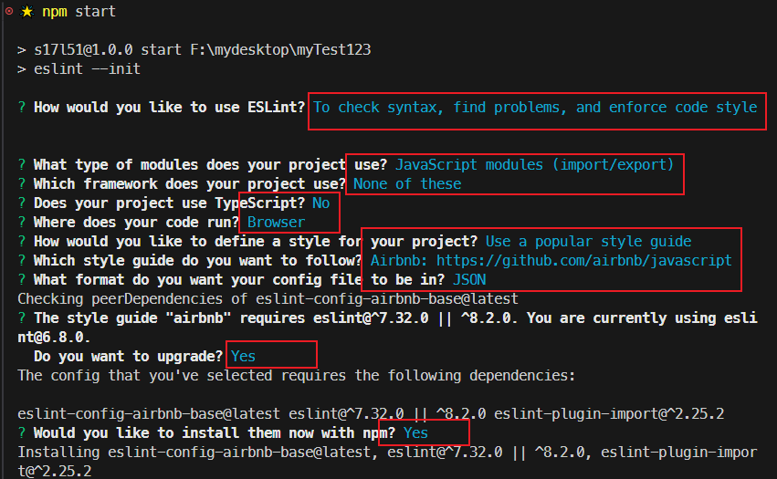
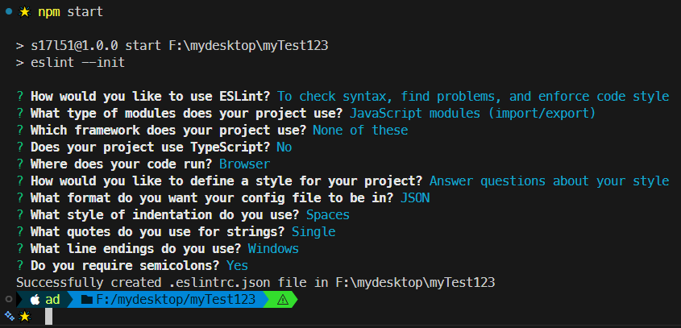
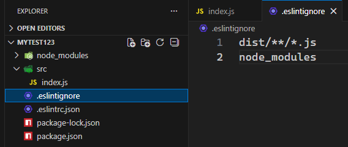
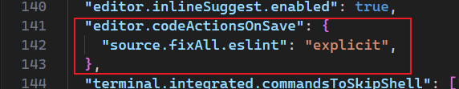

# L51：ESLint 简介

本节为第五章第 10 课。

---


> [!tip]
>
> 本节内容基本上与 `Webpack` 无关。


`ESLint` 是一个针对 `JS` 代码风格的 **检查工具**，当不满足其要求的风格时，会给予警告或错误。

工具文档：

- 英文：https://eslint.org/
- 中文：https://zh-hans.eslint.org/


## 1 安装与使用

`ESLint` 通常配合编辑器使用，`VSCode` 的插件名称即 `ESLint`：



本地项目按以下步骤操作即可：

:one: 在 `VSCode` 中安装 `ESLint` 插件

该工具会自动检查工程中的 `JS` 文件。

检查的工作交给 `ESLint` 库，如果当前工程没有，则会去全局库中查找，如果都没有，则无法完成检查。

另外，检查的依据是 `ESLint` 的配置文件 `.eslintrc`，如果找不到工程中的配置文件，也无法完成检查。

:two: 安装 `ESLint`

```bash
npm i [-g] eslint  # 视频中的版本为 v6.8.0
```

:three: 创建配置文件

可以通过 `ESLint` 交互式命令创建配置文件。

> [!note]
>
> 由于 `Windows` 环境中 `Git` 窗口对交互式命名支持不是很好，建议使用 `PowerShell`。
>
> DIY：换用 `Windows Terminal` 效果最好。

```bash
npx eslint --init
```

> [!tip]
>
> `ESLint` 会识别工程中的 `.eslintrc.*` 文件，也能够识别 `package.json` 中的 `eslintConfig` 字段。
>
> 实测时将 `eslint` 命令放入 `NPM` 的 `scripts` 运行脚本内，可提高开发效率。

实测截图（`907ac26`）：



取消预设代码风格版（`18728ce`）：



注意：若最后的安装依赖环节中断，则需要再次运行 `npm i` 命令直到全部安装成功。


## 2 具体配置

### :one: env

配置代码的运行环境

- `browser`：代码是否在浏览器环境中运行
- `es6`：是否启用 `ES6` 的全局 `API`，例如 `Promise` 等


### :two: parserOptions

该配置指定 `ESLint` 对哪些语法的支持

- `ecmaVersion`: 支持的 `ES` 语法版本
- `sourceType`
  - `script`：传统脚本
  - `module`：模块化脚本


### :three: parser

`ESLint` 的工作原理是先将代码进行 `AST` 语法树解析，然后按照规则进行分析。

`ESLint` 默认使用 `Espree` 作为其解析器，你可以在配置文件中指定一个不同的解析器。


### :four: globals

配置可在代码中使用的额外全局变量：

```json
{
  "globals": {
    "var1": "readonly",
    "var2": "writable"
  }
}
```

`ESLint` 支持注释形式的配置，在代码中使用下面的注释也可以完成配置：

```js
/* global var1, var2 */
/* global var3:writable, var4:writable */
```


### :five: extends

该配置继承自哪里

它的值可以是字符串或者数组

比如：

```json
{
  "extends": "eslint:recommended"
}
```

表示，该配置缺失的位置，使用 `eslint` 推荐的规则


### :six: ignoreFiles

文件名：`.eslintignore`；

功能：排除掉某些不需要验证的文件（类似 `.gitignore`）

例如：

```properties
dist/**/*.js
node_modules
```

实测（`202eaf7`）：



### :seven: rules

该选项配置的是 `ESLint` 规则集（:star: 本节重点）。

每条规则影响某个方面的代码风格。每条规则都有下面几个取值：

- `"off"` 或 `0` 或 `false`: 关闭该规则的检查
- `"warn"` 或 `1` 或 `true`：警告，不会导致程序退出
- `"error"` 或 `2`：错误，当被触发的时候，程序会退出

除了在配置文件中使用规则外，还可以在注释中使用：

```js
/* eslint eqeqeq: "off", curly: "error" */
```

今后遇到陌生规则，需勤用 `ESLint` 规则文档：

- 英文原版：https://eslint.org/docs/latest/rules/；
- 中文版：https://zh-hans.eslint.org/docs/latest/rules/。


> [!tip]
>
> **设置技巧：VSCode 保存时自动修复 ESLint 问题**
>
> 以下设置将启用所有插件（包括 `ESLint`）提供的自动修复功能：
>
> ```json
> {
>   "editor.codeActionsOnSave": {
>     "source.fixAll": "explicit"
>   }
> }
> ```
>
> 与之相对的是，以下设置仅启用 `ESLint` 插件提供的自动修复功能：
>
> ```json
> {
>   "editor.codeActionsOnSave": {
>     "source.fixAll.eslint": "explicit"
>   }
> }
> ```
>
> 禁用配置：直接删除该配置项、或将其值改为 `"never"` 即可。


## 3 实测备忘

实测 `VSCode` 保存时自动修复 `ESLint` 问题（只对 `ESLint` 生效，详见 `5fe28a5`）：



