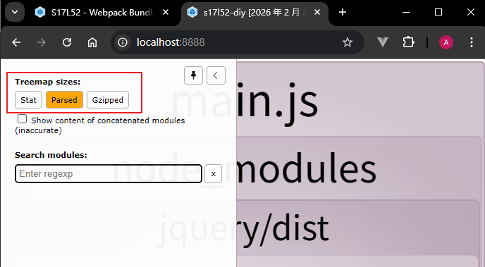
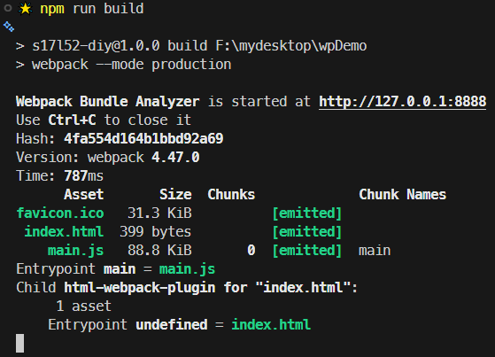
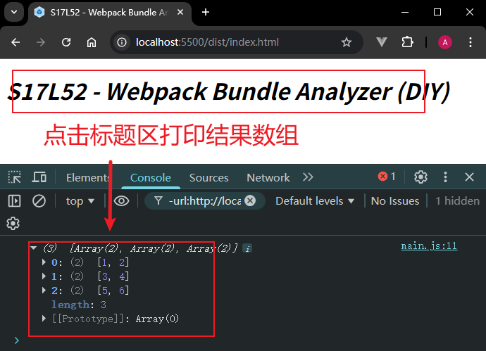
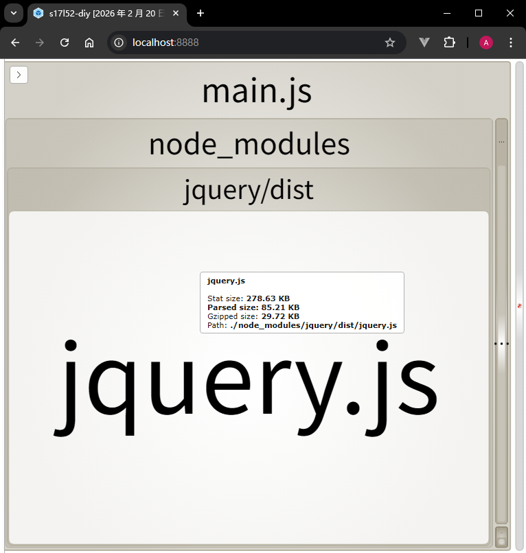
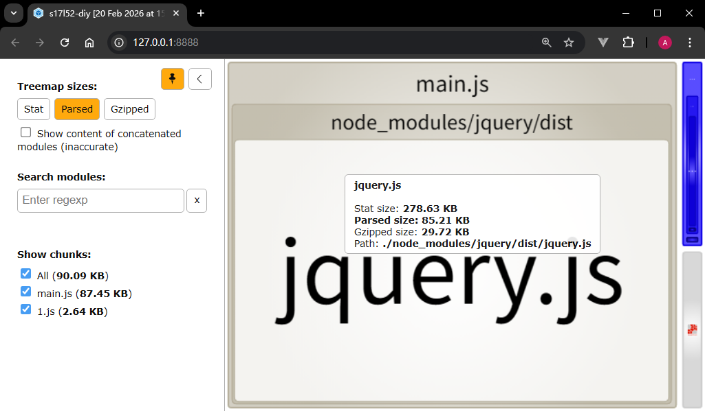

# L52：Webpack 打包分析工具之 Bundle Analyzer

本节为第五章 `5-11` 课，大致录制时间为 `2020-02-28 14:50:00`。

---

本节内容可结合 `15_Vue_intro/L39_bundle_opt/L39_bundle_optimization.md` 复习巩固。


## 1 要点回顾

`bundle` 即 `Webpack` 打包后的成果物。

`webpack-bundle-analyzer` 插件本身并不具备优化功能，但它能以可视化的方式收集并展示当次打包过程中的一些统计信息，为后续优化提供决策依据。

### :one: 安装方法

```bash
npm i -D webpack-bundle-analyzer
```

注册插件：

```js
// webpack.config.js:
const { BundleAnalyzerPlugin } = require('webpack-bundle-analyzer');
module.exports = {
  plugins: [
    new BundleAnalyzerPlugin()  // 默认端口：8888
  ],
}
```

> [!tip]
>
> 根据 `S15_Vue_intro` 实战笔记 `L39` 课内容，打包时若启用 `--modern` 选项，则 `Webpack` 会执行二次打包，`webpack-bundle-analyzer` 插件也会开启两个端口展示各次的打包统计信息。此时需要调整插件的配置参数：
>
> ```js
> // webpack.config.js:
> const { BundleAnalyzerPlugin } = require('webpack-bundle-analyzer');
> 
> const config = (process.env.NODE_ENV === 'development') ? {} : {
>  plugins: [ new BundleAnalyzerPlugin({
>    analyzerPort: 'auto',  // 8888 by default
>  }) ],
>  /* snip */
> };
> 
> module.exports = config;
> ```


### :two: 相关配置



插件收集的统计信息分三类：

- `Stat`：打包前的原始尺寸信息；
- `Parsed`：打包后的尺寸信息；
- `Gzipped`：使用 `gzip` 算法打包后的尺寸信息。

默认情况下，`Webpack` 按生产模式打包回自动开启一个端口为 `8888` 的统计页展示本次打包的各模块大小；如果不想开启本地服务来展示页面，也可以修改配置为生成静态页面离线访问：

```js
// webpack.config.js:
const { BundleAnalyzerPlugin } = require('webpack-bundle-analyzer');
module.exports = {
  plugins: [
    new BundleAnalyzerPlugin({
      analyzerMode: 'static'
    })
  ],
}
```

这样会在 `dist` 目录下生成一个静态页面 `report.html`，支持本地离线查看（`b9111db`）：


插件配置文档：[https://www.npmjs.com/package/webpack-bundle-analyzer](https://www.npmjs.com/package/webpack-bundle-analyzer)。


## 2 实测备忘

效果图（`1adedcd`）：



页面截图：



统计信息页：



:star: 启用懒加载后的打包情况（`79051f5`）：

```js
// ./src/index.js:
import $ from "jquery";

$(function () {
  $(".heading")
    .css("font-style", "italic")
    .on("click", async function (ev) {
      const {default: chunk} = await import('lodash-es/chunk');
      console.log(chunk([1, 2, 3, 4, 5, 6], 2));
    });
});
```

注意：`jQuery` 无法按模块打包，也无法实现 `TreeShaking` 优化，因此最终体积较大：

