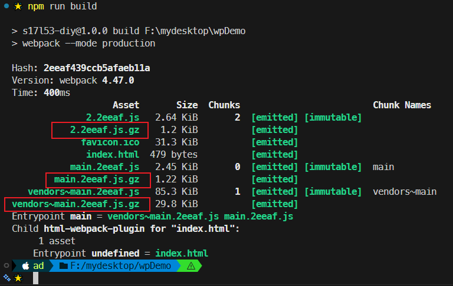

# L53：gzip 压缩技术简介

本节对应第五章第 12 课，大致录制时间：`2020-02-28 15:30:00`。

---


`gzip` 是一种压缩文件的常用算法。


## 1 B/S 结构中的压缩传输


优点：传输效率可能得到大幅提升（并非 `100%` 有效）；

缺点：服务器的压缩需要时间，客户端的解压需要时间。

压缩的基本原理：这里的压缩与之前的代码压缩不同，最终格式一般为二进制格式；基本思路：将文件中存在重复的字符（或字符串等）进行合并，然后利用某种特殊算法记录它们出现的位置，以便解压时利用这些位置信息进行还原。

> [!tip]
>
> `DeepSeek` 对上述压缩原理的评价：
>
> 这个说法 **基本准确**，抓住了核心思想，但在 **技术细节** 和 **完整性** 上可以进一步补充。为了让你更全面地理解，我来拆分一下：
>
> :one: 说法的准确性验证
>
> - **关于“二进制格式”**：✅ 正确。gzip 输出的 `.gz` 文件确实是二进制文件，不能直接当作文本阅读。
> - **关于“合并重复字符串”**：✅ 抓住了核心。这确实是压缩的关键，在信息论中称为**消除冗余**。
>
> :two: 需要补充和纠正的地方（核心补充）
>
> 为了让你更清晰地理解全貌，可以补充以下三个关键点：
>
> 【补充一】`gzip` 实际上结合了两种算法（而不仅仅是“记录位置”）
>
> `gzip` 使用的是 **LZ77** 算法与 **哈夫曼编码（Huffman encoding 或 Huffman coding）** 的组合。仅仅说“合并重复字符并记录位置”只描述了前半段（`LZ77`）。
>
> 1. **第一步（LZ77）：替换重复项。**
>    - 它的做法不是简单地统计全文重复，而是使用 **滑动窗口**。
>    - **具体逻辑**：当遇到一段数据时，它会在前面已经处理过的历史数据中查找是否出现过相同的内容。如果有，它就用一个 `(distance, length)` 这样的指针来代替这段重复内容。
>    - 例子：“我是一名学生，学生喜欢学习” :arrow_right: 后面的“学生”会被替换为 `（往前数X个字符，长度2）`。
>    - 这对应了你提到的“记录它们出现的位置”。
> 2. **第二步（哈夫曼编码）：用更短的二进制表示常用字符。**
>    - 经过第一步处理后，数据变成了一系列的文本和指针。此时，`gzip` 会统计这些内容（如字母、数字、指针符号）的出现频率。
>    - 出现频率越高的字符，就用 **越短的二进制** 表示；频率越低，就用稍长的二进制。这样可以进一步节省空间。
>
> 【补充二】关于【代码压缩】与 `gzip` 的区别
>
> 你的说法中提到“与之前的代码压缩不同”，为了便于区分，可以这样理解：
>
> - **代码压缩（如 UglifyJS， 代码混淆工具）**：属于 **语法层面** 的压缩。它删除注释、换行、空格，把长变量名 `userName` 改成 `a`。结果是 **文本**，浏览器依然能直接读懂。
> - **gzip（如 Nginx gzip）**：属于 **算法层面** 的压缩。它在上述代码压缩的基础上，通过查找重复模式来压缩。结果是 **二进制**，服务器返回给浏览器后，浏览器需要先解压才能运行。
>
> 【补充三】关于【解压时利用位置信息还原】
>
> 这个说法很准确。解压时，`gzip` 会根据 `(distance, length)` 这个指令，回到已经解压出的数据中复制对应的内容到当前位置，从而还原出完整的原始文件。
>
> 
>
> **总结**
>
> 这个说法对于理解 `gzip` **“做了什么”**已经比较准确了，但 `gzip` **“具体怎么做”** 其实包含了两步：先用滑动窗口找重复并标记位置；再用哈夫曼编码给标记和字符重新分配更短的二进制值。

实测百度首页请求头中的 `Accept-Encoding` 字段：


## 2 使用 Webpack 进行预压缩

使用 `compression-webpack-plugin` 插件对打包结果进行预压缩，可以节约出服务器压缩资源的时间：


为避免帮倒忙，`Webpack` 通常只会新增 `gzip` 打包文件，而不会直接删除原始打包文件，从而为后期服务端动态选择压缩算法预留空间。

安装（视频中的版本为 `v3.1.0`）：

```bash
npm install compression-webpack-plugin --save-dev
```

注册插件：

```js
// webpack.config.js:
const CompressionPlugin = require("compression-webpack-plugin");

module.exports = {
  plugins: [new CompressionPlugin()],
};
```

常用配置：

- `test`：对满足正则表达式的资源文件实施压缩；

  ```js
  module.exports = {
    plugins: [
      new CompressionPlugin({
        test: /\.js(\?.*)?$/i,
      }),
    ],
  };
  ```

- `minRatio`：仅对压缩率优于（即小于）该阈值的资源文件实施压缩（默认值 `0.8`）

  ```js
  module.exports = {
    plugins: [
      new CompressionPlugin({
        // Compress all assets, including files with `0` bytes size
        // minRatio: Infinity
  
        // Compress all assets, excluding files with `0` bytes size
        // minRatio: Number.MAX_SAFE_INTEGER
  
        minRatio: 0.8,
      }),
    ],
  };
  ```

  

更多配置方法，详见 [Webpack 官方文档](https://webpack.js.org/plugins/compression-webpack-plugin/)。


## 3 实测备忘

实测效果图：

