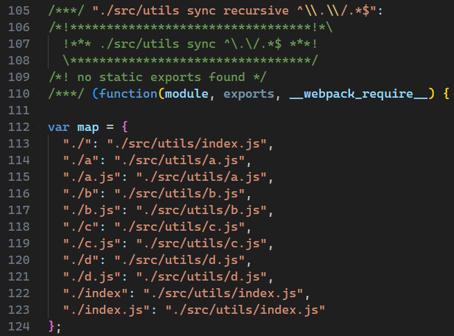
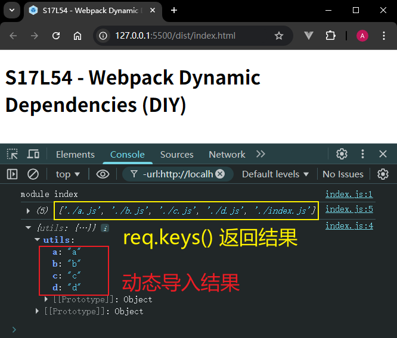
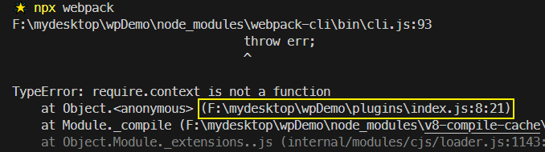

# L54：不确定的动态依赖（扩展）

本节为第六章第 `6-1` 课，大致录制时间：`2020-`。

---


本节主要介绍 `Webpack` 中的动态依赖管理，用于处理 `require()` 的参数包含变量的情况，具体通过 `require.context()` 接口实现动态管理（即批量导入或导出）。

> [!tip]
>
> `Webpack` 动态依赖管理官方文档：https://webpack.js.org/guides/dependency-management/。


## 1 问题由来

`Webpack` 打包时会优先保证运行正常，因此 `if` 分支中的依赖模块通常也会进入最终的打包结果：

```js
if (Math.random() < 0.5) {
  const a = require('./utils/a');
  console.log(a);
}
```

上述代码打包后，虽然 `if` 分支内的逻辑可能不执行，但有执行的可能。因此 `./utils/a` 模块的内容一定会一起打包。

同理，如果模块 `ID` 中包含变量，则 `Webpack` 无法确定具体模块，只能 **应收尽收**：

```js
/* 模块结构
src
|   index.js
|
\---utils
        a.js
        b.js
        c.js
        d.js
        index.js */

// ./src/index.js:
console.log('module index');

const moduleName = document.querySelector('input').value;
const content = require(`./utils/${moduleName}`);
console.log(content);
```

最终打包结果包含如下特殊结构（代码详见 `75a342a`）：



上图中的模块 `ID` 被标记为 `"./src/utils sync recursive ^\\.\\/.*$"`，它正是 `Webpack` 中的专属 `API` 接口 `require.context()` 的运行结果。

`require.context()` 的方法签名如下：

```js
require.context(
  directory,
  (useSubdirectories = true),
  (regExp = /^\.\/.*$/),
  (mode = "sync"),
);
```

该函数的返回结果，是一个带指定上下文的新的 `require` 函数；传入该函数的模块路径将追加到指定的上下文后：

```js
const req1 = require.context("./test", false, /\.test\.js$/);
// a context with files from the test directory that can be required with a request ending with `.test.js`.

const foo = req1('foo.test.js'); // => ./test/foo.test.js
const bar = req1('bar.test.js'); // => ./test/bar.test.js
```

再如：

```js
const req2 = require.context("../", true, /\.stories\.js$/);
// a context with all files in the parent folder and descending folders ending with `.stories.js`.

const foo = req2('foo.stories.js'); // => ../foo.stories.js | ./foo.stories.js | ./sub/foo.stories.js ...
const bar = req2('bar.stories.js'); // => ../bar.stories.js | ./bar.stories.js | ./sub/bar.stories.js ...
```

利用这一特性，可将 `./utils/` 下的所有模块通过 `./utils/index.js` 模块批量导入导出：

```js
// 导出当前目录中所有的 JS 模块
const context = require.context("./", true, /\.js$/);
for (const key of context.keys()) {
  if (key !== "./index.js") {
    // './foo.js' --> 'foo'
    // exports['foo'] = context('./foo.js');
    let filename = key.substr(2);
    filename = filename.substr(0, filename.length - 3);
    exports[filename] = context(key);
  }
}
```


## 2 实测备忘

`./utils/index.js` 模块（`46baf9f`）：

```js
// before
exports.a = require('./a');
exports.b = require('./b');
exports.c = require('./c');
exports.d = require('./d');

// after
const req = require.context('./', false, /\.js$/);

console.log(req.keys());

for (const moduleId of req.keys()) {
  if(moduleId !== './index.js') {
    const fileName = /\.\/(.*)\.js$/.exec(moduleId)[1];
    exports[fileName] = req(moduleId);
  }
}
```

实测截图：




:star: :star: :star: :star: :star: `require.context()` 方法在重构 `plugins/index.js` 时失败：



因此，严禁在 `Webpack` 读取配置文件时使用 `require.context()`，只能在 `Webpack` 打包过程中使用（例如 `./src/utils/index.js`）。构建 `Webpack` 配置对象是在纯 `node` 环境下，此时只能用 `NodeJS` 相关接口（例如 `fs` 和 `path`，详见 `9b8f586`）：

```js
// ./plugins/index.js:

// before:
const { cleanWebpackPlugin } = require('./cleanWebpackPlugin');
const { htmlWebpackPlugin } = require('./htmlWebpackPlugin');
module.exports = {
  cleanWebpackPlugin,
  htmlWebpackPlugin
};

// after:
const fs = require('node:fs');
const path = require('node:path');

fs.readdirSync(__dirname)
  .filter(file => file.endsWith('.js'))
  .filter(file => file !== 'index.js')
  .forEach(file => {
    const moduleName = path.basename(file, '.js');
    exports[moduleName] = require(`./${file}`)[moduleName];
  });
```

