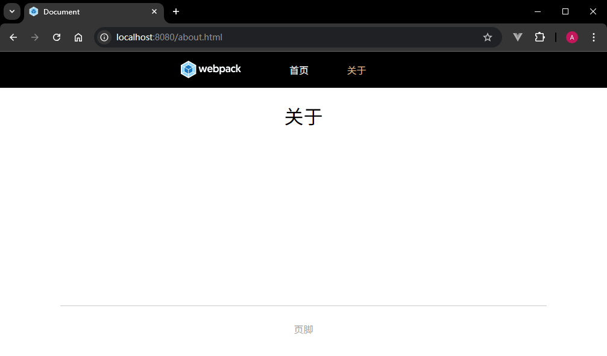

# L55：使用 Webpack 搭建多页应用程序

本课为第六章第 `6-2` 课，大致录制时间：`2020-06-07 14:30:00`。

---


## 1 适用场景

该工程适用于传统前端开发，它支持多个页面，同样也支持一个页面。

当你遇到下面类似的场景时，可以考虑使用该工程：

- 你正在开发一些 **纯粹的静态页面**，页面中有少量 `Ajax`（如活动促销页面、抽奖页面等）；
- 你正在开发一些 `JS` 功能，这些代码主要用于制作页面上的一些动态效果，比如利用 `jQuery` 实现轮播图、分页等；
- 其他不使用前端框架的工程。


## 2 使用方法

1. 从 `GitHub` 拉取工程：

   ```bash
   git clone https://github.com/yjisme/multi-static-pages-webpackproj.git
   ```

2. 安装依赖：

   ```bash
   cd multi-static-pages-webpackproj
   npm i
   ```

3. 运行：

   ```bash
   npm run dev
   ```

4. 打包：

   ```bash
   npm run build
   ```


## 3 要点梳理

:one: 正式引入 `webpack-merge` 中间件用于配置对象的自动合并（详见 [GitHub 仓库](https://github.com/survivejs/webpack-merge)）：

```js
const merge = require("webpack-merge");
const baseConfig = require("./webpack.config.js");
const devConfig = {/*-- snip --*/};
module.exports = merge(baseConfig, devConfig);
```


:two: 在 `Webpack` 的总配置中，用工具函数动态生成 `entry` 的值：

```js
// 获取入口配置
function getEntry() {
  const entry = {};
  for (const key in pages) {
    entry[key] = pages[key].js;
  }
  return entry;
}

// Webpack 基础配置
module.exports = {
  entry: getEntry(), // 获取入口配置
}

//----------------------------------------------------------//

// ./pages.js 多页配置:
module.exports = {
  // 页面名称（对应 chunk 名）
  index: {
    js: "./src/pages/index", // 页面入口js
    html: "./src/pages/index/index.html", // 页面使用的html模板
    out: "index.html", // 输出目录中的页面文件名
  },
  about: {
    js: "./src/pages/about",
    html: "./src/pages/about/index.html",
    out: "about.html",
  },
};
```


:three: `HTML` 模板文件的动态拼接：

```html
<body>
  <!-- 引入公共页头 -->
  <%= require("html-loader!../common/header/index.html") %>
  <div class="main-container">首页</div>
  <!-- 引入公共页尾 -->
  <%= require("html-loader!../common/footer/index.html") %>
</body>
```

逐段解释：

- `<%= ... %>`：这是模板引擎的 **插值语法**（`html-webpack-plugin` 插件默认使用 `Lodash` 模板，类似 `EJS`）；它会把 `...` 部分的 `JavaScript` 表达式求值结果输出到 `HTML` 中；
- `require("html-loader!../common/header/index.html")`：这是一个 **Webpack 模块请求**，且使用了 **内联 loader 语法**——
  - `require()`：`Webpack` 打包时会像处理 `JavaScript` 模块一样处理该请求，并返回该模块的导出内容；
  - `html-loader!`：是一个 **内联 loader 前缀**，表示强制使用 `html-loader` 来处理紧随其后的文件。
    - `html-loader` 会将 `HTML` 文件解析并导出为一个字符串（默认行为），然后将其作为插值结果插入当前位置；如果 `HTML` 中存在图片资源，则会交给 `url-loader` 等加载器作进一步处理；
    - 如果没有该前缀，`Webpack` 会根据配置文件中的规则来选择合适的 `loader`；加上它可以确保用 `html-loader` 处理。
  - `../common/header/index.html`：相对于当前模板文件的路径，指向公共头部 `HTML` 文件；


实测效果图：

