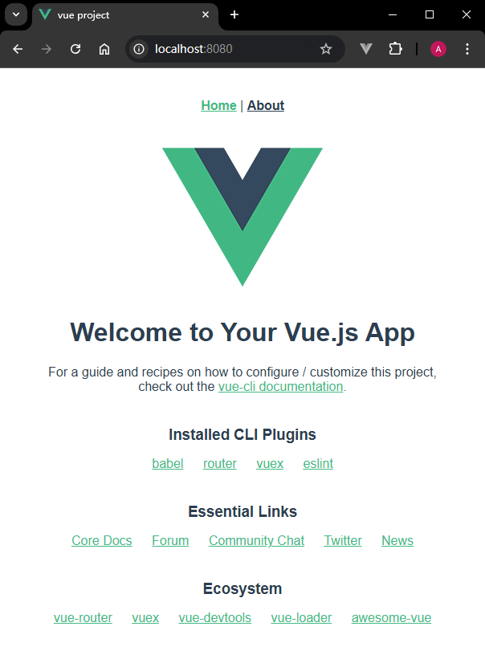

# L56：用 Webpack 手动搭建 Vue 单页应用（扩展）

本节为第六章 `6-3` 小节，大致录制时间：`2020-06-07 15:40:00`。

---


`Webpack` 在 `Vue 2` 时代扮演了至关重要的角色，它的强大功能支撑起了庞大的 `Vue` 生态。而如今，`Vite` 代表着未来，它更轻、更快、更简单，是开启 `Vue 3` 项目的最佳方式。如果你正准备启动一个新的 `Vue 3` 项目，建议直接使用 `npm create vue@latest` 命令来体验 `Vite` 带来的畅快开发。如果你需要维护一个基于 `Webpack` 的旧项目，也不必焦虑，它依然稳定可靠。了解这段历史，能帮助你更好地理解不同工具的设计哲学和适用场景。

本项目基于当时的 `vue-cli` 脚手架改造而来。


## 1 要点梳理

`GitHub` 仓库地址：https://github.com/yjisme/vue-webpack

基本用法：

```bash
# 拉取代码到本地
$ git clone https://github.com/yjisme/vue-webpack.git
$ cd vue-webpack
# 安装依赖
$ npm i
# 启动项目（开发模式）
$ npm run serve
# 项目打包（生产环境）
$ npm run build
```


在 `resolve` 根配置下新增 `extensions` 选项，值为一个数组，用于限定模块的扩展名：

```js
module.exports = {
  resolve: {
    extensions: [".js", ".vue", ".json"],
  }
}
```


`Babel` 的预设配置改用基于 `Vue` 项目的专用预设方案，需要对应安装开发级依赖 `babel-preset-vue`：

```js
// babel.config.js
module.exports = {
  presets: ["vue"],
};
```


对于 `Vue` 文件需要用 `vue-loader` 进行处理：

```js
module.exports = {
  module: {
    rules: [
      { test: /\.vue$/, use: "vue-loader" },
    ]
  }
}
```

此时除了安装 `vue-loader` 依赖，还需要 `vue-template-compiler` 依赖（详见 `package.json`）；另外，还需要同步注册一个 `VueLoaderPlugin` 插件：

```js
const VueLoaderPlugin = require("vue-loader/lib/plugin");
module.exports = {
  plugins: [
    new VueLoaderPlugin(),
  ],
};
```


实测效果：

