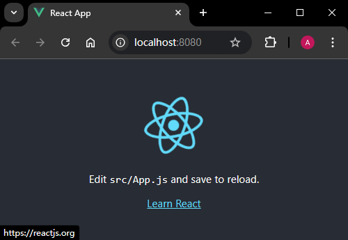

# L57：用 Webpack 手动搭建 React 单页应用（扩展）

本节为第六章 `6-4` 小节，大致录制时间：`2020-06-07 `。

---


本节最好学了 `React` 后再来了解。本项目基于 `React` 官方脚手架改造。


## 1 要点梳理

`GitHub` 地址：https://github.com/yjisme/react-webpack

具体用法：

```bash
git clone https://github.com/yjisme/react-webpack.git
cd react-webpack
npm i
npm start 
```

和上节课 `Vue` 单页应用的主要差别如下：

:one: 扩展名新增了对 `.jsx` 的识别，同时 `loader` 的判定规则中也考虑了 `.jsx`：

```js
module.exports = {
  resolve: {
    extensions: [".js", ".jsx", ".json"],
  module: {
    rules: [
      { test: /\.(js)|(jsx)$/, exclude: /node_modules/, use: "babel-loader" },
    ],
  },
};
```

:two: `Babel` 的预设方案使用 `React` 专属方案，为此需要安装 `@babel/preset-react` 依赖：

```json
// .babelrc
{
  "presets": ["@babel/preset-react"]
}
```


实测效果图：

