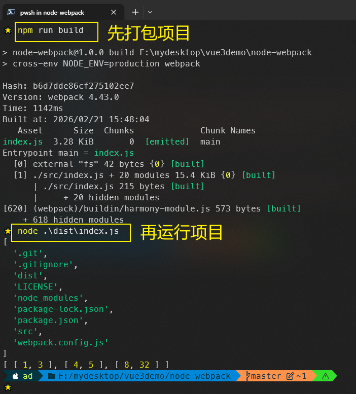
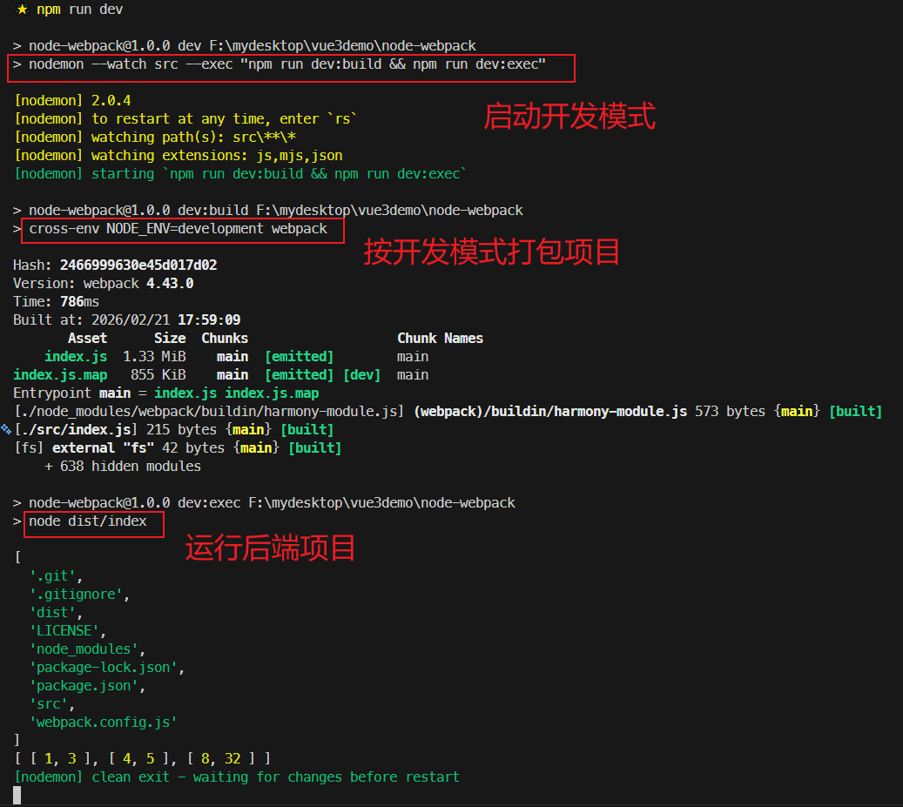

# L58：用 Webpack 搭建后端 node 应用（扩展）

本节为第六章 `6-5` 小节，大致录制时间：`2020-06-08 10:30:00`。

---


## 1 要点梳理

### 1.1 基本用法

`GitHub` 地址：https://github.com/yjisme/node-webpack

用法：

```bash
# 拉取项目代码
git clone https://github.com/yjisme/node-webpack.git
cd node-webpack
# 安装依赖
npm i
# 开发模式启动
npm run dev
# 生产环境打包
npm run build
# 运行打包文件
node dist/index
```


### 1.2 引入 Webpack 前后开发模式对比

:one: 直接开发，直接部署：
1. 搭建 `node` 工程直接开发；
2. 开发过程中使用 `Git` 进行版本管理；
3. 开发完成后，提交 `Git`；
4. 进入部署服务器，从 `Git` 中拉取最新代码，然后 `npm install`。


:two: 直接开发，用 `Webpack` 打包，然后部署：

1. 搭建 `node` + `Webpack` 工程；
2. 开发后，使用 `Webpack` 打包；
3. 将打包结果上传到服务器，服务器直接运行；


不使用 `Webpack` 打包项目可能存在的问题：

1. 服务器在 `npm install` 的过程中，或占用比较大的网络资源；
2. 代码没有压缩，拉取速度较慢；
3. 开发过程中，无法使用较新的语法（或自行处理兼容性）；
4. 开发过程中，无法使用 `ES6` 模块化（:star: 最主要的问题）。


### 1.3 不同环境下项目的运行

:star: 生产环境的运行：

创建 `build` 脚本命令：`"cross-env NODE_ENV=production webpack"`。

解释：先将环境变量 `NODE_ENV` 设置为 `production`，然后进行打包；

最终在 `dist` 目录下生成打包文件，可以直接用 `node dist/index.js` 运行。


:star: 开发环境的运行：

用 `nodemon` 工具监控源代码目录（即 `./src/`），一旦源代码有变动，则先后执行——

1. 将环境变量 `NODE_ENV` 设置为 `development`，然后进行打包；
2. 运行打包结果（`node dist/index.js`）。


### 1.4 运行脚本的设置

与之前项目不同，`node` 项目的运行脚本中使用了 `cross-env` 工具，以便忽略 `Linux` 和 `Windows` 的脚本差异来设置 `node` 所在环境：

```json
{
  "scripts": {
    "dev": "nodemon --watch src --exec 'npm run dev:build && npm run dev:exec'",
    "dev:build": "cross-env NODE_ENV=development webpack",
    "dev:exec": "node dist/index",
    "build": "cross-env NODE_ENV=production webpack"
  },
}
```


### 1.5 Webpack 在配置上的差异

减少无关的 `node` 控制台输出内容：

```js
module.exports = {
  stats: "none"
};
```


`node` 项目中的 `Webpack` 配置和前面几节演示的项目 **最大的不同** 在于 `target` 的取值：

```js
module.exports = {
  target: "node",  // 默认值 "web"
  node: false  // 关闭 Webpack 针对 node 的模拟行为
};
```

这样才能正确识别 `NodeJS` 的内置模块（如 `fs`、`http` 等）。

如果 `node` 不设为 `false`，则 `Webpack` 会自行模拟 `node` 环境下的某些全局变量（如 `__dirname`），因此需要关闭。


## 2 实测备忘

实测效果截图：



实测开发模型运行（`dev` 脚本中的引号须改为 **转以后的双引号**，否则在 `Windows` 环境下会报错）：

