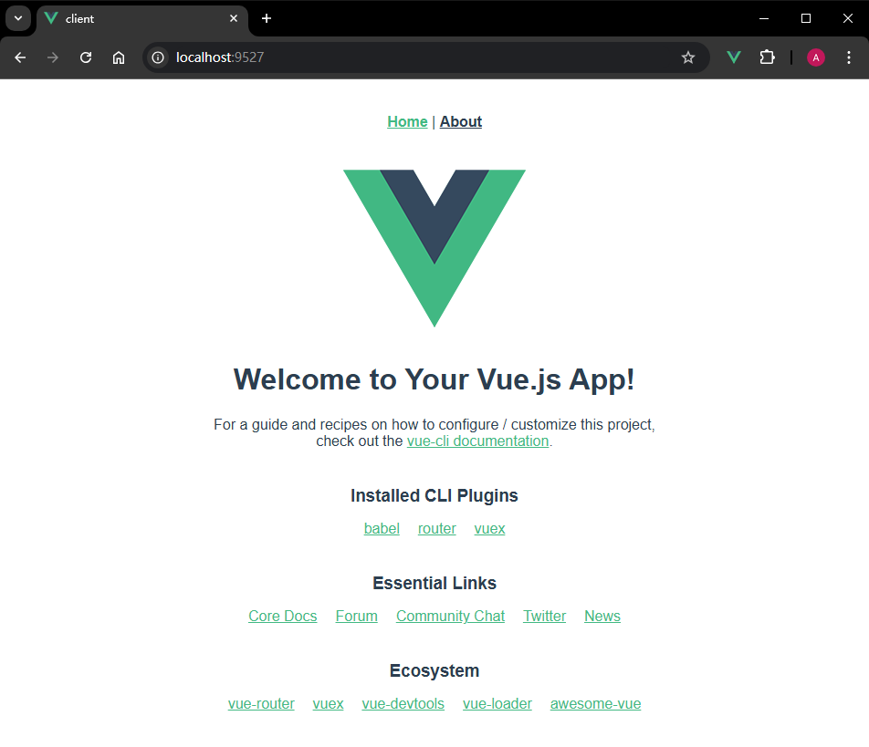

# L59：用 Webpack 搭建前后端全栈应用（扩展）

本节为第六章 `6-6` 小节，大致录制时间：`2020-06-08 12:15:00`。

---


本节最好在学习了 `Vue` 和 `NodeJS` 相关课程再尝试。


## 1 要点梳理

### 1.1 项目用法

`GitHub` 地址：https://github.com/yjisme/node-vue-webpack

用法：

```bash
# 拉取代码
git clone https://github.com/yjisme/node-vue-webpack.git
cd node-vue-webpack
# 安装依赖
npm i
cd client
npm i
cd ../server
npm i
# 先打包服务端、再打包客户端代码
cd ..
npm run build
# 运行后端项目
node dist/index.js
# 查看前端页面
# 浏览器访问 http://localhost:9527 即可

# 以开发方式运行前后端
npm run dev
# 浏览器访问 http://localhost:8080 即可
```


### 1.2 项目结构

主要设计：

- `client`：客户端文件夹，利用脚手架搭建的 `Vue` 工程；打包结果放到 `dist/public/` 目录下；
- `server`：服务器文件夹，纯 `NodeJS` 代码搭建的 `Express` 工程；最终打包到 `dist/index.js` 文件中；
- `common`：存放公用的库。

在根目录下直接运行 `npm run build` 即可完成全量打包（需要提前安装 `npm-run-all` 依赖）：

```json
{
  "scripts": {
    "build": "npm-run-all -s build:server build:client",
    "build:server": "cross-env NODE_ENV=production webpack",
    "build:client": "cd client && npm run build"
  },
}
```

同理，在开发环境下运行项目也只需一个命令 `npm run dev`：

```json
{
  "scripts": {
    "dev": "npm-run-all -p dev:server dev:client",
    "dev:server": "nodemon --watch server --exec 'npm run dev:server:build && npm run dev:server:exec'",
    "dev:server:build": "cross-env NODE_ENV=development webpack",
    "dev:server:exec": "node dist/index",
    "dev:client": "cd client && npm run serve",
  },
}
```


### 1.3 配置差异

将 `client` 中的项目代码打包到与之平级的 `dist/` 目录的 `public/` 文件夹下，需要配置 `vue.config.js`：

```js
module.exports = {
  outputDir: "../dist/public",
};
```

这样，前后端打包完毕，只需将 `dist` 中的所有内容（前端 + 后端）上传到生产服务器环境即可。


### 1.4 禁用 Webpack 的全局变量模拟

`node` 项目中的 `Webpack` 配置和前面几节演示的项目 **最大的不同** 在于 `target` 的取值：

```js
module.exports = {
  target: "node",  // 默认值 "web"
  node: false  // 关闭 Webpack 针对 node 的模拟行为
};
```

如果 `node` 为 `true`，则 `Webpack` 会对 `node` 的某些全局变量（如 `__dirname`）进行模拟，这在 `node` 环境中须禁止。


## 2 实测备忘

实测效果图：

生产环境下：



开发环境下：

